#Archive: [Class_Diagram](Class_Diagram.md)

***

##\#1 Name

```plantuml
@startuml
skinparam monochrome true
skinparam linetype ortho
top to bottom direction

class Hello {}
class World {}

Hello -- World : has a

@enduml
```

*date: 2020-02-02*

**Needed improvements:**
- Improvement 1;
- Improvement 2;
- Improvement 3;

***

#\#2 Name

*date: 2020-12-04*

**Needed improvements:**
- Improvement 1;
- Improvement 2;
- Improvement 3;

***