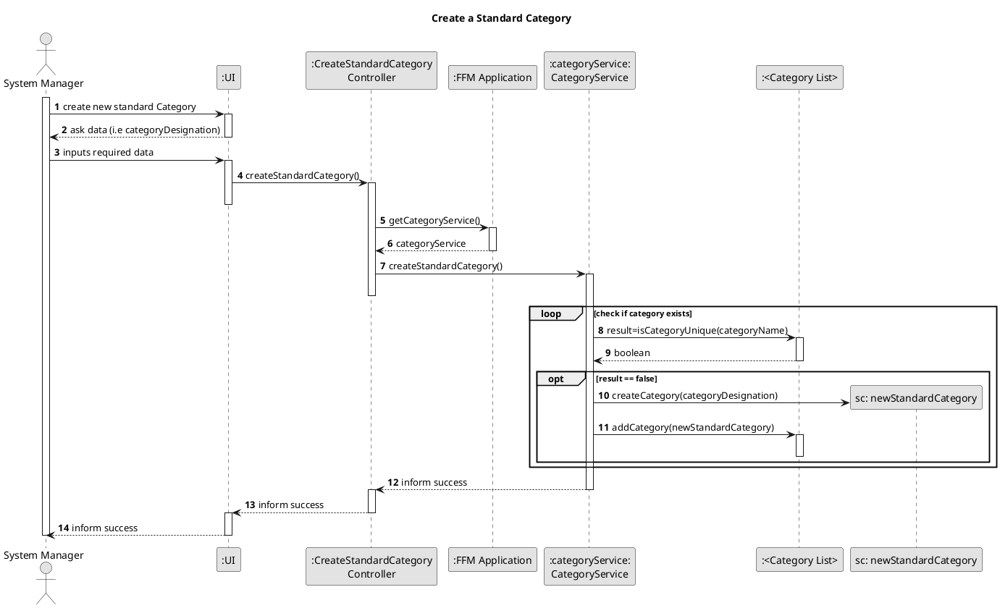
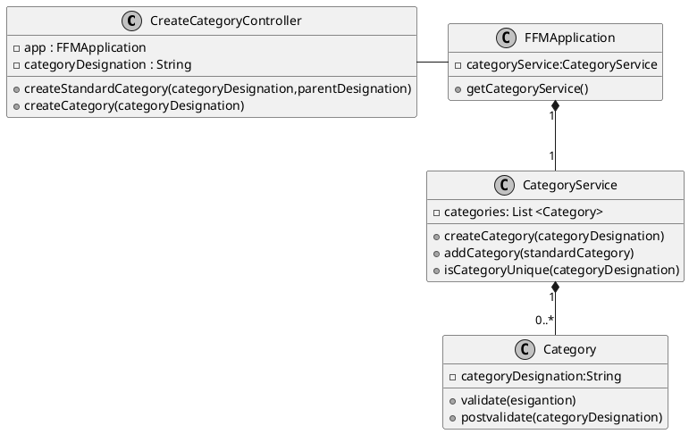

# US001
=======================================

# 1. Requirements

>__"As a system manager, I want to create a standard category."__

**Demo1** As a System Manager, I want to create a standard category and add it to the system

- Demo1.1. Create a category

- Demo1.2. add a category to the system

This requirement was interpreted as a direct possibility for the system manager to create a new 
standard category, introducing the desired name as an argument

# 2. Analysis

# 2. Analysis

## 2.1 Product Owner

Some questions must be asked to the product owner (PO) in order to make some important  design decisions.

> Q: What is the expected to happen when the system manager tries to insert an already existing category name?

> A: It should not be possible to insert an already existing category

> Q: What is the expected to happen when the system manager adds "energy" and "Energy" ? Are they
> considered to be the same category?

> A: "Energy" and "energy" should be the same category. Forcing the categories to have the same format
> (i.e,, all capitalized letters, all lower case characters or having only the first letter capitalizes )
> seems positive

## 2.2 Decisions

-It was decided that categories cannot have the same name and, as such, the name would be used for
identification processes.

-It was decided that the categories can have more than one word and that every first letter
would be capitalized. Special characters are in general not allowed except for apostrophes and
accents, commonly used in portuguese and english.

-It was decided to correct certain typing mistakes such as the spacing between characters
when the system administrator types the standard  category name but no spelling corrections were applied

-It is assumed that a category does not have a length inferior to 3 characters

## 2.3. US Dependencies

This User Story does not depend on other User Stories. However, US002 depends on this US.

# 3. Design

## 3.1. Functionalities Flow

The sequence diagram above represents the process of creating a standard category. 
The system manager must introduce the desired category name in the UI as input.
The application can answer in one of two ways:
-inform success if the category is successfully created and is added to the system
-inform failure if the standard category's addition to the system fails.
This sequence diagram represents only the first option, where the standard category is successfully 
created and added to the system.

## 3.2. Class Diagram

In the diagram class diagram above, the Controller class establishes the connection
between the UI and the business logic. The FFMApplication connects the Controller class to the
CategoryService class. After the categoryDesignation of a category is validated, it is then added to the
CategoryService class.

## 3.3. Applied Design Patterns

From GRASP pattern:
Controller,
Information Expert,
Low Coupling

From SOLID:
Single Responsibility Principle

## 3.4. Tests 

**Test 1:** Create one category successfully

    @Test
    @DisplayName("Create a valid Category")
    public void CreatingValidCategory() {
    Category standardCategory = new Category("Gastos Adicionais");
    Assertions.assertNotNull(standardCategory);
    }

**Test 2:** Create one category successfully that allows for portuguese language accents
    
    @Test
    @DisplayName("Create a valid Category with special Accents")
    public void CreatingValidCategoryWithAccents() {
    Category standardCategory = new Category("Explicações De Matemática");
    Assertions.assertNotNull(standardCategory);
    }

**Test 3:** Failure to create a category successfully due to the catagory's name having less than
3 characters
    
    @Test
    @DisplayName("Create an Invalid Category with invalid format, having less than 3 characters")
    public void CreatingCategoryWithWrongLength() {
    Throwable exception =
    assertThrows(IllegalArgumentException.class, () -> {
    Category badCategory = new Category("CC");
    });
    }

**Test 4:** Failure to create a category successfully due to the presence of numeric characters
    
    @Test
    @DisplayName("Create an Invalid Category with invalid format, having numbers")
    public void CreatingCategoryWithNumbers() {
    Throwable exception =
    assertThrows(IllegalArgumentException.class, () -> {
    Category badCategory = new Category("Compras Online546");
    });
    }

**Test 5:** Create one category unsuccessfully due to the presence of special characters
    
    @Test
    @DisplayName("Create an Invalid Category with invalid format, having special charaters")
    public void CreatingCategoryWithSpecialCharacters() {
    Throwable exception =
    assertThrows(IllegalArgumentException.class, () -> {
    Category badCategory = new Category("Compras Online!!!!!");
    });
    }

**Test 6:** Failure to add a category- null category 

    @Test
    void createCategoryNull() {

        //arrange
        //act
        //assert
        assertThrows(IllegalArgumentException.class, () -> {
            new Category(null);
        });
    }

**Test 7:** Create one category successfully that allows for portuguese language accents

    @Test
    void hasSameDesignationFalse() {

        //arrange
        Category category = new Category("Food");
        //act
        boolean result=category.hasSameDesignation("fooood");

        //assert
        Assertions.assertFalse(result);

    }

# 4. Implementation

    
    public Category createCategory(String categoryDesignation) {
    try {
    Category standardCategory = new Category(categoryDesignation);
    if (addCategory(standardCategory)) {
    return standardCategory;
    }

        } catch (Exception e) {
            e.printStackTrace(); //pinpoint the exact location of the exception
        }
        return null;
    }

At first, a category is created. There are some criteria that, if not met, can stop the
whole process.  For example, the cateory name has to have a certain format:
-has a minimum of letters
-cannot contain special characters
- the first letters of each word must be capitalized
  -must be filled.
  -must not have the same name as other categories

If any of these validations is not respected the new category will not be created, and the process will 
finish. as a result, the system manager will be informed that the process was not successful.
Due to the fact that there cannot be different categories with the same name, a category
identification (id) is not created, since their name is unique..

    public static String capitalizeFirstLetters(String categoryDesignation) {
    categoryDesignation = categoryDesignation.trim().toLowerCase();   //deletes space characters at the end and at the beginning of a Sting
    while (categoryDesignation.contains("  ")) { // deletes multiple space characters
    categoryDesignation = categoryDesignation.replaceAll("  ", " ");
    }
    String[] split = categoryDesignation.split(" ");
    for (int i = 0; i < split.length; i++) {
    split[i] = Character.toUpperCase(split[i].charAt(0)) + split[i].substring(1);
    }
    categoryDesignation = String.join(" ", split);
    return categoryDesignation;
    }

The code above was designed to help the user, in this case, it helps the system
manager to correct some typing errors:

-If the user capitalizes the wrong letters

-If the user inserts spacing characters at the beginning or a the end of a phrase

-If the user inserts multiple adjacent spacing characters

This portion was first designed for this specific US but, later on 
was moved to the Class Utils so that it can be used to format other
Strings such as the address or the family name.
This portion helps correct some typos and, in this US, it is later on combined with other
piece of code that guarantees that the category name only has alphabetic
characters (capitalized or not), space characters, apostrophes and accents. 
  Other special characters are not allowed.

# 5. Integration/Demo

This US is a base support for US002. This US creates and validates category names that can then
be added to a category tree.

# 6. Observations
Since the name of each category is unique, the category name was used for identification processes. 
However, in the future, if it proves beneficial, an id creation related to the category tree could be created and used
The category name's allowed characters can also change in the future

