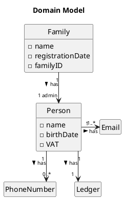

# US010
=======================================

# 1. Requirements
> __"As a system manager, I want to create a family and set the family administrator."__

## 1.1 Description
To use the application, each user must be registered in the app, and it is assigned to the family he belongs to. 
So, the first step to use the app is to create a family and assign, simultaneously, its administrator. 

**Demo1** As a system manager, I want to get create a family.
- Demo1.1. create a family.
- Demo1.2. add family to the system.
- Demo1.3. if input arguments are incorrect, the requirement cannot be fulfilled.

**Demo2** As a system manager, I want to assign an administrator to the family.
- Demo2.1. create an administrator.
- Demo1.2. assign an administrator to the family and add him to the family's list of members.
- Demo1.3. if input arguments are incorrect, the requirement cannot be fulfilled.

The family is only added to the system if both the demos are correctly accomplished. If any of these two requirements
presents a problem, the family and its administrator are not added to the application.  

# 2. Analysis

## 2.1 Domain Model 

## 2.2 Product Owner
Regarding the family creation, no questions were asked about its design.
Concerning the administration creation, some important questions were presented to the product owner (PO), that contribute to the design and implementation of the US.

>Q: Which of the person's attributes in the system are mandatory?
-A: Unlike other possible system actors, to access/use the application, the person must have, at least, one email address unique in the system, which results in the administrator must have forcefully an email address. Furthermore, this email cannot be used as an identification email by any other user.

> Q: Can families have more than one administrator? 
> A: No, each family can only have one administrator.

> Q: Can a person (or administrator) belong to more than one family? 
> A: No. If a person wants to be a part of another family, they must use another email address.

>Q: The person identification (ID) in the system must have a specific format? Or can be attributed to the system? 
> A: The person identification is described as its main email.

## 2.3 Decisions

## 2.4 Dependent US

## 2.5 System sequence diagram

# 3. Design

## 3.1 Class Diagram

```plantuml
@startuml
skinparam monochrome true
skinparam linetype ortho
top to bottom direction

class Hello {}
class World {}

Hello -- World : has a

@enduml
```

*date: 2020-02-02*

**Needed improvements:**
- Improvement 1;
- Improvement 2;
- Improvement 3;

***

## 3.2 Functionality Flows 

*date: 2020-02-02*

**Needed improvements:**
- Improvement 1;
- Improvement 2;
- Improvement 3;

***

## 3.3 Applied design patterns

## 3.4 Tests

# 4. Implementation

# 5. Integration/Demo

# 6. Observations

