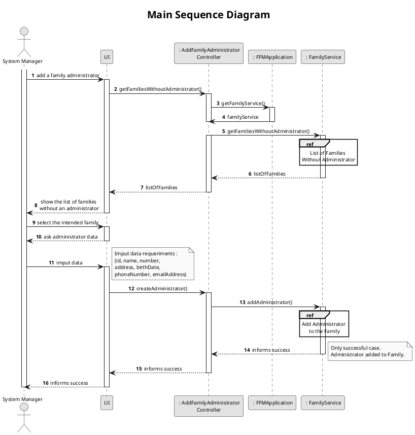
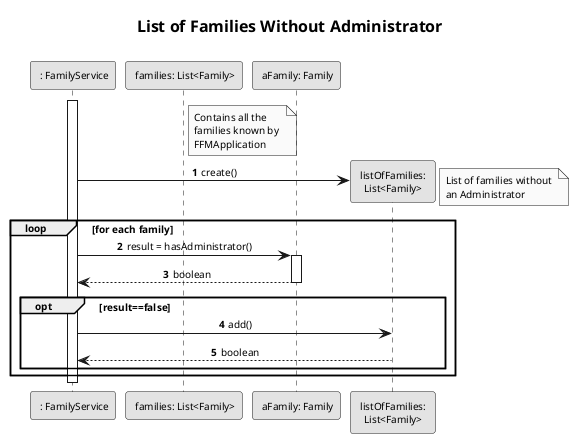
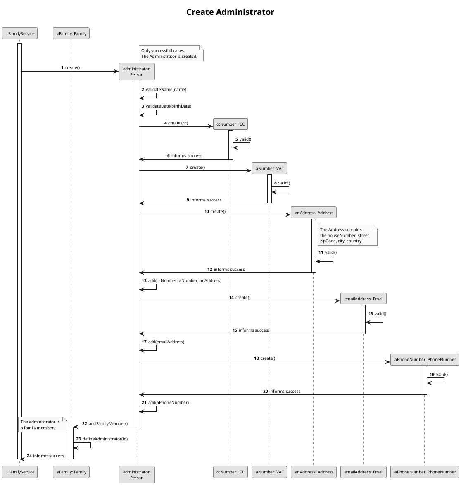
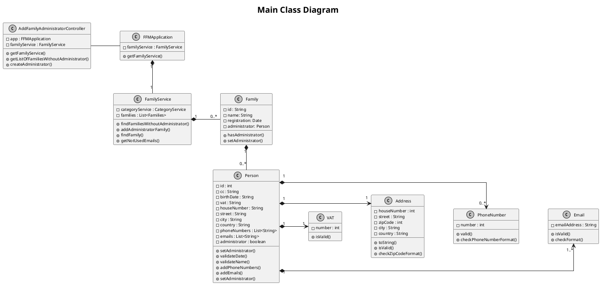

# US011
=======================================


# 1. Requirements 
#
>__"As a system manager, I want to add a family administrator."__

## 1.1 Description
**Demo1** As a System Manager, I want to select the family in which the administrator is going to be added.
- Demo1.1. select the intended family in which I want to add the administrator.
- Demo1.2. if the list of families without an administrator presents no arguments, the requirement cannot be fulfilled.  
- Demo1.3. if the list of families without an administrator doesn't present the intended family, the requirement cannot
 be fulfilled.

The requirement expresses the need of a family to have an administrator. It can only be applied to a family without an
administrator, since it's delineated that each family presents only one administrator. 
If the requested family isn't presented in the list of families, which can occur due to the non-existence of the family
or due to the fact that the administrator's already defined, a family will not be selected, and the prerequisite 
is cancelled. 

**Demo2** As a System Manager, I want to add the family administrator.
- Demo2.1. create the administrator as an argument in the app.
- Demo2.2. add the administrator to the family members.  
- Demo2.3. if the administrator's input data is not valid, the requirement cannot be fulfilled.
- Demo2.4. if the administrator isn't created, the family remains without an administrator.

The implementation of the administrator to the family can only occur if this actor is correctly created as a person of 
the system. For that, the administrator is created through several input data which have to respect certain rules. 
If during the administrator's creation an error is detected, due to invalid input data, the process stops. As a 
consequence, the family remains without an administrator, and the requirement remains on hold. 
Unlike other possible actors in the system, the administrator has to provide the complete requested input data.

# 2. Analysis
## 2.1 Product Owner
During the Sprint, the product owner (PO) set some specifications that contribute to the design and implementation of 
the US.

> Q: Which of the person's attributes in the system are mandatory?
- Unlike other possible system actors, to access/use the application, the person must have, at least, one email address
unique in the system, which results as the administrator 
must having forcefully an email address. 
- The vat and citizen identification number are also unique.

> Q: Can families have more than one administrator?
- No, each family can only have one administrator.

> Q: Can a person (or administrator) belong to more than one family?
- No.If a person wants to be a part of another family, they must use another email address.

> Q: The person identification (ID) in the system must have a specific format? Or can be attributed by the system?
- The person identification is only used in the system. As so, it doesn't have to present a specific format, as long as
it is unique.

## 2.2 Decisions
-One of the first decisions made was that a person (administrator) is stored in the family members' list in which
 they belong.

-Each of the input data required to create the administrator or person goes through several validations, in order
to verify if is consistent and logical. The vat and citizen card number must obey the rules established by Portuguese 
Entities. The Birth Date must respect the standard date format. This date also cannot be a future date. The Address is
made of various fields, such as the house number, the street, the city, the country and the zip code. Email address 
must also obey to established rules, as phone numbers. The person (administrator) identification in the system is 
generated as a unique random parameter.

-The administrator, unlike other family members, has a different status, and is the first person added to the family 
members' list.

## 2.3 Dependent US
To deliver this US is necessary to create the family in which the system manager wants to add the administrator, which 
references the US010.


## 2.4 System Sequence Diagram
```puml
skinparam monochrome true
autonumber
title SSD
actor "System Manager"

"System Manager" -> "System" : get list of families without administrator 
activate "System Manager"
activate "System"
|||  
"System Manager" <-- "System" : show list of families

"System Manager" -> "System" : select family 
|||
"System Manager" <-- "System" : ask for imput data

"System Manager" -> "System" : insert required data
|||
"System Manager" <-- "System" : inform result
deactivate "System Manager"
deactivate "System"

```

# 3. Design
## 3.1. Functionalities Flow


In the Main Sequence Diagram, it's represented the basic line to the development of the US. To start, the System Manager
must select the family in which he wants to add the administrator. 
Through a list of all the families in the FFMApplication, which is provided by the AddFamilyAdministratorController, 
the System Manager selects the one where the administrator is going to be added. This family list is represented in the 
Sequence Diagram above.
After the family' selection, the system manager must input the data required to create the administrator in the system. 
If this process to correctly done, the administrator is defined and added as a family member.
The Main Sequence Diagram represents only the successful case of the US. In other words, the family is correctly 
selected and the administrator added. For the non-represented case, an error message presents to the System Manager.



The List of Families Without Administrator Sequence Diagram describes the process to obtain the list of all the families
 in the application that still don't have assigned an administrator.
The basic line of this process is to go through all the families subscribed in the Family Service of the FFMApplication 
and verify if an administrator is already assigned. 
If the family still doesn't have an administrator, it is added to the ListOfFamilies, and posteriorly provided to the 
System Manager by the AddFamilyAdministratorController.
The final stage of this process consists in returning the ListOfFamilies. This result can contain the family which the 
System Manager is going to select (which represents the successful case and it is described in the Sequence Diagram) or 
not (the non-succeffull case).
```plantuml

title Add Administrator to the Family
skinparam titleFontSize 20
autonumber
skinparam responseMessageBelowArrow true
skinparam maxMessageSize 300
skinparam sequenceMessageAlign center
skinparam monochrome true

participant "familyService:FamilyService" as Service
participant "family : Family" as Family

[-> Service : addAdministrator (cc, name, birthDate, vat, houseNumber, street, city, country, zipCode, List phoneNumbers, List emails, familyID)
activate Service
Service -> Service : family = findFamily(familyID)
Service -> Service : validateUniqueEmails(List emails)
Service -> Service : List uniqueEmails = getNotUsedEmails(List emails)
deactivate Family  
||15||  
Service -> Family : setAdministrator(cc, name, birthDate, vat, houseNumber, street, city, country, zipCode, List phoneNumbers, List uniqueEmails, familyID)
activate Family
Family -> Family : generatePersonID()

Family -> "administrator : Person" ** : create (id, cc, name, birthDate, vat, houseNumber, street, city, country, zipCode, List phoneNumbers, List uniqueEmails, familyID)

ref over "administrator : Person"
Create Administrator
end ref

"administrator : Person" --> Family : informs success
Family--> Service : informs success
deactivate Family 

[<-- Service : informs success
deactivate Service
```
At this level, in familyService, the fists step is to find the chosen family through the familyID, and after a validation of unique emails, the personal data are send to the family. The family validate unique CC and VAT number, and after that, creates a new Person object with the personal data inputted.
If the process is successfully , the administrator is then add to the list of members of this family.
In the end, a boolean are sent to Controller that calls this operation.



This final Sequence Diagram shows the creation of the administrator. Similar to the previous diagrams, it only 
represents the successful case.
To create the administrator in the FFMApplication, all input data required must be valid. As soon as the administrator 
is created, it is added to the Family as a member.
Finally, a message informs the success or non-success of the US.

## 3.2. Class Diagram

As demonstrated in the Class Diagram, a Controller class makes the connection between the UI and the business 
logic. Each Family class is stored in the Family Service class and each Person class is stored in the Family in which 
they belong. Each Person class contains the VAT class, PhoneNumber class, Email class and Address class as attributes .
In the Administrator creation process, they are created by same approach as another Person class. However, the Person 
administrator attribute must be true, and the email not null.

## 3.3. Applied Design Patterns

From GRASP pattern:
Controller,
Information Expert,
Low Coupling

From SOLID:
Single Responsibility Principle

## 3.4. Tests 
*The tests set up were created and design to best approach both main methods required:*
- getListOfFamiliesWithoutAdministrator()
- createAdministrator()

**Families without administrator list:** 

*Test 1:* None of the families have administrator.

    @Test
    @DisplayName("None of the families have administrator")
    void getListOfFamiliesWithoutAdministratorTest3() {
        //arrange
        CategoryService categoryService = app.getCategoryService();
        FamilyService familyService = app.getFamilyService();
        PersonService personService = app.getPersonService();
        AddFamilyAdministratorController controller = new AddFamilyAdministratorController(app);

        Family family1 = new Family("Reis");
        Family family2 = new Family("Neves");
        Family family3 = new Family("Silva");

        familyService.addFamily(family1);
        familyService.addFamily(family2);
        familyService.addFamily(family3);

        List<String> expected = new ArrayList<>();
        expected.add(family1.getId());
        expected.add(family2.getId());
        expected.add(family3.getId());

        //act
        List<String> result = controller.getListOfFamiliesWithoutAdministrator();

        //assert
        assertTrue(result.contains(family1.getId()));
        assertTrue(result.contains(family2.getId()));
        assertTrue(result.contains(family3.getId()));
        assertEquals(3,result.size());
    }
    
*Test 2:* Some families have administrator.
    
    @Test
    @DisplayName("Some families have administrator")
    void getListOfFamiliesWithoutAdministratorTest1() {
        //arrange
        CategoryService categoryService = app.getCategoryService();
        FamilyService familyService = app.getFamilyService();
        AddFamilyAdministratorController controller = new AddFamilyAdministratorController(app);

        Family family6 = new Family("Barcelos");
        Family family7 = new Family("Lopes");
        Family family8 = new Family("Mendes");
        Family family9 = new Family("Valente");
        familyService.addFamily(family6);
        familyService.addFamily(family7);
        familyService.addFamily(family8);
        familyService.addFamily(family9);

        List<String> jorgePhoneNumbers = new ArrayList<String>();
        jorgePhoneNumbers.add("914565807");
        List<String> jorgeEmails = new ArrayList<String>();
        jorgeEmails.add("pedrinho@isep.ipp.pt");
        String lopesID = family6.getId();
        familyService.addAdministrator("157905810ZW6","Jorge Lopes","16/05/1992",
                "262351676","12","Rua das Rosas","Porto","Portugal",
                "4418-876",jorgePhoneNumbers,jorgeEmails,lopesID);

        List<String> gloriaPhoneNumbers = new ArrayList<String>();
        gloriaPhoneNumbers.add("914565807");
        List<String> gloriaEmails = new ArrayList<String>();
        gloriaEmails.add("luana@isep.ipp.pt");
        String ferreiraID = family7.getId();
       familyService.addAdministrator("198916868ZZ9","Glória Ferreira","16/08/1990",
                "281471762","7","Rua das Luzes","Porto","Portugal",
                "4418-446",gloriaPhoneNumbers,gloriaEmails,ferreiraID);

        //act
        List<String> result = controller.getListOfFamiliesWithoutAdministrator();

        //assert
       assertTrue(result.contains(family8.getId()));
       assertTrue(result.contains(family9.getId()));
       assertFalse(result.contains(family6.getId()));
       assertFalse(result.contains(family7.getId()));
       assertEquals(2,result.size() );
    }   
    
*Test 3:* All families have administrator.   

    @Test
    @DisplayName("All families have administrator")
    void getListOfFamiliesWithoutAdministratorTest2() {
        //arrange;
        CategoryService categoryService = app.getCategoryService();
        FamilyService familyService = app.getFamilyService();
        PersonService personService = app.getPersonService();
        AddFamilyAdministratorController controller = new AddFamilyAdministratorController(app);

        Family santos = new Family("Santos");
        Family soares = new Family("Martins");
        Family rios = new Family("Soares");

        familyService.addFamily(santos);
        familyService.addFamily(soares);
        familyService.addFamily(rios);

        List<String> marciaPhoneNumbers = new ArrayList<String>();
        marciaPhoneNumbers.add("914565807");
        List<String> marciaEmails = new ArrayList<String>();
        marciaEmails.add("marcia@isep.ipp.pt");
        String santosID = santos.getId();
        familyService.addAdministrator("142579319ZY1","Márcia Guedes","08/04/1996",
                "225639840","54","Rua das Bailarinas","Porto","Portugal",
                "4423-876",marciaPhoneNumbers,marciaEmails,santosID);

        List<String> jorgePhoneNumbers = new ArrayList<String>();
        jorgePhoneNumbers.add("914565807");
        List<String> jorgeEmails = new ArrayList<String>();
        jorgeEmails.add("jorge@isep.ipp.pt");
        String riosId = rios.getId();
        familyService.addAdministrator("02749225XZ3","Jorge Lopes","16/05/1992",
                "125677745","12","Rua das Rosas","Porto","Portugal",
                "4418-876",jorgePhoneNumbers,jorgeEmails,riosId);

        List<String> ricardoPhoneNumbers = new ArrayList<String>();
        ricardoPhoneNumbers.add("910565807");
        List<String> ricardoEmails = new ArrayList<String>();
        ricardoEmails.add("ricardo@isep.ipp.pt");
        String soaresId = soares.getId();
        familyService.addAdministrator("129610259ZX9","Ricardo Mendes","30/04/1992",
                "266232060","49","Rua dos Leões","Porto","Portugal",
                "4416-874",ricardoPhoneNumbers,ricardoEmails,soaresId);

        List<String> barbaraPhoneNumbers = new ArrayList<String>();
        barbaraPhoneNumbers.add("914565807");
        List<String> barbaraEmails = new ArrayList<String>();
        barbaraEmails.add("barbara@isep.ipp.pt");
        String riosID = rios.getId();
        familyService.addAdministrator("125992084ZZ3","Bárbara Sousa","30/04/1992",
                "258462477","49","Rua das Tulipas","Porto","Portugal",
                "4415-874",barbaraPhoneNumbers,barbaraEmails,riosID);

        //act
        List<String> result = controller.getListOfFamiliesWithoutAdministrator();

        //assert
        assertFalse(result.contains(santosID));
        assertFalse(result.contains(soaresId));
        assertFalse(result.contains(riosID));
        assertEquals(0, result.size());

    }

**Create Administrator:** 
    
*Test 1:* Create Administrated in Family without an Administrator.

    @Test
    @DisplayName("Create Administrated in Family without an Administrator ")
    void createAdministrator_FamilyWithoutOne() {
       //arrange
        CategoryService categoryService = app.getCategoryService();
        FamilyService familyService = app.getFamilyService();
        PersonService personService = app.getPersonService();
        AddFamilyAdministratorController controller = new AddFamilyAdministratorController(app);

        //list of families in the app
        Family family4 = new Family("Neves");
        familyService.addFamily(family4);

        List<String> marciaPhoneNumbers = new ArrayList<String>();
        marciaPhoneNumbers.add("914565807");
        List<String> marciaEmails = new ArrayList<String>();
        marciaEmails.add("ritawork@isep.ipp.pt");
        String rodriguesId = family4.getId();

       //act
        boolean result = controller.createAdministrator("199184437ZX0","Márcia Guedes","08/04/1996",
                "233109510","54","Rua das Bailarinas","Porto","Portugal",
                "4423-876",marciaPhoneNumbers,marciaEmails,rodriguesId);

       //assert
        assertTrue(result);

    }
    

*Test 2:* Change Administrator.

    @Test
    @DisplayName("Change Administrator ")
    void createAdministrator() {
        //arrange
        CategoryService categoryService = app.getCategoryService();
        FamilyService familyService = app.getFamilyService();
        PersonService personService = app.getPersonService();
        AddFamilyAdministratorController controller = new AddFamilyAdministratorController(app);

        //list of families in the app
        Family family5 = new Family("Fontes");
        familyService.addFamily(family5);

        List<String> marciaPhoneNumbers = new ArrayList<String>();
        marciaPhoneNumbers.add("914565807");
        List<String> marciaEmails = new ArrayList<String>();
        marciaEmails.add("laura@isep.ipp.pt");
        String family5Id = family5.getId();
        
        familyService.addAdministrator("161643965ZZ1","Márcia Guedes","08/04/1996",
                "225842874","54","Rua das Bailarinas","Porto","Portugal",
                "4423-876",marciaPhoneNumbers,marciaEmails,family5Id);

        //act
        List<String> jorgePhoneNumbers = new ArrayList<String>();
        jorgePhoneNumbers.add("914565807");
        List<String> jorgeEmails = new ArrayList<String>();
        jorgeEmails.add("hugo@isep.ipp.pt");
        boolean result = controller.createAdministrator("02749543ZX3","Jorge Lopes","16/05/1992",
                "912677745","12","Rua das Rosas","Porto","Portugal",
                "4418-876",jorgePhoneNumbers,jorgeEmails,family5Id);

        //assert
        assertFalse(result);

    }
    
*Test 3:* Add Administrator without email.
 
    @Test
     @DisplayName("Add Administrator without email")
     void addAdministratorNotSuccess_EmptyEmail() {
         //arrange
         CategoryService categoryService = new CategoryService();
         FamilyService familyService = new FamilyService(categoryService);
 
         Family family1 = new Family("Paixão");
         familyService.addFamily(family1);
 
         List<String> sofiaPhoneNumbers = new ArrayList<String>();
         sofiaPhoneNumbers.add("914565807");
         List<String> sofiaEmails = new ArrayList<String>();
 
         //act
         boolean result = familyService.addAdministrator("199184437ZX0", "Sofia Paixão", "08/04/1996",
                 "233109510", "54", "Rua das Bailarinas", "Porto", "Portugal",
                 "4423-876", sofiaPhoneNumbers, sofiaEmails, family1.getId());
 
         //assert
         assertFalse(result);
 
     }

*Test 4:* Add Administrator without email.

    @Test
    @DisplayName("Add Administrator without valid email")
    void addAdministratorNotSuccess_AllEmailInvalid() {
        //arrange
        CategoryService categoryService = new CategoryService();
        FamilyService familyService = new FamilyService(categoryService);

        Family family1 = new Family("Paixão");
        familyService.addFamily(family1);

        List<String> sofiaPhoneNumbers = new ArrayList<String>();
        sofiaPhoneNumbers.add("914565807");
        List<String> sofiaEmails = new ArrayList<String>();
        sofiaEmails.add("sofiap@isep.ipp.pt");
        sofiaEmails.add("sofiazinha@gmail.com");
        sofiaEmails.add("paixao@gmail.com");

        List<String> catarinaPhoneNumbers = new ArrayList<String>();
        catarinaPhoneNumbers.add("914565807");
        List<String> catarinaEmails = new ArrayList<String>();
        catarinaEmails.add("catarina@gmail.com");
        catarinaEmails.add("menina@gmail.com");

        familyService.addAdministrator("149706200ZV0", "Sofia Paixão", "3/4/2005", "213362317",
                "54", "Rua das Bailarinas", "Porto", "Portugal",
                "4423-876", sofiaPhoneNumbers, sofiaEmails, family1.getId());

        familyService.addFamilyMember("177244330ZW3", "Catarina Paixão", "6/6/1992", "287190609",
                "54", "Rua das Bailarinas", "Porto", "Portugal",
                "4423-876", catarinaPhoneNumbers, catarinaEmails, family1.getId());

        Family family2 = new Family("Brito");
        familyService.addFamily(family2);

        List<String> franciscaPhoneNumbers = new ArrayList<String>();
        franciscaPhoneNumbers.add("914565807");
        List<String> franciscaEmails = new ArrayList<String>();
        franciscaEmails.add("paixao@gmail.com");
        franciscaEmails.add("menina@gmail.com");

        //act
        boolean result = familyService.addAdministrator("166162469ZV2", "Francisca Brito", "08/04/1996",
                "270021108", "54", "Rua das Fontes", "Porto", "Portugal",
                "4426-876", franciscaPhoneNumbers, franciscaEmails, family2.getId());

        //assert
        assertFalse(result);

    }

*Test 5:* Add Administrator without valid name.
       
    @Test
    @DisplayName("Add Administrator without valid name")
    void addAdministratorNotSuccess_NameInvalid() {
        //arrange
        CategoryService categoryService = new CategoryService();
        FamilyService familyService = new FamilyService(categoryService);

        Family family1 = new Family("Paixão");
        familyService.addFamily(family1);

        List<String> sofiaPhoneNumbers = new ArrayList<String>();
        sofiaPhoneNumbers.add("914565807");
        List<String> sofiaEmails = new ArrayList<String>();
        sofiaEmails.add("sofiap@isep.ipp.pt");
        sofiaEmails.add("sofiazinha@gmail.com");
        sofiaEmails.add("paixao@gmail.com");

        //act
        boolean result = familyService.addAdministrator("149706200ZV0", "Sofia Paixão44", "3/4/2005", "213362317",
                "54", "Rua das Bailarinas", "Porto", "Portugal",
                "4423-876", sofiaPhoneNumbers, sofiaEmails, family1.getId());

        //assert
        assertFalse(result);

    }
    
*Test 6:* Add Administrator without valid birthDate format.
   
    @Test
    @DisplayName("Add Administrator without valid birthDate format")
    void addAdministratorNotSuccess_BirthDateInvalid() {
        //arrange
        CategoryService categoryService = new CategoryService();
        FamilyService familyService = new FamilyService(categoryService);

        Family family1 = new Family("Paixão");
        familyService.addFamily(family1);

        List<String> sofiaPhoneNumbers = new ArrayList<String>();
        sofiaPhoneNumbers.add("914565807");
        List<String> sofiaEmails = new ArrayList<String>();
        sofiaEmails.add("sofiap@isep.ipp.pt");
        sofiaEmails.add("sofiazinha@gmail.com");
        sofiaEmails.add("paixao@gmail.com");

        //act
        boolean result = familyService.addAdministrator("149706200ZV0", "Sofia Paixão", "38/4/1998", "213362317",
                "54", "Rua das Bailarinas", "Porto", "Portugal",
                "4423-876", sofiaPhoneNumbers, sofiaEmails, family1.getId());

        //assert
        assertFalse(result);

    }    

*Test 7:* Add Administrator without valid birthDate (future).

    @Test
    @DisplayName("Add Administrator without valid birthDate")
    void addAdministratorNotSuccess_FutureBirthDateInvalid() {
        //arrange
        CategoryService categoryService = new CategoryService();
        FamilyService familyService = new FamilyService(categoryService);

        Family family1 = new Family("Paixão");
        familyService.addFamily(family1);

        List<String> sofiaPhoneNumbers = new ArrayList<String>();
        sofiaPhoneNumbers.add("914565807");
        List<String> sofiaEmails = new ArrayList<String>();
        sofiaEmails.add("sofiap@isep.ipp.pt");
        sofiaEmails.add("sofiazinha@gmail.com");
        sofiaEmails.add("paixao@gmail.com");

        //act
        boolean result = familyService.addAdministrator("149706200ZV0", "Sofia Paixão", "22/4/2100", "213362317",
                "54", "Rua das Bailarinas", "Porto", "Portugal",
                "4423-876", sofiaPhoneNumbers, sofiaEmails, family1.getId());

        //assert
        assertFalse(result);

    }

    
# 4. Implementation

*As demonstrated in de "Main Sequence Diagram", the fisrt part of this US is to aquire the list of all the families in the
system that still don't have an administrator assigned. The approach to best implement the detailed proccess in the   *
"List Of Families Without Administrator" Sequence Diagram was:*

    /**
     * Creates list of families in which administrator is not assigned.
     *
     * @return ArrayList with all families
     */
    public List<String> findFamiliesWithoutAdministrator() {
        List<String> listOfFamilies = new ArrayList<>();
        for (Family family : families) {
            if (!family.hasAdministrator()) {

                listOfFamilies.add(family.getId());
            }
        }
        return listOfFamilies;
    }

*As described by the method above, for each family in the system, it is verified if this family already has an
administrator. If isn't the case, the family is added to the list which is, afterwards, presented to the System
Manager.*


*In the second part of the US, the System Manager selects a family and creates an administrator, process that is 
detailed described in the "Add Administrator to Family" Sequence Diagram. The code design to sustain the requirements 
was:*

     * Add administrator in a Family
     *
     * @param name         Receive name of member.
     * @param cc           Receive civil identification number of member.
     * @param birthDate    Receive birth date of member.
     * @param vat          Receive value added tax identification number of member.
     * @param houseNumber  Receive house number of address of member.
     * @param street       Receive street of address of member.
     * @param city         Receive city of address of member.
     * @param country      Receive country of address of member.
     * @param zipCode      Receive zip code of address of member.
     * @param phoneNumbers Receive the array of phone numbers of member.
     * @param emails       Receive the array of emails of member.
     * @param familyID     Receive the id of the family of member.
     * @return true if the administrator is correctly assigned in the Family.
     */
    public boolean addAdministrator(String cc, String name, String birthDate, String vat, String houseNumber, String street, String city,
                                    String country, String zipCode, List<String> phoneNumbers, List<String> emails, String familyID) {
        Family family = findFamily(familyID);

        if (emails.size() != 0) {
            // Verifies if the emails in the imput data still don't exist on the app
            List<String> mail = getNotUsedEmails(emails);
            // The mail list return needs to have at least 1 emailAddress
            if (mail.size() >= 1) {
                try {
                    family.setAdministrator(cc, name, birthDate, vat, houseNumber, street, city, country, zipCode, phoneNumbers, mail);
                } catch (Exception exception) {
                    return false;
                }
                if (family.hasAdministrator()) {
                    return true;
                }
            }
        }
        return false;
    }

*As described by the method above, the first step is to allocate and store the person (administrator) into the right
family, which is made through the family identification. After the family is found is the system, the email list in the 
input data is validated. This process simply makes sure the email's list content is filled in, and that at least one of 
those emails isn't registered in the system. If all the other input arguments are valid, the administrator is created 
and added to the family members' list. Otherwise, the administrator is not created, and a error message is send to the 
System Manager to inform them.To finish, if all the previous actions run without any problem, the method implemented 
confirms if the family has an administrator assigned now.*
    

# 5. Integration/Demo

*The [US010](./US010.md) is, at the moment, the only dependency that exists in this US, since it is necessary to
create a family in the system to which the administrator is going to be assigned.*
*Another possible connection is the  [US101](./US101.md), since, as happens with the administrator, the other 
family members are created a in the Person class and added to the system, through the same attributes and almost all the
 same validations.*
 

# 6. Observations
*The main problem that is not approach in these methodologies is the list of families without an administrator, provided
to the System Manager. At the moment, the list shows, as content, the families without an administrator. This approach 
is not the best solution. The ideal adjustment, in these particular case, would be that the system returns not the 
actual families, but a DTO (Data Transfer Object).*
 
 *Another possible change can be on the Person class. From an overall perspective, this class is filled with methods
that can only be used by the Administrator. A better strategy isn't yet defined, but can be, in the future, 
implemented (if necessary).*

 *A final observation in this sprint is related to the person identification in the system. This attribute is generated 
by a random number method. However, at the moment, the system doesn't check if the identification isn't in used. Even 
if this the probability of this event occur, it should be verified.*


