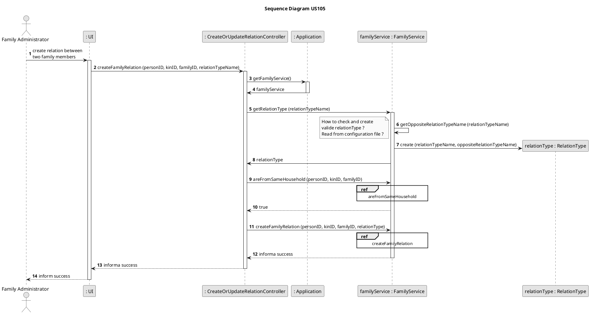
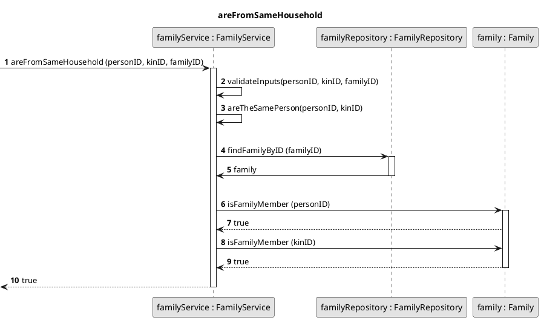
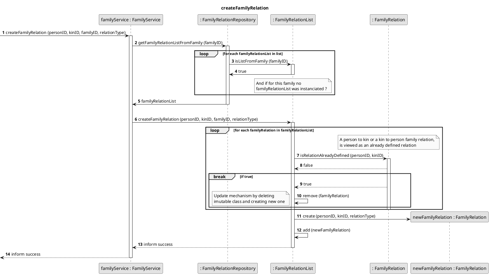

#Archive: [US105](../../user_stories/sp1/US105.md)

***

##\#1 Class diagram

```puml
skinparam linetype ortho
skinparam monochrome true
left to right direction

class CreateRelationController {
    + getListOfFamilyMembers(family)
    + createRelation(personId1, personId2, relationType)
}

class FFMApplication {
    + getInstance()
    + getPersonService()
    + getFamilyService()
    + getCategoryService()
}

class PersonService {
    - relations : List<RelationType>
    - isValidRelation(relationType)
    + getOpposite(relationType)
    + getListOfPossibleRelations()
    + createRelation(personId, kinId, relationType, familyId)
    + findPerson(personId)
    - initialiseListOfRelations();
}

class FamilyService {
    + getListOfFamilyMembers(familyId)
    + findFamily(familyId) 
}

class Family {
    - name : String
    - registration  : Date
    + getListOfFamilyMembers(familyId)
    + findPerson(personId) 
    + changeRelation(personId, relationType)
    + createRelation(personId, relationType)
    + addRelation(relation)
}

class FamilyRelation {
    - kinId : String
    - relationType : RelationType
}

class Person {
    - id : integer
    - name : String
    - birthDate : Date
    + changeRelation(personId, relationType)
}

class RelationType {
    - type: String
    - oppositeType
}

CreateRelationController --> FFMApplication 
CreateRelationController --> PersonService

FFMApplication -> PersonService
FFMApplication -> FamilyService
FamilyService "1" *-right- "0..*" Family

Person "0..*"--o "1" Family
Person "1" *-- "0..*" FamilyRelation 
PersonService o- RelationType
PersonService --> Person

RelationType -o FamilyRelation
```

*date: 2021-03-20*

**Needed improvements:**
- Implementation Domain-Driven-Design principles;

***

##\#1 Sequence diagram

```puml
skinparam monochrome true
autonumber

title SD Part1
actor "Family Administrator"

"Family Administrator" -> ":UI" : create relation between \ntwo family members
activate ":UI"
":UI" -> ":CreateOrUpdate\nRelationController" : getListOfFamilyMembers(familyId)


activate ":CreateOrUpdate\nRelationController"
":CreateOrUpdate\nRelationController" -> ":FFMApplication" : getFamilyService()
activate ":FFMApplication" 
":CreateOrUpdate\nRelationController" <-- ":FFMApplication" : familyService
deactivate ":FFMApplication" 

":CreateOrUpdate\nRelationController" -> "familyService:FamilyService" : getListOfFamilyMembers(familyId)

activate "familyService:FamilyService"
"familyService:FamilyService" -> "familyService:FamilyService" : findFamily(familyId)
"familyService:FamilyService" -> ":Family" : getListOfFamilyMembers()

activate ":Family"
"familyService:FamilyService" <-- ":Family" :List of family members
deactivate ":Family"

":CreateOrUpdate\nRelationController" <-- "familyService:FamilyService" :List of family members
deactivate "familyService:FamilyService"

alt One family member
    ":CreateOrUpdate\nRelationController" --> ":UI" : Message: not enough members
    
    note right : A zero members family \nis not possible because \nthe Family Administrator \nis part of the family.
else More than one family member
    ":CreateOrUpdate\nRelationController" --> ":UI" : List of family members
    deactivate ":UI"
    deactivate ":CreateOrUpdate\nRelationController"
    ref over ":UI"

        US105 SD Part2

    end ref
end
```

```puml
skinparam monochrome true
autonumber

title SD Part2

actor "Family Administrator"
"Family Administrator"<--":UI" : List of family members
activate ":UI"
"Family Administrator"->":UI" : Select two family members
note right : By selecting the first person \nwe could show just the people \nthat don't have yet a relation to it
"Family Administrator"<--":UI" : Ask for type of relation
":UI" -> ":CreateOrUpdate\nRelationController" : getListOfPossibleRelations()

participant ":FFMApplication"
activate ":CreateOrUpdate\nRelationController"
":CreateOrUpdate\nRelationController" -> ":FFMApplication" : getPersonService()
activate ":FFMApplication"
":CreateOrUpdate\nRelationController" <-- ":FFMApplication" : personService
deactivate ":FFMApplication"


":CreateOrUpdate\nRelationController" -> "personService\n:PersonService" : getListOfPossibleRelations()
activate "personService\n:PersonService"
":CreateOrUpdate\nRelationController" <-- "personService\n:PersonService" : List of relations
deactivate "personService\n:PersonService"

":UI" <-- ":CreateOrUpdate\nRelationController" : List of relation types
"Family Administrator"<--":UI" : Show all possible relation types
"Family Administrator"->":UI" : Inputs required data
":UI" -> ":CreateOrUpdate\nRelationController" : createRelation\n(personId, kinId, relationType, familyId)


":CreateOrUpdate\nRelationController" -> ":FFMApplication" : getPersonService()
activate ":FFMApplication"
":CreateOrUpdate\nRelationController" <-- ":FFMApplication" : personService
deactivate ":FFMApplication"

":CreateOrUpdate\nRelationController" -> "personService\n:PersonService" : createTwoWayRelation\n(personId, kinId, type, familyId)

participant "relations:\nList<RelationType>"
participant "relationType:RelationType"

activate "personService\n:PersonService"
"personService\n:PersonService" -> "personService\n:PersonService" : validateCreateRelationInputs\n(personId, kinId, familyId)
"personService\n:PersonService" -> "familyService\n:FamilyService" : findFamily()
activate "familyService\n:FamilyService"
"personService\n:PersonService" <-- "familyService\n:FamilyService" : family
deactivate "familyService\n:FamilyService"
"personService\n:PersonService" --> "family:Family" : findPerson(personId)
activate "family:Family"
"personService\n:PersonService" <-- "family:Family" : person
"personService\n:PersonService" --> "family:Family" : findPerson(kinId)
"personService\n:PersonService" <-- "family:Family" : kin
deactivate "family:Family"
"personService\n:PersonService" -> "relations:\nList<RelationType>" : getRelationTypeInstance(type)
activate "relations:\nList<RelationType>"
"personService\n:PersonService" <- "relations:\nList<RelationType>" : relationType
deactivate "relations:\nList<RelationType>"
"personService\n:PersonService" -> "relationType:RelationType" : relationType.getOpposite()
activate "relationType:RelationType"
"personService\n:PersonService" <- "relationType:RelationType" : oppositeRelationType
deactivate "relationType:RelationType"

ref over "personService\n:PersonService"

    person.insertRelation(kin, relationType)

end ref

ref over "personService\n:PersonService"

    kin.insertRelation(person, oppositeRelationType)

end ref

"personService\n:PersonService" --> ":CreateOrUpdate\nRelationController" : informs success
deactivate "personService\n:PersonService"
":CreateOrUpdate\nRelationController" --> ":UI" : informs success
deactivate ":CreateOrUpdate\nRelationController"

":UI" --> "Family Administrator" : informs success
deactivate ":UI"
```


```puml
skinparam monochrome true
autonumber

title insertRelation(kin, relationType)

[-> "person:Person" : insertRelation\n(kin, relationType)


participant "relations :List<FamilyRelation>"
loop for each relation in relations
    "person:Person"->"relation : FamilyRelation" : isSameKin(kin)
    activate "relation : FamilyRelation"
    "person:Person"<--"relation : FamilyRelation" : false
    break if true
        "person:Person"<--"relation : FamilyRelation" : true
        deactivate "relation : FamilyRelation"
        "person:Person"->"relations :List<FamilyRelation>" : relations.remove(relation)
        activate "relations :List<FamilyRelation>"
    end
end
opt if loop returns false
    "person:Person"-> "newRelation: FamilyRelation" ** : create (kin, relationType)
    
    "person:Person"->"relations :List<FamilyRelation>" : add(newRelation)
    deactivate "relations :List<FamilyRelation>"
end
deactivate "person:Person"
[<-- "person:Person" : informs success
deactivate ":Family"
```

*date: 2021-03-20*

**Needed improvements:**
- Implementation Domain-Driven-Design principles;
- The creation of a symmetric family relation is not needed - PO conversation on 2021-03-19;

***

##\#2 Sequence diagram


[//]: <> (=================================================================================)


[//]: <> (=================================================================================)


*date: 2021-03-22*

**Needed improvements:**
- A FamilyRelation Aggregate is not necessary. All FamilyRelations will be stored inside family.