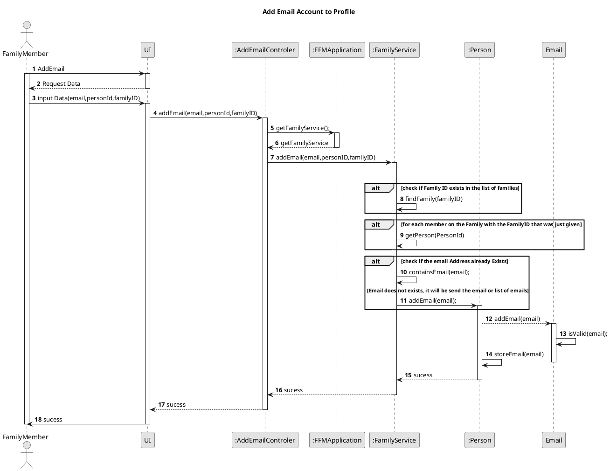

US151 - Add email to profile 
===============================================================


# 1. Requirements

>__"As a family member, I want to add an email account to my profile."__

## 1.1. Description 
* Any family member has the possibility to add an email their profile. 

# 2. Analysis
To meet this requirement, a few key pieces of data are need: 
- An Email address to add
- A Person ID of the Person's profile
- A FamilyID of the Person's Family

For this User Story and in this sprint, the personID and the familyID will have to be input along with the email Address because with need a way to identify the Person.
We interpreted this requirement as the function of a user to add an email account to his profile information.

## 2.1. Product Owner Requirements
During the Sprint, the product owner (PO) set some specifications that contribute to the design and implementation of 
the US.

> Q: Can a person (or administrator) belong to more than one family?
- No.If a person wants to be a part of another family, they must use another email address.

Also and related to another User story a family member can be created with or without a email address. 


## 2.2 Decisions
- One of decisions in the beginning of the switchtwentytwenty, was about the class where the add email operation should be stored, it was decided to implement on the Person because it is an action made by a Person.
- Another decision that was made was to assume that the email to be introduced must be an email that is not assigned to any user regardless of the family to which they belong.
- In the event of a case a family member try to add an email list with one email address on invalid format, none of the emails of the present list are added to the email list that the person has.
- Taking into account the possibility that a person may belong to two families, he cannot have the same email to be added to both.

## 2.3. US Dependencies

* This User Story has other user stories dependencies, like US150(get my profile’s information), US010 (to create a family) and US101 (add family members),
 because that is necessary to have a family in order to add family members and to create a profile information, and then an only then it is possible to add an email account to the actor's profile.
 
## 2.4. System Sequence Diagram

```puml
skinparam monochrome true
autonumber
title SSD
actor "Family Member"

"Family Member" -> "System" : add an email account to the my profile 
activate "Family Member"
activate "System"
|||  
"Family Member" <-- "System" : asks email, personID, familyID

"Family Member" -> "System" : inputs email, personID, familyID

|||
"Family Member" <-- "System" : returns result
deactivate "Family Member"
deactivate "System"

```
 
 
# 3. Design

## 3.1. Functionalities Flow


## 3.2. Class Diagram

The main Classes involved are:
 - AddEmailController
 - Application
 - PersonService
 - FamilyService
 - Person
 - Email

```puml

skinparam monochrome true
skinparam nodesep 100
skinparam monochrome true

class "AddEmailController"
class "FFMApplication"
class "Person"
class "Email"
class "PersonService"
class "FamilyService"

class AddEmailController {
    -app : FFMApplication
    + addEmail(email,personId)
    
}

class FFMApplication {
    - app : FFMApplication
    - personService : PersonService
    - familyService : FamilyServicee
    - categoryService : CategoryService
    + getPersonService()
    + getFamilyService()
    + getCategoryService()
}

class PersonService {
    - familyService : FamilyService
    + addEmail(email,personId)
    - getAllUsersEmails()
    - findPerson(personId)
}

class FamilyService{
 - families : List<Family>
    + getListOfFamilyMembers(familyId)
    + findFamily(familyId) 
}


class Person {
    - id : integer
    - name : String
    - birthDate : Date
    - vat : VAT
    - address : PostalAddress
    - phoneNumbers : List<PhoneNumber>
    - emails : List<Email>
    - relations : List<FamilyRelation> 
    + addEmail(email)
}

class Family {
-id : String
-name : String
-registration : Date
-members : List<Person>
-administrator : Person
-cashAccount : CashAccount
-categories : List<Category>

+getListOfFamilyMembers()

}

class Email {
    - emailAddress: String
    - isValid(emailAddress)
    - checkFormat(emailFormat)
}


AddEmailController -right- FFMApplication 
PersonService "1"-- "1..*" Person
Person "1"*-----right-----"0..*" Email
FamilyService -down-* FFMApplication
FFMApplication *--right-- PersonService
FamilyService "1" o---right--- "1..*" Family
Person "1..*" --o "1" Family

@enduml

```

As shown in the sequence and class diagrams there is the class Controller that makes the connection between the UI and the business logic.
The AddEmailController will invoke the FFMApplication object, which stores the PersonService which in turns stores the Person object.
It will call its addEmail method. This will involve running some methods with the purpose to verify that the family ID corresponds to a created family and that the person's id really corresponds to a family member.
After that and through the containsEmail method it will verify if the email does already exist on another user, 
it will then create an Email object after getting a validation email Address in the Email constructor. 
This Email object will be stored on the Person object. 
All person's emails are stored in the Person class.


## 3.3. Applied Design Patterns

From GRASP design pattern was applied the principles of Controller, Information Expert and Low Coupling.
From SOLID pattern was applied the Single Responsability Principle.


## 3.4. Tests 
Email class tests that validate what is entered in the Email Address attribute

**Test 1:** Create a email with an invalid domain

	@Test
        public void CreatingEmailAddressWithInvalidDomain() {
    
            Exception exception = assertThrows(IllegalArgumentException.class, () -> {
                Email badEmail = new Email("miguel+as@gmail.com");
            });
            String exceptionMessage = exception.getMessage();
            String expectedMessage = "The email Address is not in the correct format.";
            assertEquals(exceptionMessage, expectedMessage);

**Test 2:** Create a email with an invalid domain (blank spaces in the email)
   
    @Test
       public void CreatingEmailAddressWithBlankSpaces() {
           Exception exception = assertThrows(IllegalArgumentException.class, () -> {
               Email badEmail = new Email("  ");
           });
           String exceptionMessage = exception.getMessage();
           String expectedMessage = "The email Address can't have blank spaces.";
           
           //assert
           assertEquals(exceptionMessage, expectedMessage);
       }
 
 **Test 2.1:** Create a email with an null
 
     @Test
     public void CreatingEmailAddressWithNull() {
 
         Exception exception = assertThrows(NullPointerException.class, () -> {
             Email badEmail = new Email(null);
         });
 
         String exceptionMessage = exception.getMessage();
         String expectedMessage = "The email Address can't be null";
         
         //assert
         assertEquals(exceptionMessage, expectedMessage);
     }
    
       

**Test 3:** Create a email with an valid domain
    
      @Test
       public void CreatingValidEmailAddress() {
        Email email = new Email("1120717@isep.ipp.pt");
        //assert
        Assertions.assertNotNull(email);
    }
	
In the PersonService class, it is verified that the Person and Family ID's exist
 and that the inserted email is no longer assigned to someone.

**Test 4:** Failure to add an email Address - The email already belongs to another Person


      @Test
   
      void failureToAddAnEmailThatAlreadyExists() {

        //arrange
        
        FamilyService familyService = new FamilyService(app.getCategoryService());
        Family family = new Family("santos");
        familyService.addFamily(family);
        String familyID = family.getId();
        PersonService personService = new PersonService(familyService);

        ArrayList<String> phoneNumbers = new ArrayList<>();
        phoneNumbers.add("915482678");
        ArrayList<String> emails = new ArrayList<>();
        emails.add("holidays@gmail.com");

        familyService.addFamilyMember(
                "12589078",
                "Miguel",
                "2/5/1998",
                "256324778",
                "2",
                "Rua Nova",
                "Porto",
                "Portugal",
                "4444-001",
                phoneNumbers, emails, familyID);

        //Try to add Second member
        ArrayList<String> phoneNumbers2 = new ArrayList<>();
        phoneNumbers2.add("915524678");
        ArrayList<String> emails2 = new ArrayList<>();
        emails2.add("joana_travel@gmail.com");

        familyService.addFamilyMember(
                "12945678",
                "Joana",
                "5/02/1998",
                "210527242",
                "10A",
                "Rua Velha",
                "Maia",
                "Portugal",
                "4444-100",
                phoneNumbers2, emails2, familyID);

        String familyMemberTwoId = family.getListOfFamilyMembers().get(1).getId();

        //act
        Exception exception = assertThrows(IllegalStateException.class, () -> {
            personService.addEmail("holidays@gmail.com", familyMemberTwoId, familyID);
        });

        String exceptionMessage = exception.getMessage();
        String expectedMessage = "Email address already Exists.";
        
        //assert
        assertEquals(exceptionMessage, expectedMessage);


    }


       
**Test 5:** Failure to add an email Address - This personId is assigned to a Person that does not exists. 

      @Test
       void failureToAddAnEmailToAPersonThatDoesNotExist() {
  
           //arrange
           
           FamilyService familyService = new FamilyService(app.getCategoryService());
           Family family = new Family("reis");
           familyService.addFamily(family);
           String familyID = family.getId();
           PersonService personService = new PersonService(familyService);
           ArrayList<String> phoneNumbers = new ArrayList<>();
           phoneNumbers.add("915482678");
           ArrayList<String> emails = new ArrayList<>();
           emails.add("holidays@gmail.com");
   
           familyService.addFamilyMember(
                   "125896448ZX6",
                   "Miguel",
                   "2/5/1998",
                   "123456789",
                   "2",
                   "Rua Nova",
                   "Porto",
                   "Portugal",
                   "4444-001",
                   phoneNumbers, emails, familyID);
   
           String notExistingMemberId = "2387ryreyuh";
   
            //act
            
           Exception exception = assertThrows(NullPointerException.class, () -> {
               personService.addEmail("miguel_work@gmail.com", notExistingMemberId, familyID);
           });
   
           String exceptionMessage = exception.getMessage();
           String expectedMessage = "The Person does not exist.";
           
           //assert
           assertEquals(exceptionMessage, expectedMessage);
   
       }

    
**Test 5:** Failure to add an email Address - This familyId is assigned to a Family that does not exists. 
 
    @Test
        void failureToAddAnEmailToAPersonThatDoesNotExistInAFamily() {
 
        // arrange
        
         FamilyService familyService = new FamilyService(app.getCategoryService());
         Family family = new Family("martins");
         familyService.addFamily(family);
         String familyID = family.getId();
         PersonService personService = new PersonService(familyService);
         ArrayList<String> phoneNumbers = new ArrayList<>();
         phoneNumbers.add("915482678");
         ArrayList<String> emails = new ArrayList<>();
         emails.add("holidays@gmail.com");
 
         familyService.addFamilyMember(
                 "125896448ZX1",
                 "Miguel",
                 "2/5/1998",
                 "123456789",
                 "2",
                 "Rua Nova",
                 "Porto",
                 "Portugal",
                 "4444-001",
                 phoneNumbers, emails, familyID);
 
         String familyMemberOneId = family.getListOfFamilyMembers().get(0);
         String notExistingFamilyId = "jsadygfsyf45453";
 
         //act
         Exception exception = assertThrows(NullPointerException.class, () -> {
             personService.addEmail("miguel_work@gmail.com", notExistingFamilyId, familyMemberOneId);
         });
 
         String exceptionMessage = exception.getMessage();
         String expectedMessage = "The Family does not exist.";
         
         //assert
         assertEquals(exceptionMessage, expectedMessage);
         assertNotEquals(familyID, notExistingFamilyId);
     }   

**Test 6:** Add an email Address to a Person.
                
        @Test
            void AddAnEmailToAPerson() {
              
              //arrange
              
                FamilyService familyService = new FamilyService(app.getCategoryService());
                Family family = new Family("reis");
                familyService.addFamily(family);
                String familyID = family.getId();
                PersonService personService = new PersonService(familyService);
                ArrayList<String> phoneNumbers = new ArrayList<>();
                phoneNumbers.add("915482678");
                ArrayList<String> emails = new ArrayList<>();
                emails.add("miguel_holidays@gmail.com");
        
                familyService.addFamilyMember(
                        "125896448ZX1",
                        "Miguel",
                        "2/5/1998",
                        "123456789",
                        "2",
                        "Rua Nova",
                        "Porto",
                        "Portugal",
                        "4444-001",
                        phoneNumbers, emails, familyID);
        
                String familyMemberOneId = family.getListOfFamilyMembers().get(0);
                boolean result = false;

                // act
                result = personService.addEmail("miguel_work@gmail.com", familyMemberOneId, familyID);
                
                //assert
                assertTrue(result);
            }
            
            

**Test 7:** In class controller - Add an valid Email Address to a Person that was created without an Email.     

    @Test
        @DisplayName("Add an valid Email Address to a Person that was created without an Email")
        void addEmailToAnAccountToAnAccountThatHasNone() {
    
            //arrange
            AddEmailController addEmailController = new AddEmailController(app);
            //CreateFamilyController createFamilyController = new CreateFamilyController(app);
           
            FamilyService familyService = this.app.getFamilyService();
            PersonService personService = this.app.getPersonService();
    
    
            Family family = new Family("furtado");
            familyService.addFamily(family);
            String familyID = family.getId();
    
            ArrayList<String> phoneNumbers = new ArrayList<String>();
            phoneNumbers.add("919104587");
    
            familyService.addFamilyMember(
                    "15398629", "Tomas", "31/01/1997", "136534481",
                    "15", "Rua da Estação", "Paredes", "Portugal", "4589-701", phoneNumbers, null, familyID);
    
            emailAddress = "1400777@isep.ipp.pt";
    
            String familyMemberId = family.getListOfFamilyMembers().get(0).getId();
    
            boolean result = false;
            
            //act
            result = addEmailController.addEmail(emailAddress, familyMemberId,familyID);
    
            //Verify is the operation was made
            assertTrue(result);

# 4. Implementation

* Has shown in the sequence diagram, when you add an email to your profile, you need to make sure that the person id, familyId are already assigned  
to an existing person in a existing family. After that you need to make sure that the email that is about to be inserted it is unique and in a correct format.
This code snippet shows this validation in the method addEmail in Person Service class:


    public boolean addEmail(String email, String personID, String familyID) {
        if (email == null || email.trim().length() == 0) {
            return false;
        }
        Family f = familyService.findFamily(familyID);
        if (f == null) {
            throw new NullPointerException("The Family does not exist.");
        }
        Person person = familyService.findFamily(familyID).findPerson(personID);
        if (person == null) {
            throw new NullPointerException("The Person does not exist.");
        }

        if (this.familyService.containsEmail(email)) {
            // emailAddress already exists
            throw new IllegalStateException("Email Address already Exists.");
        }
        return person.addEmail(email);
    }


After verifying the Person id, family id and verifying the uniqueness of the email,
the method addEmails of the Person class is called which will add the email to the person's email list.
The following code snippet shows this validation in the method addEmails in Person class:

      public boolean addEmail(String inputEmail) {
             try {
                 Email email = new Email(inputEmail);
                 emails.add(email);
             } catch (Exception exception) {
                 return false;
             }
             return true;
         }
     
    
If the email address is null or on a invalid format, the email is not added to the family member profile.
If the email address are not null, it will be created a new email after a verification on Email class. 

  
 
# 5. Integration/Demo

The [US151](./US151.md) to add an email to my user profile. 
The addEmail method in the controller class will try to handle some exception that could be throwed in the class PersonService
When the method from controller class handles the exception it returns false, which could be transmited was - the operation was not complete- which means the email address was not added.
That prevents possible incoherent outputs.

# 6. Observations

Given the possibility of creating a family member without an email, the group defined that the if the email is not valid, it will be replace by an empty list.
This brought the need to validate, in the Person and Person Service classes, the inserted email, preventing the addition of a null email address.


