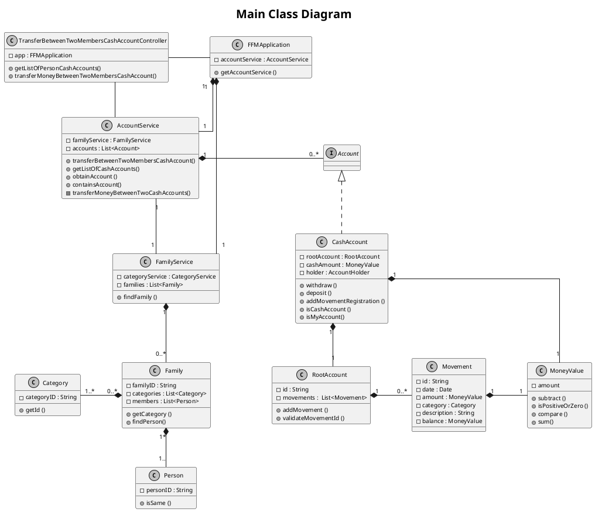

# US180
=======================================


# 1. Requirements

>__"As a family member, I want to transfer money from my cash account to another family member’s cash account."__

## 1.1 Description
**Demo1** As a family member, I want to select another family member's cash account in which I want to make a deposit.
- Demo1.1. select the cash account in which I want to make a deposit.
- Demo1.2. if the account selected isn't a cash account, the requirement cannot be fulfilled.

**Demo2** As a family member, I want to register a transfer using my cash account and the other family member's cash account.
- Demo2.1. select the cash account and add the transfer registration.
- Demo2.2. if one of the two family members don't have a cash account, the requirement cannot be fulfilled.
- Demo2.3. if the transfer input data are wrong, the requirement cannot be fulfilled.

The requirement of this US focuses on the registration of the transfer occurring between two family member's cash accounts.
To fulfill this purpose, the family member that wants to make the transfer must select the cash account in which is supposed to make the deposit and introduce the correct data.
The registration of this transfer takes place in two accounts:
- in the account of the family member who wants to make the transfer, at the same moment that the money is withdrawn from this account;
- in the account of the family member who will receive the transfer, at the same moment the money is deposited in this account.

So, the registration of this transfer is saved in both cash accounts.
Therefore, both family members must have a cash account created and assigned. Otherwise, the requirement isn't successfully crafted.


# 2. Analysis

## 2.1 Product Owner 

The product owner (PO) set some specifications that contribute to the design and implementation of
this US.

> Q: Which data should be presented in the movement registration on the Cash Account ?
>
>A: Each movement contains a description, a category, the date of the transfer, amount of money involved and the
balance of the cash account after the transfer.

> Q: Can the family member have more than one cash account?
>
>A: For now, each family member has one person cash account.

## 2.2 Decisions

The major decision made in this US was to save all the movements in each root account.

## 2.3 Dependent US

To implement this US it is necessary that both family members have a cash account.
Therefore, these accounts must be created in order to be used at the time of the transfer.
Thus, this US depends directly on US170.

## 2.4 System sequence diagram

```puml
skinparam monochrome true
skinparam defaultFontSize 10
autonumber
title SSD
actor "Family Member"

"Family Member" -> "System" : get list of accounts of the family member\nto which I want to transfer the money
activate "Family Member"
activate "System"
|||  
"Family Member" <-- "System" : show list of accounts

"Family Member" -> "System" : select account
|||
"Family Member" <-- "System" : ask for input data

"Family Member" -> "System" : insert required data
|||
"Family Member" <-- "System" : inform result
deactivate "Family Member"
deactivate "System"

```


# 3. Design

## 3.1. Functionalities Flow


```puml
skinparam monochrome true
autonumber
title Sequence Diagram - US180
actor FamilyMember

activate FamilyMember
FamilyMember -> ":UI" : Get list of the other family\nmember cash accounts
activate ":UI"
":UI" -> ": TransferBetweenTwoMembersController" : getListOfPersonCashAccounts(person2Id)
activate ": TransferBetweenTwoMembersController"

": TransferBetweenTwoMembersController" -> ":FFMApplication" : getAccountService()
activate ":FFMApplication" 
":FFMApplication" --> ": TransferBetweenTwoMembersController" : accountService
deactivate ":FFMApplication"

": TransferBetweenTwoMembersController" -> "accountService:\nAccountService" : getListOfCashAccounts(person2Id)
activate "accountService:\nAccountService"

 "accountService:\nAccountService" -> "listOfPersonAccounts\n:List<AccountDTO>" *: create
            
            loop for each account in system 
                "accountService:\nAccountService" -> "accountDTO:AccountDTO" *: create
                "accountService:\nAccountService" -> "accountService:\nAccountService" : listOfPersonAccounts.add(accountDTO)
            end
        


"accountService:\nAccountService" --> ": TransferBetweenTwoMembersController" : listOfCashAccountsDTO
deactivate "accountService:\nAccountService"
": TransferBetweenTwoMembersController" --> ":UI" : listOfCashAccountsDTO
deactivate ": TransferBetweenTwoMembersController"

":UI" --> FamilyMember : List of the other family\nmember cash accounts
deactivate ":UI" 

FamilyMember -> ":UI" : Transfer money from my cash account \n to another family member's cash account
activate ":UI" 
":UI" -> ": TransferBetweenTwoMembersController" : transferMoneyBetweenTwoMembersCashAccount(person1Id, person2Id, familyId,\nperson1AccountId, person2AccountId, amount, categoryId, description, date)
activate ": TransferBetweenTwoMembersController" 

": TransferBetweenTwoMembersController" -> ":FFMApplication" : getAccountService()
activate ":FFMApplication" 
":FFMApplication" --> ": TransferBetweenTwoMembersController" : accountService
deactivate ":FFMApplication"

": TransferBetweenTwoMembersController" -> "accountService:\nAccountService" : transferBetweenTwoMembersCashAccount(person1Id, person2Id, familyId,\nperson1AccountId, person2AccountId, amount, categoryId, description, date)

activate "accountService:\nAccountService"


 ref over "accountService:\nAccountService"

        Sequence Diagram - US180 Part II

    end ref
    
    
"accountService:\nAccountService" --> ":FFMApplication": informResult    
deactivate "accountService:\nAccountService"

":FFMApplication" --> ": TransferBetweenTwoMembersController": informResult 
deactivate ":FFMApplication"

": TransferBetweenTwoMembersController" --> ":UI" : informResult 
deactivate ": TransferBetweenTwoMembersController"

":UI" --> FamilyMember : Inform Result 
deactivate ":UI"
deactivate FamilyMember

```


```puml
skinparam monochrome true
autonumber
title Sequence Diagram - US180 Part II


[-> "accountService:\nAccountService" : transferBetweenTwoMembersCashAccount(person1Id, person2Id, familyId,\nperson1AccountId, person2AccountId, amount, categoryId, description, date)
activate "accountService:\nAccountService"

"accountService:\nAccountService" -> "familyService:\nFamilyService" : findFamily(familyId)
activate "familyService:\nFamilyService"

"familyService:\nFamilyService" -> "family:\nFamily" : isSame(familyId)
activate "family:\nFamily"

"family:\nFamily" --> "familyService:\nFamilyService" : returnBoolean
deactivate "family:\nFamily"


"familyService:\nFamilyService" --> "accountService:\nAccountService" : family
deactivate "familyService:\nFamilyService"

"accountService:\nAccountService" -> "accountService:\nAccountService" : obtainAccount(person1AccountId)
"accountService:\nAccountService" -> "accountService:\nAccountService" : obtainAccount(person2AccountId)

alt if the members belong to the family

"accountService:\nAccountService" -> "family:\nFamily" : isPersonOnTheFamily(person1Id)
activate "family:\nFamily"
"family:\nFamily" -> ":Person" : isSame(person1Id)
activate ":Person"
":Person" --> "family:\nFamily" : returnBoolean
deactivate ":Person"
"family:\nFamily" --> "accountService:\nAccountService" : returnBoolean
deactivate "family:\nFamily"
"accountService:\nAccountService" -> "family:\nFamily" : isPersonOnTheFamily(person2Id)
activate "family:\nFamily"
"family:\nFamily" -> ":Person" : isSame(person2Id)
activate ":Person"
":Person" --> "family:\nFamily" : returnBoolean
deactivate ":Person"
"family:\nFamily" --> "accountService:\nAccountService" : returnBoolean
deactivate "family:\nFamily"
"accountService:\nAccountService" -> "accountService:\nAccountService" : getCategory(categoryId)

"accountService:\nAccountService" -> "moneyValue:\nMoneyValue" ** : create(amount)
activate "moneyValue:\nMoneyValue"
"moneyValue:\nMoneyValue" --> "accountService:\nAccountService" : moneyValue
deactivate "moneyValue:\nMoneyValue"


"accountService:\nAccountService" -> "accountService:\nAccountService" : transferMoneyBetweenTwoCashAccounts(person1Account,\nperson2Account, amount, category, description, date)


 ref over "accountService:\nAccountService"

        Validate Transfer Between Two Accounts

    end ref

else if one of the members don't belong to the family
"accountService:\nAccountService" --> "accountService:\nAccountService" : Message: "Is not possible to make this transfer".
end

[<-- "accountService:\nAccountService" : informResult
deactivate "accountService:\nAccountService"
```


```puml
skinparam monochrome true
autonumber
title Validate Transfer Between Two Accounts

alt if the two accounts are cash accounts
"accountService:\nAccountService" -> "originAccount:\nCashAccount" : isCashAccount()
activate "accountService:\nAccountService"
activate "originAccount:\nCashAccount"
"originAccount:\nCashAccount" --> "accountService:\nAccountService" : returnBoolean
deactivate "originAccount:\nCashAccount"

"accountService:\nAccountService" -> "destinyAccount:\nCashAccount" : isCashAccount()
activate "destinyAccount:\nCashAccount"
"destinyAccount:\nCashAccount" --> "accountService:\nAccountService" : returnBoolean
deactivate "destinyAccount:\nCashAccount"

"accountService:\nAccountService" -> "originAccount:\nCashAccount" : withdraw(moneyValue, category, description, date)
activate "originAccount:\nCashAccount" 

alt if amount is higher than the balance of \nthe account or amount is negative or zero
"originAccount:\nCashAccount" -> "moneyValue:\nMoneyValue" : compare(moneyValue)
activate "moneyValue:\nMoneyValue"
"moneyValue:\nMoneyValue" --> "originAccount:\nCashAccount" : informResult
deactivate "moneyValue:\nMoneyValue"
"originAccount:\nCashAccount" --> "originAccount:\nCashAccount" : Message: "Not enough money."
else if amount is not smaller than the balance of \nthe account and amount is positive

"originAccount:\nCashAccount" -> "moneyValue:\nMoneyValue" : subtract(moneyValue)
activate "moneyValue:\nMoneyValue"
"moneyValue:\nMoneyValue" --> "originAccount:\nCashAccount" : returnBoolean
deactivate "moneyValue:\nMoneyValue"

"originAccount:\nCashAccount" -> "originAccount:\nRootAccount" : addMovement(moneyValue,\ncategory, description, date, balance)
activate "originAccount:\nRootAccount"
"originAccount:\nRootAccount" -> "movement:\nMovement" ** : create(moneyValue, category, description, date)
activate "movement:\nMovement"
"movement:\nMovement" --> "originAccount:\nRootAccount": returnMovement
deactivate "movement:\nMovement"
"originAccount:\nRootAccount" -> "movements:\nList<Movement>" : addMovement(moneyValue,\ncategory, description, date, balance)
activate "movements:\nList<Movement>"
"movements:\nList<Movement>" --> "originAccount:\nRootAccount" : returnBoolean
deactivate "movements:\nList<Movement>"
"originAccount:\nRootAccount" --> "originAccount:\nCashAccount" : return boolean

deactivate "originAccount:\nRootAccount"
end

"originAccount:\nCashAccount" --> "accountService:\nAccountService" : returnBoolean

deactivate "originAccount:\nCashAccount"

"accountService:\nAccountService" -> "destinyAccount:\nCashAccount" : deposit(moneyValue, category, description, date)
activate "destinyAccount:\nCashAccount"

alt if amount is amount is negative or zero
"destinyAccount:\nCashAccount" --> "destinyAccount:\nCashAccount" : Message: "Not enough money."
else if amount is positive

"destinyAccount:\nCashAccount" -> "moneyValue:\nMoneyValue" : sum(moneyValue)
activate "moneyValue:\nMoneyValue"
"moneyValue:\nMoneyValue" --> "destinyAccount:\nCashAccount" : returnBoolean
deactivate "moneyValue:\nMoneyValue"
"destinyAccount:\nCashAccount" -> "destinyAccount:\nRootAccount" : addMovement(moneyValue,\ncategory, description, date, balance)
activate "destinyAccount:\nRootAccount"
"destinyAccount:\nRootAccount" -> "movement:\nMovement" ** : create(moneyValue, category, description, date)
activate "movement:\nMovement"
"movement:\nMovement" --> "destinyAccount:\nRootAccount": returnMovement
deactivate "movement:\nMovement"
"destinyAccount:\nRootAccount" -> "movements:\nList<Movement>" : addMovement(moneyValue,\ncategory, description, date, balance)
activate "movements:\nList<Movement>"
"movements:\nList<Movement>" --> "destinyAccount:\nRootAccount" : returnBoolean
deactivate "movements:\nList<Movement>"
"destinyAccount:\nRootAccount" --> "destinyAccount:\nCashAccount" : return boolean
deactivate "destinyAccount:\nRootAccount"
end


"destinyAccount:\nCashAccount" --> "accountService:\nAccountService" : returnBoolean
deactivate "destinyAccount:\nCashAccount"


else if one of the accounts is not a cash accounts
"accountService:\nAccountService" --> "accountService:\nAccountService" : Message: This transfer is only applied to cash accounts
end

deactivate "accountService:\nAccountService"
```


## 3.2. Class Diagram



## 3.3. Applied Design Patterns

From GRASP pattern:
Controller, Information Expert, Low Coupling

From SOLID:
Single Responsibility Principle

## 3.4. Tests 

The input given by the family member to the controller will be filter by two function:
- getListOfPersonCashAccounts()
- transferMoneyBetweenTwoMembersCashAccount()

**Test 1:** Test to transfer a valid amount from a family member cash account to another family member cash account:

        @Test
        void testToTransferAValidAmountFromAFamilyMemberToAnotherFamilyCashAccount() {
        this.app = new FFMApplication();
        FamilyService familyService = this.app.getFamilyService();
        AccountService accountService = this.app.getAccountService();
        CategoryService categoryService = this.app.getCategoryService();
        TransferBetweenTwoMembersCashAccountController controller = new TransferBetweenTwoMembersCashAccountController(this.app);

        //create family category
        Category category = categoryService.createCategory("Food");

        //create family
        String familyID = familyService.createFamily("Verne");
        Family family = familyService.findFamily(familyID);

        //create family member
        List<String> julesPhoneNumbers = new ArrayList<String>();
        julesPhoneNumbers.add("914565807");
        List<String> julesEmails = new ArrayList<String>();
        julesEmails.add("julesverne@isep.ipp.pt");
        familyService.addFamilyMember("199184437ZX0", "Jules Verne", "08/02/1828",
                "233109510", "54", "Rua dos Dragões", "Porto", "Portugal",
                "4423-876", julesPhoneNumbers, julesEmails, familyID);

        List<String> paulPhoneNumbers = new ArrayList<String>();
        paulPhoneNumbers.add("914565808");
        List<String> paulEmails = new ArrayList<String>();
        paulEmails.add("paulverne@isep.ipp.pt");
        familyService.addFamilyMember("133572358ZX7", "Paul Verne", "29/11/1829",
                "236667530", "54", "Rua dos Dragões", "Porto", "Portugal",
                "4423-876", paulPhoneNumbers, paulEmails, familyID);

        //create family member's cash account
        String person1ID = family.getPersonIdbyCc("199184437ZX0");
        String person2ID = family.getPersonIdbyCc("133572358ZX7");

        accountService.createPersonCashAccount(person1ID, family.getId(), 300, "My Cash Account");
        String person1AccountId = accountService.getListOfPersonAccounts(person1ID).get(0).getId();

        accountService.createPersonCashAccount(person2ID, family.getId(), 100, "My Cash Account");
        String person2AccountId = accountService.getListOfPersonAccounts(person2ID).get(0).getId();

        //determine initial amount in Jules cash account and in Paul cash account
        MoneyValue initialPerson1Amount = accountService.obtainAccount(person1AccountId).getBalance();
        MoneyValue initialPerson2Amount = accountService.obtainAccount(person2AccountId).getBalance();

        //act
        boolean result = controller.transferMoneyBetweenTwoMembersCashAccount(person1ID, person2ID, family.getId(), person1AccountId, person2AccountId, 50, category.getId(), "Dinner at MacDonald", "01/02/2021");

        //determine amount in family cash account and in person cash account after the transfer
        MoneyValue finalPerson1Amount = accountService.obtainAccount(person1AccountId).getBalance();
        MoneyValue finalPerson2Amount = accountService.obtainAccount(person2AccountId).getBalance();

        MoneyValue transferAmount = new MoneyValue(new BigDecimal(50));
        MoneyValue expected1 = initialPerson1Amount.subtract(transferAmount);
        MoneyValue expected2 = initialPerson2Amount.sum(transferAmount);

        //verify if movements were added to the list of movements of each account
        Account accountPerson1 = accountService.obtainAccount(person1AccountId);
        Account accountPerson2 = accountService.obtainAccount(person2AccountId);
        int size1 = accountPerson1.getListOfAllMovements().size();
        int size2 = accountPerson2.getListOfAllMovements().size();

        //assert
        assertEquals(expected1, finalPerson1Amount);
        assertEquals(expected2, finalPerson2Amount);
        assertEquals(1, size1);
        assertEquals(1, size2);
        assertTrue(result);
    }

**Test 2:** Test to fail to transfer an invalid amount from a family member cash account to another family member cash account:

        @Test
        void testToTransferAnInvalidAmountFromAFamilyMemberToAnotherFamilyCashAccount() {
        this.app = new FFMApplication();
        FamilyService familyService = this.app.getFamilyService();
        AccountService accountService = this.app.getAccountService();
        CategoryService categoryService = this.app.getCategoryService();
        TransferBetweenTwoMembersCashAccountController controller = new TransferBetweenTwoMembersCashAccountController(this.app);

        //create family category
        Category category = categoryService.createCategory("Food");

        //create family
        String familyID = familyService.createFamily("Verne");
        Family family = familyService.findFamily(familyID);

        //create family member
        List<String> julesPhoneNumbers = new ArrayList<String>();
        julesPhoneNumbers.add("914565807");
        List<String> julesEmails = new ArrayList<String>();
        julesEmails.add("julesverne@isep.ipp.pt");
        familyService.addFamilyMember("199184437ZX0", "Jules Verne", "08/02/1828",
                "233109510", "54", "Rua dos Dragões", "Porto", "Portugal",
                "4423-876", julesPhoneNumbers, julesEmails, familyID);

        List<String> paulPhoneNumbers = new ArrayList<String>();
        paulPhoneNumbers.add("914565808");
        List<String> paulEmails = new ArrayList<String>();
        paulEmails.add("paulverne@isep.ipp.pt");
        familyService.addFamilyMember("133572358ZX7", "Paul Verne", "29/11/1829",
                "236667530", "54", "Rua dos Dragões", "Porto", "Portugal",
                "4423-876", paulPhoneNumbers, paulEmails, familyID);

        //create family member's cash account
        String person1ID = family.getPersonIdbyCc("199184437ZX0");
        String person2ID = family.getPersonIdbyCc("133572358ZX7");

        accountService.createPersonCashAccount(person1ID, family.getId(), 300, "My Cash Account");
        String person1AccountId = accountService.getListOfPersonAccounts(person1ID).get(0).getId();

        accountService.createPersonCashAccount(person2ID, family.getId(), 100, "My Cash Account");
        String person2AccountId = accountService.getListOfPersonAccounts(person2ID).get(0).getId();

        //determine initial amount in Jules cash account and in Paul cash account
        MoneyValue initialPerson1Amount = accountService.obtainAccount(person1AccountId).getBalance();
        MoneyValue initialPerson2Amount = accountService.obtainAccount(person2AccountId).getBalance();

        //act
        boolean result = controller.transferMoneyBetweenTwoMembersCashAccount(person1ID, person2ID, family.getId(), person1AccountId, person2AccountId, -50, category.getId(), "Dinner at MacDonald", "01/02/2021");

        //determine amount in family cash account and in person cash account after the transfer
        MoneyValue finalPerson1Amount = accountService.obtainAccount(person1AccountId).getBalance();
        MoneyValue finalPerson2Amount = accountService.obtainAccount(person2AccountId).getBalance();

        //verify if movements were added to the list of movements of each account
        Account accountPerson1 = accountService.obtainAccount(person1AccountId);
        Account accountPerson2 = accountService.obtainAccount(person2AccountId);
        int size1 = accountPerson1.getListOfAllMovements().size();
        int size2 = accountPerson2.getListOfAllMovements().size();

        //assert
        assertEquals(initialPerson1Amount, finalPerson1Amount);
        assertEquals(initialPerson2Amount, finalPerson2Amount);
        assertEquals(size1, 0);
        assertEquals(size2, 0);
        assertFalse(result);
    }

**Test 3:** Test to fail to transfer a bigger amount than possible from a family member cash account to another family member cash account:

        @Test
        void testToTransferABiggerAmountThanPossibleFromAFamilyMemberToAnotherFamilyCashAccount() {
        this.app = new FFMApplication();
        FamilyService familyService = this.app.getFamilyService();
        AccountService accountService = this.app.getAccountService();
        CategoryService categoryService = this.app.getCategoryService();
        TransferBetweenTwoMembersCashAccountController controller = new TransferBetweenTwoMembersCashAccountController(this.app);

        //create family category
        Category category = categoryService.createCategory("Food");

        //create family
        String familyID = familyService.createFamily("Verne");
        Family family = familyService.findFamily(familyID);

        //create family member
        List<String> julesPhoneNumbers = new ArrayList<String>();
        julesPhoneNumbers.add("914565807");
        List<String> julesEmails = new ArrayList<String>();
        julesEmails.add("julesverne@isep.ipp.pt");
        familyService.addFamilyMember("199184437ZX0", "Jules Verne", "08/02/1828",
                "233109510", "54", "Rua dos Dragões", "Porto", "Portugal",
                "4423-876", julesPhoneNumbers, julesEmails, familyID);

        List<String> paulPhoneNumbers = new ArrayList<String>();
        paulPhoneNumbers.add("914565808");
        List<String> paulEmails = new ArrayList<String>();
        paulEmails.add("paulverne@isep.ipp.pt");
        familyService.addFamilyMember("133572358ZX7", "Paul Verne", "29/11/1829",
                "236667530", "54", "Rua dos Dragões", "Porto", "Portugal",
                "4423-876", paulPhoneNumbers, paulEmails, familyID);

        //create family member's cash account
        String person1ID = family.getPersonIdbyCc("199184437ZX0");
        String person2ID = family.getPersonIdbyCc("133572358ZX7");

        accountService.createPersonCashAccount(person1ID, family.getId(), 300, "My Cash Account");
        String person1AccountId = accountService.getListOfPersonAccounts(person1ID).get(0).getId();

        accountService.createPersonCashAccount(person2ID, family.getId(), 100, "My Cash Account");
        String person2AccountId = accountService.getListOfPersonAccounts(person2ID).get(0).getId();

        //determine initial amount in Jules cash account and in Paul cash account
        MoneyValue initialPerson1Amount = accountService.obtainAccount(person1AccountId).getBalance();
        MoneyValue initialPerson2Amount = accountService.obtainAccount(person2AccountId).getBalance();

        //act
        boolean result = controller.transferMoneyBetweenTwoMembersCashAccount(person1ID, person2ID, family.getId(), person1AccountId, person2AccountId, 400, category.getId(), "Dinner at MacDonald", "01/02/2021");

        //determine amount in family cash account and in person cash account after the transfer
        MoneyValue finalPerson1Amount = accountService.obtainAccount(person1AccountId).getBalance();
        MoneyValue finalPerson2Amount = accountService.obtainAccount(person2AccountId).getBalance();

        //verify if movements were added to the list of movements of each account
        Account accountPerson1 = accountService.obtainAccount(person1AccountId);
        Account accountPerson2 = accountService.obtainAccount(person2AccountId);
        int size1 = accountPerson1.getListOfAllMovements().size();
        int size2 = accountPerson2.getListOfAllMovements().size();

        //assert
        assertEquals(initialPerson1Amount, finalPerson1Amount);
        assertEquals(initialPerson2Amount, finalPerson2Amount);
        assertEquals(size1, 0);
        assertEquals(size2, 0);
        assertFalse(result);
    }

**Test 4:** Test to fail to transfer an amount if an account doesn't exist;

        @Test
        void testToTransferAnAmountFromAFamilyMemberToAnotherFamilyMemberCashAccountIfAccountDontExist() {
        this.app = new FFMApplication();
        FamilyService familyService = this.app.getFamilyService();
        AccountService accountService = this.app.getAccountService();
        CategoryService categoryService = this.app.getCategoryService();
        TransferBetweenTwoMembersCashAccountController controller = new TransferBetweenTwoMembersCashAccountController(this.app);

        //create family category
        Category category = categoryService.createCategory("Food");

        //create family
        String familyID = familyService.createFamily("Verne");
        Family family = familyService.findFamily(familyID);

        //create family member
        List<String> julesPhoneNumbers = new ArrayList<String>();
        julesPhoneNumbers.add("914565807");
        List<String> julesEmails = new ArrayList<String>();
        julesEmails.add("julesverne@isep.ipp.pt");
        familyService.addFamilyMember("199184437ZX0", "Jules Verne", "08/02/1828",
                "233109510", "54", "Rua dos Dragões", "Porto", "Portugal",
                "4423-876", julesPhoneNumbers, julesEmails, familyID);

        List<String> paulPhoneNumbers = new ArrayList<String>();
        paulPhoneNumbers.add("914565808");
        List<String> paulEmails = new ArrayList<String>();
        paulEmails.add("paulverne@isep.ipp.pt");
        familyService.addFamilyMember("133572358ZX7", "Paul Verne", "29/11/1829",
                "236667530", "54", "Rua dos Dragões", "Porto", "Portugal",
                "4423-876", paulPhoneNumbers, paulEmails, familyID);

        //create family member's cash account
        String person1ID = family.getPersonIdbyCc("199184437ZX0");
        String person2ID = family.getPersonIdbyCc("133572358ZX7");

        accountService.createPersonCashAccount(person1ID, family.getId(), 300, "My Cash Account");
        String person1AccountId = accountService.getListOfPersonAccounts(person1ID).get(0).getId();

        //determine initial amount in Jules cash account and in Paul cash account
        MoneyValue initialPerson1Amount = accountService.obtainAccount(person1AccountId).getBalance();

        //act
        boolean result = controller.transferMoneyBetweenTwoMembersCashAccount(person1ID, person2ID, family.getId(), person1AccountId, "A768402", 150, category.getId(), "Dinner at MacDonald", "01/02/2021");

        //determine amount in family cash account and in person cash account after the transfer
        MoneyValue finalPerson1Amount = accountService.obtainAccount(person1AccountId).getBalance();

        //verify if movements were added to the list of movements of each account
        Account accountPerson1 = accountService.obtainAccount(person1AccountId);
        int size1 = accountPerson1.getListOfAllMovements().size();

        //assert
        assertEquals(initialPerson1Amount, finalPerson1Amount);
        assertEquals(size1, 0);
        assertFalse(result);
    }

**Test 5:** Test to fail to transfer an amount from a family member cash account to another family bank account:

        @Test
        void testToTryToTransferMoneyFromFamilyMemberCashAccountToFamilyMemberBankAccount() {
        this.app = new FFMApplication();
        FamilyService familyService = this.app.getFamilyService();
        AccountService accountService = this.app.getAccountService();
        CategoryService categoryService = this.app.getCategoryService();
        TransferBetweenTwoMembersCashAccountController controller = new TransferBetweenTwoMembersCashAccountController(this.app);

        //create family category
        Category category = categoryService.createCategory("Food");

        //create family
        String familyID = familyService.createFamily("Verne");
        Family family = familyService.findFamily(familyID);

        //create family member
        List<String> julesPhoneNumbers = new ArrayList<String>();
        julesPhoneNumbers.add("914565807");
        List<String> julesEmails = new ArrayList<String>();
        julesEmails.add("julesverne@isep.ipp.pt");
        familyService.addFamilyMember("199184437ZX0", "Jules Verne", "08/02/1828",
                "233109510", "54", "Rua dos Dragões", "Porto", "Portugal",
                "4423-876", julesPhoneNumbers, julesEmails, familyID);

        List<String> paulPhoneNumbers = new ArrayList<String>();
        paulPhoneNumbers.add("914565808");
        List<String> paulEmails = new ArrayList<String>();
        paulEmails.add("paulverne@isep.ipp.pt");
        familyService.addFamilyMember("133572358ZX7", "Paul Verne", "29/11/1829",
                "236667530", "54", "Rua dos Dragões", "Porto", "Portugal",
                "4423-876", paulPhoneNumbers, paulEmails, familyID);

        //create family member's cash account and add bank account
        String person1ID = family.getPersonIdbyCc("199184437ZX0");
        String person2ID = family.getPersonIdbyCc("133572358ZX7");

        List<String> holders = new ArrayList<>();
        holders.add(person2ID);

        accountService.createPersonCashAccount(person1ID, family.getId(), 300, "My Cash Account");
        String person1AccountId = controller.getListOfPersonCashAccounts(person1ID).get(0).getId();

        accountService.addBankAccount("My Bank Account", holders, familyID);
        String person2AccountId = accountService.getListOfPersonAccounts(person2ID).get(0).getId();

        //determine initial amount in Jules cash account and in Paul cash account
        MoneyValue initialPerson1Amount = accountService.obtainAccount(person1AccountId).getBalance();
        MoneyValue initialPerson2Amount = accountService.obtainAccount(person2AccountId).getBalance();

        //act
        boolean result = controller.transferMoneyBetweenTwoMembersCashAccount(person1ID, person2ID, family.getId(), person1AccountId, person2AccountId, 150, category.getId(), "Dinner at MacDonald", "01/02/2021");

        //determine amount in family cash account and in person cash account after the transfer
        MoneyValue finalPerson1Amount = accountService.obtainAccount(person1AccountId).getBalance();
        MoneyValue finalPerson2Amount = accountService.obtainAccount(person2AccountId).getBalance();

        //verify if movements were added to the list of movements of each account
        Account accountPerson1 = accountService.obtainAccount(person1AccountId);
        Account accountPerson2 = accountService.obtainAccount(person2AccountId);
        int size1 = accountPerson1.getListOfAllMovements().size();
        int size2 = accountPerson2.getListOfAllMovements().size();

        //assert
        assertEquals(initialPerson1Amount, finalPerson1Amount);
        assertEquals(initialPerson2Amount, finalPerson2Amount);
        assertEquals(size1, 0);
        assertEquals(size2, 0);
        assertFalse(result);
    }

**Test 6:** Test to fail to transfer an amount from a family member to another family cash account if person is not the account holder:

        @Test
        void testToTryToTransferMoneyFromFamilyMemberCashAccountToFamilyMemberCashAccountIfInvalidHolder() {
        this.app = new FFMApplication();
        FamilyService familyService = this.app.getFamilyService();
        AccountService accountService = this.app.getAccountService();
        CategoryService categoryService = this.app.getCategoryService();
        TransferBetweenTwoMembersCashAccountController controller = new TransferBetweenTwoMembersCashAccountController(this.app);

        //create family category
        Category category = categoryService.createCategory("Food");

        //create family
        String familyID = familyService.createFamily("Verne");
        Family family = familyService.findFamily(familyID);

        //create family member
        List<String> julesPhoneNumbers = new ArrayList<String>();
        julesPhoneNumbers.add("914565807");
        List<String> julesEmails = new ArrayList<String>();
        julesEmails.add("julesverne@isep.ipp.pt");
        familyService.addFamilyMember("199184437ZX0", "Jules Verne", "08/02/1828",
                "233109510", "54", "Rua dos Dragões", "Porto", "Portugal",
                "4423-876", julesPhoneNumbers, julesEmails, familyID);

        List<String> paulPhoneNumbers = new ArrayList<String>();
        paulPhoneNumbers.add("914565808");
        List<String> paulEmails = new ArrayList<String>();
        paulEmails.add("paulverne@isep.ipp.pt");
        familyService.addFamilyMember("133572358ZX7", "Paul Verne", "29/11/1829",
                "236667530", "54", "Rua dos Dragões", "Porto", "Portugal",
                "4423-876", paulPhoneNumbers, paulEmails, familyID);

        //create family member's cash account
        String person1ID = family.getPersonIdbyCc("199184437ZX0");
        String person2ID = family.getPersonIdbyCc("133572358ZX7");

        accountService.createPersonCashAccount(person1ID, family.getId(), 300, "My Cash Account");
        String person1AccountId = accountService.getListOfPersonAccounts(person1ID).get(0).getId();

        accountService.createPersonCashAccount(person2ID, family.getId(), 100, "My Cash Account");
        String person2AccountId = accountService.getListOfPersonAccounts(person2ID).get(0).getId();

        //determine initial amount in Jules cash account and in Paul cash account
        MoneyValue initialPerson1Amount = accountService.obtainAccount(person1AccountId).getBalance();
        MoneyValue initialPerson2Amount = accountService.obtainAccount(person2AccountId).getBalance();

        //act
        boolean result = controller.transferMoneyBetweenTwoMembersCashAccount(person1ID, person2ID, family.getId(), person1AccountId, person1AccountId, 150, category.getId(), "Dinner at MacDonald", "01/02/2021");

        //determine amount in family cash account and in person cash account after the transfer
        MoneyValue finalPerson1Amount = accountService.obtainAccount(person1AccountId).getBalance();
        MoneyValue finalPerson2Amount = accountService.obtainAccount(person2AccountId).getBalance();

        //verify if movements were added to the list of movements of each account
        Account accountPerson1 = accountService.obtainAccount(person1AccountId);
        Account accountPerson2 = accountService.obtainAccount(person2AccountId);
        int size1 = accountPerson1.getListOfAllMovements().size();
        int size2 = accountPerson2.getListOfAllMovements().size();

        //assert
        assertEquals(initialPerson1Amount, finalPerson1Amount);
        assertEquals(initialPerson2Amount, finalPerson2Amount);
        assertEquals(size1, 0);
        assertEquals(size2, 0);
        assertFalse(result);
    }

**Test 7:** Test to fail to transfer an amount from a family member to a person who does not belong to the same family:

        @Test
        void testToTryToTransferMoneyFromFamilyMemberCashAccountToAPersonNotInTheFamily() {
        this.app = new FFMApplication();
        FamilyService familyService = this.app.getFamilyService();
        AccountService accountService = this.app.getAccountService();
        CategoryService categoryService = this.app.getCategoryService();
        TransferBetweenTwoMembersCashAccountController controller = new TransferBetweenTwoMembersCashAccountController(this.app);

        //create family category
        Category category = categoryService.createCategory("Food");

        //create families
        String family1ID = familyService.createFamily("Verne");
        Family family1 = familyService.findFamily(family1ID);

        String family2ID = familyService.createFamily("Copernico");
        Family family2 = familyService.findFamily(family2ID);

        //create family member
        List<String> julesPhoneNumbers = new ArrayList<String>();
        julesPhoneNumbers.add("914565807");
        List<String> julesEmails = new ArrayList<String>();
        julesEmails.add("julesverne@isep.ipp.pt");
        familyService.addFamilyMember("199184437ZX0", "Jules Verne", "08/02/1828",
                "233109510", "54", "Rua dos Dragões", "Porto", "Portugal",
                "4423-876", julesPhoneNumbers, julesEmails, family1ID);

        List<String> paulPhoneNumbers = new ArrayList<String>();
        paulPhoneNumbers.add("914565808");
        List<String> paulEmails = new ArrayList<String>();
        paulEmails.add("paulverne@isep.ipp.pt");
        familyService.addFamilyMember("133572358ZX7", "Paul Copernico", "29/11/1829",
                "236667530", "54", "Rua dos Dragões", "Porto", "Portugal",
                "4423-876", paulPhoneNumbers, paulEmails, family2ID);

        //create family member's cash account
        String person1ID = family1.getPersonIdbyCc("199184437ZX0");
        String person2ID = family2.getPersonIdbyCc("133572358ZX7");

        accountService.createPersonCashAccount(person1ID, family1.getId(), 300, "My Cash Account");
        String person1AccountId = accountService.getListOfPersonAccounts(person1ID).get(0).getId();

        accountService.createPersonCashAccount(person2ID, family2.getId(), 100, "My Cash Account");
        String person2AccountId = accountService.getListOfPersonAccounts(person2ID).get(0).getId();

        //determine initial amount in Jules cash account and in Paul cash account
        MoneyValue initialPerson1Amount = accountService.obtainAccount(person1AccountId).getBalance();
        MoneyValue initialPerson2Amount = accountService.obtainAccount(person2AccountId).getBalance();

        //act
        boolean result = controller.transferMoneyBetweenTwoMembersCashAccount(person1ID, person2ID, family1ID, person1AccountId, person2AccountId, 150, category.getId(), "Dinner at MacDonald", "01/02/2021");

        //determine amount in family cash account and in person cash account after the transfer
        MoneyValue finalPerson1Amount = accountService.obtainAccount(person1AccountId).getBalance();
        MoneyValue finalPerson2Amount = accountService.obtainAccount(person2AccountId).getBalance();

        //verify if movements were added to the list of movements of each account
        Account accountPerson1 = accountService.obtainAccount(person1AccountId);
        Account accountPerson2 = accountService.obtainAccount(person2AccountId);
        int size1 = accountPerson1.getListOfAllMovements().size();
        int size2 = accountPerson2.getListOfAllMovements().size();

        //assert
        assertEquals(initialPerson1Amount, finalPerson1Amount);
        assertEquals(initialPerson2Amount, finalPerson2Amount);
        assertEquals(size1, 0);
        assertEquals(size2, 0);
        assertFalse(result);
    }
        
# 4. Implementation

As shown in the sequence diagram, the first step in this US is to obtain the list of accounts of the family member that will receive the money.

This code snippet shows that:

     public List<AccountDTO> getListOfCashAccounts(String holderId) {
        List<AccountDTO> listOfPersonAccount = new ArrayList<>();
        for (Account account : accounts) {
            if (account.isMyAccount(holderId) && account.isCashAccount()) {
                AccountDTO accountDTO = account.createDTO();
                listOfPersonAccount.add(accountDTO);
            }
        }
        return listOfPersonAccount;
    }

The second step consists in the fact that the family member that is in charge to make the transfer chooses a family member and is able to transfer an amount from his/her cash acount to the other family member's cash account.


        public boolean transferBetweenTwoMembersCashAccount(String person1Id, String person2Id, String familyId, String person1AccountId,
                                                        String person2AccountId, double amount, String categoryId, String description, String date) {

        Family family = familyService.findFamily(familyId);

        if (!containsAccount(person1Id) || !containsAccount(person2Id)) {
            throw new IllegalArgumentException("This account does not exists");
        }

        try {
            Category category = family.getCategory(categoryId);
            Account person1Account = obtainAccount(person1AccountId);
            Account person2Account = obtainAccount(person2AccountId);
            MoneyValue money = new MoneyValue(new BigDecimal(amount));
            boolean isTheAccountHolder1 = person1Account.isMyAccount(person1Id);
            boolean isTheAccountHolder2 = person2Account.isMyAccount(person2Id);

            if (isTheAccountHolder1 && isTheAccountHolder2 && family.isPersonOnTheFamily(person1Id) && family.isPersonOnTheFamily(person2Id)) {
                transferMoneyBetweenTwoCashAccounts(person1Account, person2Account, money, category, description, date);
                return true;

            } else {
                throw new IllegalArgumentException("Is not possible to make this transfer");
            }

        } catch (NoSuchElementException | IllegalArgumentException exception) {
            return false;
        }
    }

The method described above allows the transfer of the amount entered by the family member that wants to make the transfer from his/her account to the account of the other family member, if both have a cash account.
In addition, the method checks whether the family members are the holders of the accounts involved in the transfer and whether these two persons belong to the same family.

This method use the concept of "withdraw" and "deposit" that are being implemented in a private method:

        private void transferMoneyBetweenTwoCashAccounts(Account originAccount, Account destinyAccount, MoneyValue money, Category category,
        String description, String date) {

        if (originAccount.isCashAccount() && destinyAccount.isCashAccount()) {

            originAccount.withdraw(money);
            originAccount.addMovementRegistration(money.toNegative(), category, description, date);
            destinyAccount.deposit(money);
            destinyAccount.addMovementRegistration(money, category, description, date);

        } else {
            throw new IllegalArgumentException("This transfer is only applied to cash accounts");
        }
    }

As we can see, if it is a valid amount, it will be withdrawn from the cash account of the family member that was in charge of the transfer and this movement is added to the list of movements in his/her cash account.
The same amount is deposited in the other family member's cash account and this movement is added to the list of movements of his/her cash account.

# 5. Integration/Demo

This US is related to [US170](./US170.md), since is necessary to create a family member's cash account in order to make a transfer between two family member's cash accounts.


# 6. Observations