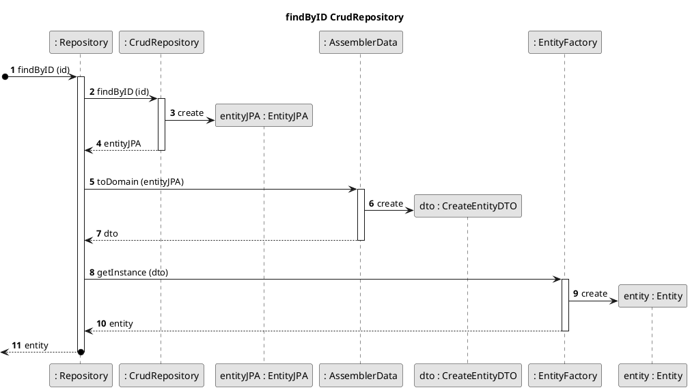
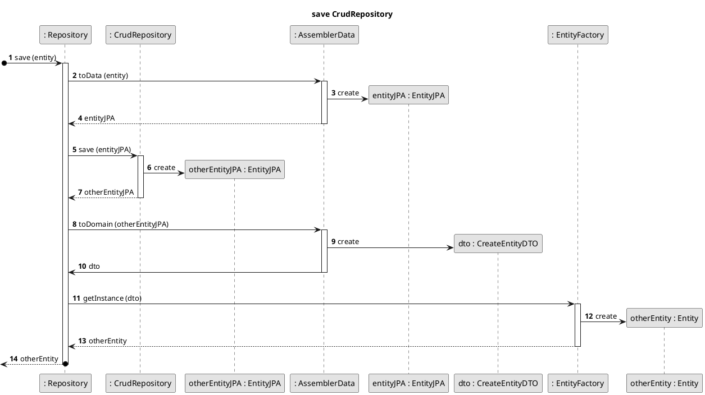

```puml
@startuml

skinparam monochrome true
autonumber
title findByID CrudRepository

participant ": Repository" as Repository
participant ": CrudRepository" as Crud
participant "entityJPA : EntityJPA" as entityJPA
participant ": AssemblerData" as Assembler
participant "dto : CreateEntityDTO" as DTO
participant ": EntityFactory" as Factory
participant "entity : Entity" as Entity

[o-> Repository : findByID (id)
activate Repository

    Repository -> Crud : findByID (id)
    activate Crud
    
        Crud -> entityJPA ** : create
        
    Repository <-- Crud : entityJPA
    deactivate Crud
    |||
    Repository -> Assembler : toDomain (entityJPA)
    activate Assembler
    
          Assembler -> DTO ** : create
    
    Repository <-- Assembler : dto
    deactivate Assembler
    |||
    Repository -> Factory : getInstance (dto)
    activate Factory
    
        Factory -> Entity ** : create
    
    Repository <-- Factory : entity
    deactivate Factory
    
[<--o  Repository : entity
deactivate Repository
    
@enduml
```

```puml
@startuml

skinparam monochrome true
autonumber
title save CrudRepository

participant ": Repository" as Repository
participant ": CrudRepository" as Crud
participant "otherEntityJPA : EntityJPA" as otherEntityJPA
participant ": AssemblerData" as Assembler
participant "entityJPA : EntityJPA" as entityJPA
participant "dto : CreateEntityDTO" as DTO
participant ": EntityFactory" as Factory
participant "otherEntity : Entity" as Entity

[o-> Repository : save (entity)
activate Repository

    Repository -> Assembler : toData (entity)
    activate Assembler
    
        Assembler -> entityJPA ** : create
    
    Repository <-- Assembler : entityJPA
    deactivate Assembler
    
    |||
    Repository -> Crud : save (entityJPA)
    activate Crud
    
        Crud -> otherEntityJPA **: create
    Repository <-- Crud : otherEntityJPA
    deactivate Crud
    |||
    
    Repository -> Assembler : toDomain (otherEntityJPA)
    activate Assembler
    
        Assembler -> DTO ** : create
    
    Repository <- Assembler : dto
    deactivate Assembler
    |||
    Repository -> Factory : getInstance (dto)
    activate Factory
    
        Factory -> Entity ** : create
    
    Repository <-- Factory : otherEntity
    deactivate Factory
    
[<--o  Repository : otherEntity
deactivate Repository
    
@enduml
```