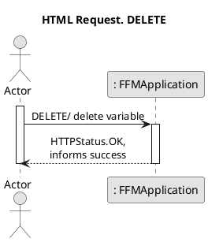
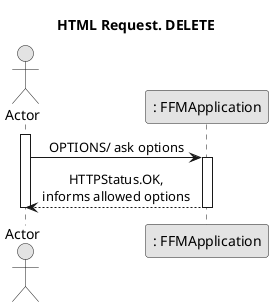
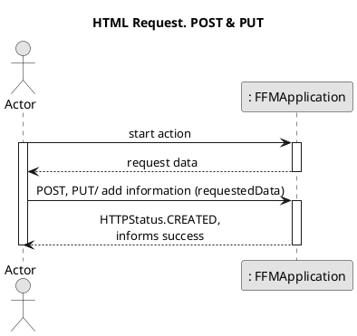
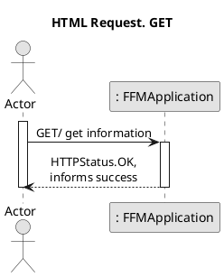
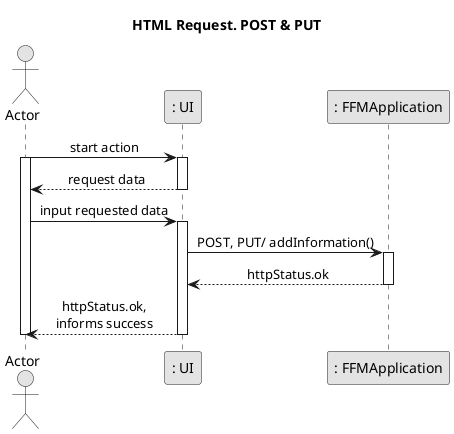
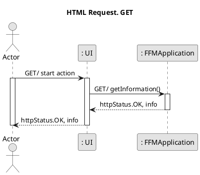
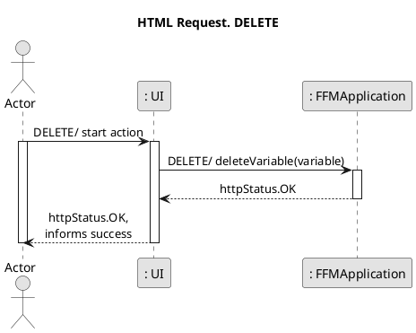
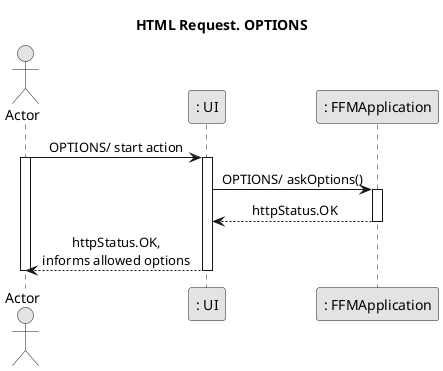

# System Sequence Diagrams #
___
## Level 1 ##
___

### HTML Request. DELETE ###

### HTML Request. OPTIONS ###

### HTML Request. POST & PUT ###

### HTML Request. GET ###

___
## Level 2 ##
___

### HTML Request. POST & PUT ###

### HTML Request. GET ###

### HTML Request. DELETE ###

### HTML Request. OPTIONS ###

