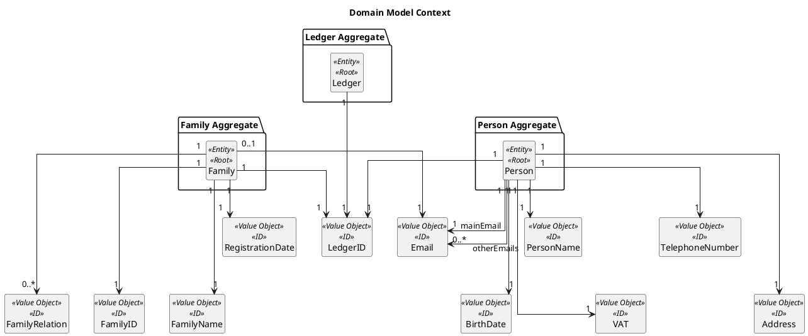
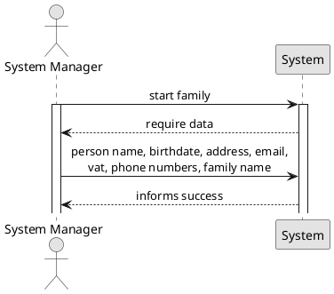
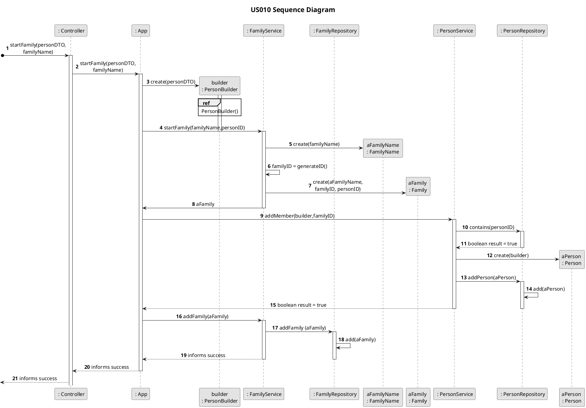

# US010
=======================================

# 1. Requirements

>__"As a system manager, I want to create a family and its administrator."__

To use the application, each user must be registered in the app, and it is assigned to the family he belongs to. So, the
first step to use the app is to create a family and, simultaneously, its administrator. 

**Demo1** As a system manager, I want to get create a family.
- Demo1.1. create a family.
- Demo1.2. add family to the system.
- Demo1.3. if input arguments are incorrect, the requirement cannot be fulfilled.

**Demo2** As a system manager, I want to assign an administrator to the family.
- Demo2.1. create an administrator.
- Demo1.2. assign administrator to the family and add him into the family's list of members.
- Demo1.3. if input arguments are incorrect, the requirement cannot be fulfilled.

# 2. Analysis
## 2.1 Domain Model Context



As it can be described in the previous image, this US contextualizes with three different aggregates. Due to the business rules implemented, each family depends on a few value objects, but also it is correlated with the person and ledger aggregates. Each family knows its administrator and its ledger. Both these pieces of information are stored in the family through its IDs, also as value objects.
Regarding the administrator, this person stores a few value objects, which correspond to its identification, but also a personal ledger ID as the ID of the family where they belong.
Each Person (Administrator) and Family are presented with a single and unique Ledger.

## 2.2 Product Owner
 Regarding the family creation, no questions were asked about its design.
Concerning the administration creation, some important questions were presented to the product owner (PO), that 
contribute to the design and implementation of the US.

>Q: Which of the person's attributes in the system are mandatory?
-A: Unlike other possible system actors, to access/use the application, the person must have, at least, one email 
>address unique in the system, which results in the administrator must have forcefully an email address. Furthermore, 
>this email cannot be used as an identification email by any other user.

> Q: Can families have more than one administrator? 
> A: No, each family can only have one administrator.

> Q: Can a person (or administrator) belong to more than one family? 
> A: No. If a person wants to be a part of another family, they must use another email address.

>Q: The person identification (ID) in the system must have a specific format? Or can be attributed to the system? 
> A: The person identification is described as its main email.

## 2.3 Decisions
 -> A familia conhece apenas o seu administrator. Esta decisão teve por vase a proteção da quantidade de administradores que uma familia pode ter, e a atribuição dessa responsabilidade a uma pessoa (unicamente por parte da familia -> information expert)

 -> Cada familia e pessoa conhecem o seu respetivo ledger, que é instanciado durante a criação destas mesmas entidades.

 -> Cada Familia e Pessoa também são responsáveis por conhecer as suas respectivas contas. Ainda que nenhuma seja criada durante a criação destas.

 -> Cada Familia guarda em si as relações familares existentes entre os seus membros.

 -> sendo a pessoa o ponto de acesso à aplicação, poderia ser mais acessivel esta conhecer alguma da informação a que está associada.

-> durante a criação da pessoal, apenas é inserido o email que esta vai usar como identificador. Emails extra são posteriormente adicionados, a partir da US151.

## 2.4. US Dependencies

-> Não existem qualquer dependencias com outras US para o desenvolvimento desta.

## 2.5. System Sequence Diagram 


# 3. Design
## 3.1. Class Diagram
```plantuml
@startuml

@enduml
```

-> 

<DESCRIPTION>

## 3.2. Functionality Flows 


<Description>;


## 3.3. Applied Design Patterns

-> DTOs podem chegar ao domain service (book: patterns, principles and practices of domain-driven design)

-> DTOs são imutáveis. Pelo que ao adicionar algum atributo estamos a retornar um DTO novo. 

-> Domain services para encapsular lógicas de negócio que não são colocados nas nossas entidades (https://docs.microsoft.com/en-us/archive/msdn-magazine/2009/february/best-practice-an-introduction-to-domain-driven-design)

-> CRUD operations only occour in the app service ()


## 3.4. Applied Design Patterns

From GRASP pattern:
Controller,
Information Expert,
Low Coupling

From SOLID:
Single Responsibility Principle

## 3.4. Tests 

# 4. Implementation


# 5. Integration/Demo


# 6. Observations


