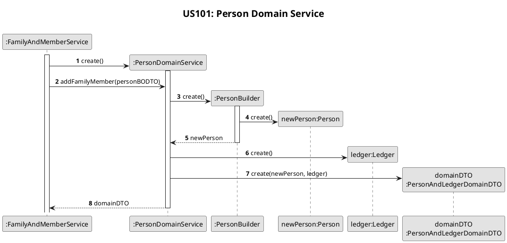

# US101
=======================================


# 1. Requirements

>__"As a family administrator, I want to add family members."__

**Demo1** As a family administrator, I want to add a new family member to one of my administrated families.

- Demo1.1 - About input data, if at least one email unique in APP and ID and VAT unique in family. 
- Demo1.2 - About input data, if all emails already used in APP or ID and/or VAT already used in family.

We interpreted this requirement as a function for family administrator add a family member in one of its administrated families.
The inputted data follow certain rules. If this validation fails the process stop, and member is not added to family.
This validation gives particular attention to ensures that in each family are only unique person CC and VAT numbers among members, and in all members from all families there is also unique emails.
In successfully scenario the new member is add to family and system actor informed about success.


# 2. Analysis
## 2.1 Product Owner
During the Sprint, the product owner (PO) set some specifications that contribute to the design and implementation of 
the US.

> Q: Which of the person's attributes in the system are mandatory?
- Unlike other possible system actors, to access/use the application, the person must have, at least, one email address
unique in the system.
- The vat and citizen identification number are also unique.

> Q: Can a family member have no email or telephone?
- Most family members will have one or more emails and/or telephones. It is possible to have none (e.g. a baby or an elderly person).

> Q: Can a person belong to more than one family?
- No.If a person wants to be a part of another family, they must use another email address.

> Q: If personal data is wrong, what is the system's behavior?
- From a business point of view, it seems reasonable to assume that it is not possible to add an element if any of the data that characterizes it is wrong.

> Q: What is the valid format of personal data?
- The application will start to be available in Portugal, only for residents. Internationalization requirements may arise in the future.

## 2.2 Decisions

To accomplish this requirement, we need the following data:
- the ID of the family to add new member
- the personal data of new member (cc, name, birthDate, vat, houseNumber, street, city, country, zipCode, List phoneNumbers, List emails)

According project goals and PO requests we decide:
- All personal data are mandatory, except email and telephones. For that we choose represents by null in our system when user not inputs any of them.
- Validate personal data according portuguese system rules.
- For CC number, accepted the 8 digits format, and the 8 digits + check digit + 3 digits format.
- For emails, if at least one email inputted are unique in system add family member occurs. Only unique emails are add to person. If none emails are unique the process aborts, not adding new member.  
- Also, only emails with correct format are add to person, invalid emails are reject.
- At this point there is no interaction to user by a UI so, in this sprint, familyID is request to be inputted to chosen family.

## 2.3 Dependent US
This US depends on create person feature that is also used by [US011](./US011.md), where the system manager add a family administrator.
Also, has dependency to [US010](./US010.md), where families are create.    

## 2.4 System Sequence Diagram
The System Sequence Diagram for this US are shown below:
```puml
skinparam monochrome true
autonumber
title **US101: System Sequence Diagram**
actor "Family Administrator" as User
skinparam sequenceMessageAlign center


activate User
User -> ":System" : add family member
activate ":System"
User <-- ":System" : request data (name, vat, birthDate, mainEmail, telephoneNumbers, houseNumber, street, city, country, zipCode)
deactivate ":System"
||20||
User -> ":System" : input data (name, vat, birthDate, mainEmail, telephoneNumbers, houseNumber, street, city, country, zipCode)
activate ":System"
User <-- ":System" : informs sucess
deactivate ":System"
deactivate User
```
    
# 3. Design

## 3.1. Functionalities Flow

The Sequence Diagrams for this US are shown below:



```plantuml
title **US101: Person Domain Service**
skinparam titleFontSize 20
autonumber
skinparam responseMessageBelowArrow true
skinparam sequenceMessageAlign center
skinparam monochrome true

participant ":FamilyAndMemberService" as FamilyAndMemberService
participant ":PersonDomainService" as PersonDomainService
participant ":PersonBuilder" as PersonBuilder
participant "newPerson:Person" as Person
participant "ledger:Ledger" as Ledger
participant "domainDTO\n:PersonAndLedgerDomainDTO" as PersonAndLedgerDomainDTO

activate FamilyAndMemberService
FamilyAndMemberService -> PersonDomainService **: create()
activate PersonDomainService
FamilyAndMemberService -> PersonDomainService : addFamilyMember(personBODTO)
PersonDomainService -> PersonBuilder **: create()
activate PersonBuilder
PersonBuilder -> Person **: create()
PersonBuilder --> PersonDomainService : newPerson
deactivate PersonBuilder
PersonDomainService -> Ledger **: create()
PersonDomainService -> PersonAndLedgerDomainDTO **: create(newPerson, ledger)
PersonDomainService --> FamilyAndMemberService : domainDTO
deactivate PersonDomainService
```

```plantuml
title **US101: Validate Data**
skinparam titleFontSize 20
autonumber
skinparam responseMessageBelowArrow true
skinparam sequenceMessageAlign center
skinparam monochrome true

participant ":FamilyAndMemberService" as FamilyAndMemberService
participant "familyID:FamilyID" as FamilyID
participant ":FamilyRepository" as FamilyRepository
participant "email:Email" as Email
participant "vat:VAT" as Vat
participant ":PersonRepository" as PersonRepository


activate FamilyAndMemberService
FamilyAndMemberService -> FamilyID **: create\n(personDTO.getFamilyID)
FamilyAndMemberService -> FamilyRepository : existsByID(familyID)
activate FamilyRepository
FamilyRepository --> FamilyAndMemberService : true
deactivate FamilyRepository

FamilyAndMemberService -> Email **: create(personDTO.getEmail)
FamilyAndMemberService -> PersonRepository : existsByID(email)
activate PersonRepository
PersonRepository --> FamilyAndMemberService : false
deactivate PersonRepository

FamilyAndMemberService -> Vat **: create(personDTO.getVat)
||||
FamilyAndMemberService -> PersonRepository : existsByFamilyIDAndVat(familyID, vat)
activate PersonRepository
PersonRepository --> FamilyAndMemberService : false
deactivate PersonRepository
```

## 3.2. Class Diagram

The Class Diagram for this US is shown below:

```puml
skinparam defaultFontSize 10
skinparam sequenceMessageAlign center
skinparam monochrome true
title ** US101: Main Class Diagram**
skinparam titleFontSize 20
skinparam linetype ortho
skinparam nodesep 50

class "AddFamilyMemberController" as Controller {}
class "FFMApplication" as APP {}
class "PersonService" as Service {}
class Family {}
class Person {}
class PersonName {}
class VAT {}
class BirthDate {}
class Email implements ID {}
class PhoneNumber {}
class Address {}
class PersonRepository{}
interface ID{}

Controller "1" o-- "1" APP
Controller -- Service
APP "1" *--> "1" Service
APP "1" *--> "1" PersonRepository 
Service ..> PersonRepository
PersonRepository "0..*" *--> "1" Person
Person "1" *--> "1" PersonName
Person "1" *--> "1" VAT
Person "1" *--> "1" BirthDate
Person "1" *--> "1" Address
Person "1" *--> "1" Email
Person "0..*" *--> "1" PhoneNumber
Family "1" -- "1..*" ID
```
## 3.3. Applied Design Patterns

In this US we adopted the following GRASP principles: Controller, Information Expert, Low Coupling.
Also adopted the SOLID principles: Single Responsibility Principle.

## 3.4. Tests 

The following presented tests set up were design to evaluate the requirement of this US:

**Before** All following tests are preceded by create family and set administrator.

	public class AddFamilyMemberControllerTest {
        private CreateFamilyController createFamilyController;
        private AddFamilyAdministratorController addFamilyAdministratorController;
        private String costaFamilyID;
        private String silvaFamilyID;
        private FFMApplication app;
    
        @BeforeEach
        public void initialise() {
            this.app = new FFMApplication();
            this.createFamilyController = new CreateFamilyController(app);
            this.addFamilyAdministratorController = new AddFamilyAdministratorController(app);
            this.createFamilyController.createFamily("Costa");
            this.costaFamilyID = addFamilyAdministratorController.getListOfFamiliesWithoutAdministrator().get(0);
    
            List<String> phoneNumbers = new ArrayList<>();
            phoneNumbers.add("918541251");
            List<String> emails = new ArrayList<>();
            emails.add("happy85@hotmail.com");
            addFamilyAdministratorController.createAdministrator(
                    "15468543",
                    "António",
                    "16/02/1985",
                    "127813101",
                    "25",
                    "Rua das Laranjeiras",
                    "Braga",
                    "Portugal",
                    "9874-555",
                    phoneNumbers, emails, costaFamilyID);
    
            createFamilyController.createFamily("Silva");
            silvaFamilyID = addFamilyAdministratorController.getListOfFamiliesWithoutAdministrator().get(0);
            List<String> phoneNumbers2 = new ArrayList<>();
            phoneNumbers2.add("962135484");
            List<String> emails2 = new ArrayList<>();
            emails2.add("albertina_silva3@hotmail.com");
            addFamilyAdministratorController.createAdministrator(
                    "95175328",
                    "Albertina",
                    "12/08/1958",
                    "264053737",
                    "10",
                    "Rua Norte",
                    "Portimão",
                    "Portugal",
                    "4158-952",
                    phoneNumbers2, emails2, silvaFamilyID);
        }

**Test 1** - Add a family member successfully:

    @Test
    @DisplayName("Add a family member successfully")
    public void addFamilyMember() {
        AddFamilyMemberController addFamilyMemberController = new AddFamilyMemberController(app);
        List<String> phoneNumbers2 = new ArrayList<>();
        phoneNumbers2.add("962135484");
        List<String> emails2 = new ArrayList<>();
        emails2.add("cool_yeah3@hotmail.com");
        boolean result = addFamilyMemberController.addFamilyMember(
                "15286957",
                "Vasco",
                "01/05/2002",
                "255049412",
                "28",
                "Rua Direira",
                "Viana do Castelo",
                "Portugal",
                "2132-221",
                phoneNumbers2, emails2, costaFamilyID);

        Assertions.assertTrue(result);
    }

**Test 2** - Add a member with same personal data as another member registered in other family (except unique personal data):

    @Test
    @DisplayName("Add member with same personal data as another member registered in other family")
    public void addFamilyMember_SameUserInDifferentFamilies() {
        AddFamilyMemberController addFamilyMemberController = new AddFamilyMemberController(app);
        List<String> phoneNumbers = new ArrayList<>();
        phoneNumbers.add("962135484");
        List<String> emails2 = new ArrayList<>();
        emails2.add("albertina58@hotmail.com");
        boolean result = addFamilyMemberController.addFamilyMember(
                "95173258",
                "Albertina",
                "12/08/1958",
                "297368079",
                "10",
                "Rua Norte",
                "Portimão",
                "Portugal",
                "4158-952",
                phoneNumbers, emails2, costaFamilyID);

        Assertions.assertTrue(result);
    }
    
**Test 3** - Failure to add a new member, invalid personal data:

    @Test
    @DisplayName("Failure to add new member: invalid personal data")
    public void failureAddFamilyMember_PersonalData() {
        AddFamilyMemberController addFamilyMemberController = new AddFamilyMemberController(app);
        List<String> phoneNumbers2 = new ArrayList<>();
        phoneNumbers2.add("962135484");
        List<String> emails2 = new ArrayList<>();
        emails2.add("MoreOne@hotmail.com");
        boolean result = addFamilyMemberController.addFamilyMember(
                "15286957",
                "",
                "01/05/2002",
                "241415829",
                "28",
                "Rua Direira",
                "Viana do Castelo",
                "Portugal",
                "2132-221",
                phoneNumbers2, emails2, costaFamilyID);

        Assertions.assertFalse(result);
    }    

There is also design another tests to coverage more possible situations of failure to add a new member, such inserts not unique data or invalid data.

# 4. Implementation

Has show in sequence diagram, add Family Member occurs in two main involved classes. First in FamilyService class through the method show below:

     public boolean addFamilyMember(String cc, String name, String birthDate, String vat, String houseNumber, String street, String city,
                                       String country,
                                       String zipCode, List<String> phoneNumbers, List<String> emails, String familyID) {
           Family family = findFamily(familyID);
           validateUniqueEmails(emails);
           if (emails != null) {
               emails = getNotUsedEmails(emails);
           }
           String id = generatePersonID();
           try {
               return family.addMember(id, cc, name, birthDate, vat, houseNumber, street, city, country, zipCode, phoneNumbers, emails);
           } catch (Exception exception) {
               return false;
           }
     }

In this method, first finds the family and then, after validate emails and get the uniques, there is call the following method of Family class:

    public boolean addMember(String id, String cc, String name, String birthDate, String vat, String houseNumber, String street, String city,
                                 String country, String zipCode, List<String> phoneNumbers, List<String> emails) {
            validateUnique(cc, vat);
            Person newMember;
            try {
                newMember = new Person(id, cc, name, birthDate, vat, houseNumber, street, city, country, zipCode, phoneNumbers, emails, this.id);
            } catch (Exception exception) {
                return false;
            }
            this.members.add(newMember);
            return true;
      }
    
In this method, unique CC and VAT number are validate, and after that, there is created a new Person instance and added to list of members.

There are another methods that are used in this US. In a overall view, all methods ensures that something failed during process, the process aborts and member not created, neither add to family.       

# 5. Integration/Demo

This US implementation is directly depend on [US010](/docs/US010.md), once is necessary create families for add members, and [US011](/docs/US011.md), once this US creates a family administrator, that is the actor of this US.
 
About [US011](/docs/US011.md), there be an effort to presents a similar approach to this US, and both US share the same way to create a new Person, with some differences in data validation.


# 6. Observations

Since this US involves the manipulation of large amount of data, we suggest a best approach using DTO (Data Transfer Object).
Also, the use of null to represent the not input of emails and telephones can be improvement using the Builder Pattern, which allows to not input all data, and improvement the create person feature. 
