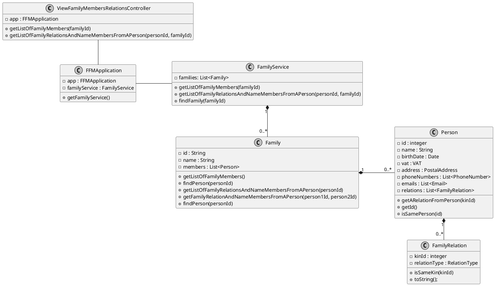

# US104
=======================================


# 1. Requirements

> __"As a family administrator, I want to get the list of family members and their relations."__

## 1.1 Description

The family administrator has the possibility to get the list of family members and the list of relations between a
person of that family and the others members of the family.

**Demo1** As a family administrator, I want to get the list of family members

- Demo1.1. if a family has less than one member, I cannot go further with this function.
- Demo1.2. a list of family members is displayed and I select one element.

**Demo2** As family administrator, I want to get the list of relations of the selected family member

- Demo2.1. if the selected member has a relation to the other family member it is displayed their names and their
  relation.
- Demo2.2 if the selected member has no relation to the other family member it is displayed their names and the
  message "is not related".

We interpreted this requirement as the function of the family administrator to get the list of family members and their
relation to a selected family member. If there is a family relation from a family member to the selected person, it will
appear their relation and their names. If there is no relation between the two elements, it will appear a message saying
that they are not related.


# 2. Analysis

## 2.1 Product Owner

Some answers of the product owner (PO) are important in some design decisions.


> Q: As a family administrator, I want to get a list of family members and the relation that they have with me.
>
>A: It's possible, but it would mean to translate existing relations to relations with the family administrator.

> Q: As family administrator, I want to get a list of family members and all possible relations between them.
>
> A: There are a lot of possible combinations. That functionality seem useless.
>
> What is really wanted is to return the list of family members and, for those with defined relationships, include the relationships introduced.
>

- The greatest question here hangs upon the possibility of just being necessary a relation between a member and his
  family administrator. Considering the answers from PO, we interpreted that the administrator can choose a family
  member and get the list of family relations of that person.

> All relations use the level of the main user of the family as a reference.

- The _main user_ is here interpreted as the user of the application and not necessarily the administrator.

## 2.2 Decisions

- One of the first decisions was about the class where the family relations should be stored: Person or Family. In terms
  of one of the GRASP principles, information expert, the visualization of a list of family relations between a person
  and the members of the family looks like a responsibility of the Person class.
- With this in mind, we decided that one of the attributes of the Person class would be a list of family relations,
  where all family relations referring to that person are kept.

## 2.3 Dependent US

This User Story doesn't have other user stories depending on it, but has some dependency with US010 (to create a family)
, US011 (add family administrator), US101 (add family members) and US105(create a relation between to family members),
since it's necessary to have a family first in order to add the family members and create a family relation between
them. Only then is possible to view the list of relationships of a certain person.


## 2.4 System sequence diagram

```puml
skinparam monochrome true
skinparam defaultFontSize 10
autonumber
title SSD
actor "FamilyAdministrator"

"FamilyAdministrator" -> "System" : ask list of relations\nof a family member
activate "FamilyAdministrator"
activate "System"
|||  

"FamilyAdministrator" <-- "System" : show list of relations\nof the family member

deactivate "FamilyAdministrator"
deactivate "System"

```

# 3. Design

## 3.1. Functionalities Flow

```puml
skinparam monochrome true
title Sequence Diagram - US104
autonumber
actor FamilyAdministrator 

activate FamilyAdministrator
FamilyAdministrator -> ":UI" : Show list of family relations\nof a family member
activate ":UI"
":UI" -> ": ViewFamilyMembersRelationsController" : showListOfRelationOfAPerson(personID, familyId)

activate ": ViewFamilyMembersRelationsController"
": ViewFamilyMembersRelationsController" -> ":Application" : getFamilyService()
activate ":Application" 
": ViewFamilyMembersRelationsController" <-- ":Application" : familyService
deactivate ":Application" 

": ViewFamilyMembersRelationsController" -> "familyService:\nFamilyService" : showListOfRelationOfAPerson(personID, familyID)

activate "familyService:\nFamilyService"
"familyService:\nFamilyService" -> "familyRepository:\nFamilyRepository" : findFamilyByID(familyID)
activate "familyRepository:\nFamilyRepository"
"familyRepository:\nFamilyRepository" --> "familyService:\nFamilyService" : family


"familyService:\nFamilyService" -> "family:\nFamily" : isPersonInFamily(personID)
activate "family:\nFamily"
 loop for each memberID in membersIDs
 "family:\nFamily" -> "family:\nFamily" : isPersonInFamily(personID)
 
        end
        
"family:\nFamily" --> "familyRepository:\nFamilyRepository" : boolean
deactivate "family:\nFamily" 
"familyRepository:\nFamilyRepository" --> "familyService:\nFamilyService" : boolean
deactivate "familyRepository:\nFamilyRepository"

alt true

"familyService:\nFamilyService" --> "familyService:\nFamilyService" : getListOfRelationsOfPerson(personID, familyID)

"familyService:\nFamilyService" -> "familyRelationRepository:\nFamilyRelationRepository" : getRelationsList(personID)
activate "familyRelationRepository:\nFamilyRelationRepository"

"familyRelationRepository:\nFamilyRelationRepository" -> "familyRelationList:\nFamilyRelationList" : getRelation()
activate "familyRelationList:\nFamilyRelationList"

"familyRelationRepository:\nFamilyRelationRepository" <-- "familyRelationList:\nFamilyRelationList" : familyRelation
deactivate "familyRelationList:\nFamilyRelationList"

"familyService:\nFamilyService" <-- "familyRelationRepository:\nFamilyRelationRepository" : informResult
deactivate "familyRelationRepository:\nFamilyRelationRepository"
    
"familyService:\nFamilyService" <-- "familyService:\nFamilyService" : informResult

else false
"familyService:\nFamilyService" --> "familyService:\nFamilyService" : Message: "This person does not belong to the family".
end

"familyService:\nFamilyService" --> ": ViewFamilyMembersRelationsController" : informResult
deactivate "familyService:\nFamilyService"


": ViewFamilyMembersRelationsController" --> ":UI" : informResult
deactivate ": ViewFamilyMembersRelationsController"
  
":UI" --> FamilyAdministrator : Inform Result
deactivate FamilyAdministrator
deactivate ":UI"
 
```

## 3.2. Class Diagram



As shown in the class diagram there is a Controller class that makes the connection between the UI and the business logic.
The family relations - FamilyRelation class - are kept in the Person class, who in turn is kept in the Family class.
All families are stored in the FamilyService class.

The ViewFamilyMembersRelationsController will invoke the FFMApplication object, which stores the FamilyService object, which in
turns stores the ListOfFamilies. At this point, it will call getListOfFamilyMembers method, which will
return a list of each family member's id.
The path is the same when getListOfFamilyRelationsAndNameMembersFromAPerson method is called. This method will return a list of family members name and relation to a selected person.
If the length of the list of family members is 1, then the getListOfFamilyRelationsAndNameMembersFromAPerson method will return
an empty list, because it will mean that the only member of the list is the family administrator and, in that case,
is not possible to have a relation to himself/herself.


## 3.3. Applied Design Patterns

From GRASP pattern:
Controller Information Expert Low Coupling

From SOLID:
Single Responsibility Principle

## 3.4. Tests

The input given by the family administrator to the controller will be filter by two function:
- getListOfFamilyMembers()
- getListOfFamilyRelationsAndNameMembersFromAPerson()

**Test 1:** Test to get list of family members id's:

    @Test
    public void testToGetListOfFamilyMembersIds() {

        Family family = new Family("Boss");

        family.addMember("117879940ZY3", "João", "04/03/2001", "254065473", "32", "Rua Java", "IntelliJ", "Portugal", "4356-908", null, null);
        family.addMember("110715705ZW7", "Maria", "21/05/1985", "238321061", "32", "Rua Java", "IntelliJ", "Portugal", "4356-908", null, null);
        family.addMember("182234282ZZ2", "Pedro", "12/04/1991", "260108090", "32", "Rua Java", "IntelliJ", "Portugal", "4356-908", null, null);
        family.addMember("126761310ZY1", "Manuela", "21/05/1999", "278986757", "32", "Rua Java", "IntelliJ", "Portugal", "4356-908", null, null);

        String person1 = family.getListOfFamilyMembers().get(0).getId();
        String person2 = family.getListOfFamilyMembers().get(1).getId();
        String person3 = family.getListOfFamilyMembers().get(2).getId();
        String person4 = family.getListOfFamilyMembers().get(3).getId();

        List<String> expected = new ArrayList<>();
        expected.add(person1);
        expected.add(person2);
        expected.add(person3);
        expected.add(person4);

        List<PersonDTO> listOfFamilyMembers = family.getListOfFamilyMembers();
        List<String> result = new ArrayList<>();

        for (PersonDTO personDTO : listOfFamilyMembers) {
            result.add(personDTO.getId());
        }

        assertEquals(expected, result);
    }


**Test 2:** Test to get list of family member's name and their relation to a person:

        @Test
        void testToGetFamilyRelationsListFromAPerson() {

        Family family = new Family("Boss");

        family.addMember("12343256","João", "04/03/2001", "327614439", "32", "Rua Java", "IntelliJ", "Portugal", "4356-908", null, null);
        family.addMember("12643257","Maria",  "21/05/1985", "229314210", "32", "Rua Java", "IntelliJ", "Portugal", "4356-908", null, null);
        family.addMember("12643457", "Pedro", "12/04/1991", "286883538", "32", "Rua Java", "IntelliJ", "Portugal", "4356-908", null, null);
        family.addMember("13743256","Manuela",  "21/05/1999", "248471694", "32", "Rua Java", "IntelliJ", "Portugal", "4356-908", null, null);

        String person1 = family.getListOfFamilyMembers().get(0).getId();
        String person2 = family.getListOfFamilyMembers().get(1).getId();
        String person3 = family.getListOfFamilyMembers().get(2).getId();
        String person4 = family.getListOfFamilyMembers().get(3).getId();

        family.createTwoWayRelation(person1, person2, "child");
        family.createTwoWayRelation(person1, person3, "sibling");
        family.createTwoWayRelation(person1, person4, "sibling");

        List<String> expected = new ArrayList<>();
        expected.add("[João is child to Maria]");
        expected.add("[João is sibling to Pedro]");
        expected.add("[João is sibling to Manuela]");

        List<String> result = family.getListOfFamilyRelationsAndNameMembersFromAPerson(person1);

        assertEquals(expected, result);
    }


**Test 3:** Test to get an empty list of family relations to a person if the list of family members has only one member:

        @Test
        void testToGetFamilyRelationsListFromAPersonIfListOfMembersHasOnlyOneElement() {

        Family family = new Family("Boss");

        family.addMember("12343256","João", "04/03/2001", "229143180", "32", "Rua Java", "IntelliJ", "Portugal", "4356-908", null, null);
        String person1 = family.getListOfFamilyMembers().get(0).getId();

        List<String> expected = new ArrayList<>();

        List<String> result = family.getListOfFamilyRelationsAndNameMembersFromAPerson(person1);

        assertEquals(expected, result);
    }


**Test 4:** Test to get list of family member's name and their relation to a specific family member if there is no relation between this person and one of the family members:

        @Test
        public void testToGetFamilyRelationsListFromAPersonIfNotRelatedToOneMember() {

        Family family = new Family("Boss");

        family.addMember("117879940ZY3", "João", "04/03/2001", "254065473", "32", "Rua Java", "IntelliJ", "Portugal", "4356-908", null, null);
        family.addMember("110715705ZW7", "Maria", "21/05/1985", "238321061", "32", "Rua Java", "IntelliJ", "Portugal", "4356-908", null, null);
        family.addMember("182234282ZZ2", "Pedro", "12/04/1991", "260108090", "32", "Rua Java", "IntelliJ", "Portugal", "4356-908", null, null);
        family.addMember("126761310ZY1", "Manuela", "21/05/1999", "278986757", "32", "Rua Java", "IntelliJ", "Portugal", "4356-908", null, null);

        String person1 = family.getListOfFamilyMembers().get(0).getId();
        String person2 = family.getListOfFamilyMembers().get(1).getId();
        String person3 = family.getListOfFamilyMembers().get(2).getId();

        family.createTwoWayRelation(person1, person2, "child");
        family.createTwoWayRelation(person1, person3, "sibling");

        List<String> expected = new ArrayList<>();
        expected.add("[João is child to Maria]");
        expected.add("[João is sibling to Pedro]");
        expected.add("[João is not related to Manuela]");

        List<String> result = family.getListOfFamilyRelationsAndNameMembersFromAPerson(person1);

        assertEquals(expected, result);
    }


**Test 5:** Test to get list of family member's name and their relation to a specific family member if there is no relation between this person and none of the other family members:

        @Test
        public void testToGetFamilyRelationsListFromAPersonIfNotRelatedToAnyMember() {

        Family family = new Family("Boss");

        family.addMember("117879940ZY3", "João", "04/03/2001", "254065473", "32", "Rua Java", "IntelliJ", "Portugal", "4356-908", null, null);
        family.addMember("110715705ZW7", "Maria", "21/05/1985", "238321061", "32", "Rua Java", "IntelliJ", "Portugal", "4356-908", null, null);
        family.addMember("182234282ZZ2", "Pedro", "12/04/1991", "260108090", "32", "Rua Java", "IntelliJ", "Portugal", "4356-908", null, null);
        family.addMember("126761310ZY1", "Manuela", "21/05/1999", "278986757", "32", "Rua Java", "IntelliJ", "Portugal", "4356-908", null, null);

        String person1 = family.getListOfFamilyMembers().get(0).getId();

        List<String> expected = new ArrayList<>();
        expected.add("[João is not related to Maria]");
        expected.add("[João is not related to Pedro]");
        expected.add("[João is not related to Manuela]");

        List<String> result = family.getListOfFamilyRelationsAndNameMembersFromAPerson(person1);

        assertEquals(expected, result);
    }


**Test 6:** Test to get list of family member's name and their relation to a specific family member if given the opposite relation:

        @Test
        public void testToGetFamilyRelationsListFromAPersonGivenOppositeRelation() {

        Family family = new Family("Boss");

        family.addMember("117879940ZY3", "João", "04/03/2001", "254065473", "32", "Rua Java", "IntelliJ", "Portugal", "4356-908", null, null);
        family.addMember("110715705ZW7", "Maria", "21/05/1985", "238321061", "32", "Rua Java", "IntelliJ", "Portugal", "4356-908", null, null);
        family.addMember("182234282ZZ2", "Pedro", "12/04/1991", "260108090", "32", "Rua Java", "IntelliJ", "Portugal", "4356-908", null, null);
        family.addMember("126761310ZY1", "Manuela", "21/05/1999", "278986757", "32", "Rua Java", "IntelliJ", "Portugal", "4356-908", null, null);

        String person1 = family.getListOfFamilyMembers().get(0).getId();
        String person2 = family.getListOfFamilyMembers().get(1).getId();
        String person4 = family.getListOfFamilyMembers().get(3).getId();

        family.createTwoWayRelation(person1, person2, "child");
        family.createTwoWayRelation(person4, person2, "grandchild");

        List<String> expected = new ArrayList<>();
        expected.add("[Maria is parent to João]");
        expected.add("[Maria is not related to Pedro]");
        expected.add("[Maria is grandparent to Manuela]");

        List<String> result = family.getListOfFamilyRelationsAndNameMembersFromAPerson(person2);

        assertEquals(expected, result);
    }


**Test 7:** Get list of ids of family members:

        @Test
        void testToGetListOfFamilyMembersId() {

        Family family = new Family("Boss");

        family.addMember("12343256","João", "04/03/2001", "163402000", "32", "Rua Java", "IntelliJ", "Portugal", "4356-908", null, null);
        family.addMember("19432567","Maria",  "21/05/1985", "149357672", "32", "Rua Java", "IntelliJ", "Portugal", "4356-908", null, null);
        family.addMember("15643259", "Pedro", "12/04/1991", "249216370", "32", "Rua Java", "IntelliJ", "Portugal", "4356-908", null, null);
        family.addMember("13643267","Manuela",  "21/05/1999", "219178313", "32", "Rua Java", "IntelliJ", "Portugal", "4356-908", null, null);

        String person1 = family.getListOfFamilyMembers().get(0).getId();
        String person2 = family.getListOfFamilyMembers().get(1).getId();
        String person3 = family.getListOfFamilyMembers().get(2).getId();
        String person4 = family.getListOfFamilyMembers().get(3).getId();

        List<String> expected = new ArrayList<>();
        expected.add(person1);
        expected.add(person2);
        expected.add(person3);
        expected.add(person4);

        List<PersonDTO> listOfPersonDTO = family.getListOfFamilyMembers();
        List<String> result = new ArrayList<>();

        for (PersonDTO personDTO : listOfPersonDTO) {
            result.add(personDTO.getId());
        }

        assertEquals(expected, result);
    }


# 4. Implementation

As shown in the sequence diagram, the first step in this US is to obtain the list of family members. This list shows the id's of the family members.

This code snippet shows that:

     public List<PersonDTO> getListOfFamilyMembers() {
        List<PersonDTO> listOfFamilyMembers = new ArrayList<>();
        if (this.members != null) {
            listOfFamilyMembers = new ArrayList<>();
            for (Person person : members) {
                listOfFamilyMembers.add(person.createPersonDTO());
            }
        }
        return listOfFamilyMembers;
    }

The second step consists in the fact that the administrator chooses a family member and is able to view the list of relationships between that member and other family members.

     public List<String> getListOfFamilyRelationsAndNameMembersFromAPerson(String personId) {
        List<String> nameAndRelationWithAPerson = new ArrayList<>();
        Person familyMember1 = findPerson(personId);
            for (Person familyMember2 : this.members) {
                if (!familyMember2.isSamePerson(personId)) {
                    nameAndRelationWithAPerson.add(getFamilyRelationAndNameMembersFromAPerson(familyMember1.getId(), familyMember2.getId()));
                }
            }
            return nameAndRelationWithAPerson;
     }

The method described above checks the relationship of the selected person with all other people in the family.
If the relationship exists, it returns a string "Name of person 1 is 'description of the relation' to name of person 2".
If the relationship does not exist, it returns a string "Name of person 1 'is not related' to name of person 2"


# 5. Integration/Demo

This US is related to [US105](./US105.md), since in that US a relationship is created between two family members and in US104 it shows the result of creating these relationships.
This US also relates to [US010](./US010.md), since it is necessary to create a family and to [US101](/docs/US101.md), since it is necessary to add members to the family in order to have a list of family relationships.


# 6. Observations


