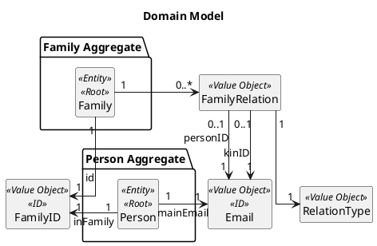
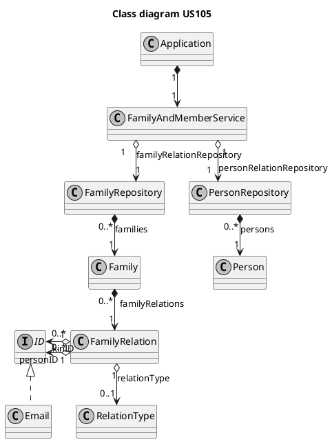
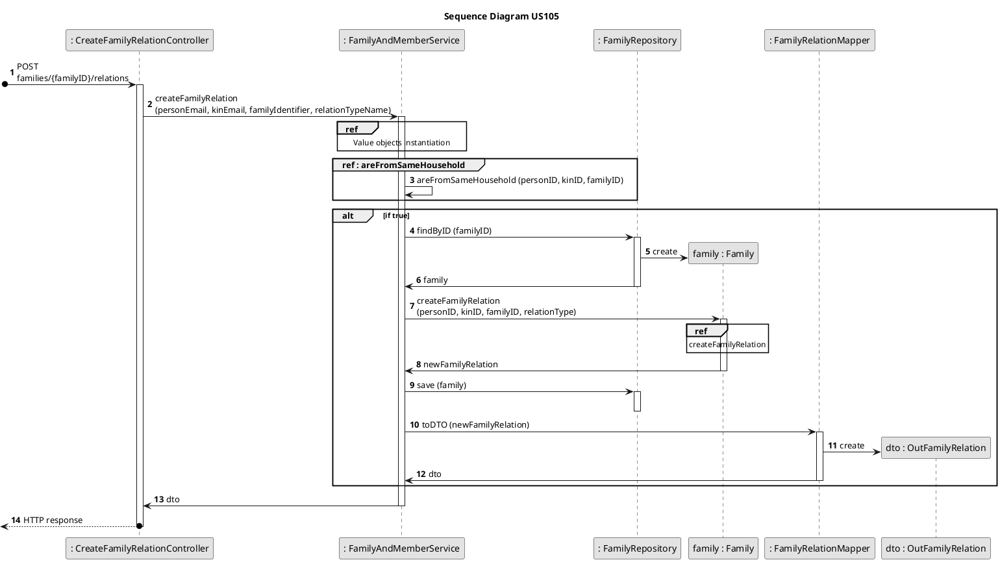
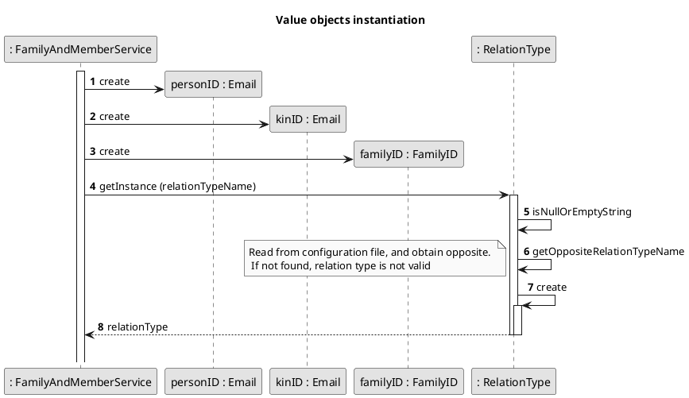
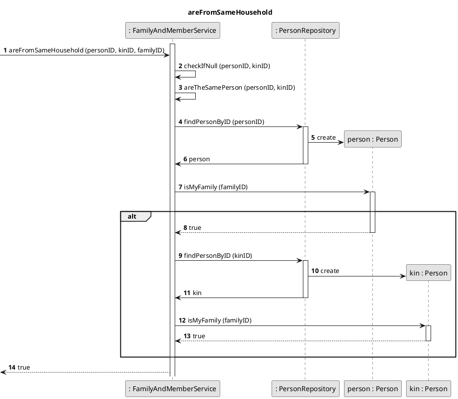
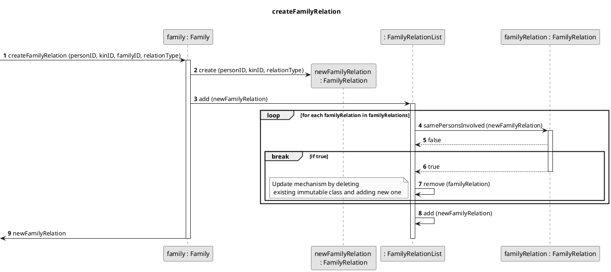

# US105
=======================================


# 1. Requirements

>__"As a family administrator, I want to create a relation between two family members."__

## 1.1 Description
The family administrator has the possibility to select two members of the family, that he is part of, and create a relation between them.
The selected members cannot be the same person and don't need to include the administrator. That give us a more flexible functionality by maintaining the possibility of a broader range of connections if necessary. 

**Demo1** As family administrator, I want to select two members that I want to relate
- Demo1.1. if a family as less than two members, I cannot go further with this function. 
- Demo1.2. a list of family members is displayed to me, and I select two members.

**Demo2** As family administrator, I want to choose the type of relation between those members
- Demo2.1. I choose a type of relation that connects the two members. 

We interpreted this requirement as a direct possibility of the family administrator to connect any member of the family to another member through a family relation.

# 2. Analysis

## 2.1 Domain Model



## 2.2 Product Owner 
Some answers of the product owner (PO) are important in some design decisions.
> The definition of a relation isn't done at the creation of a member of the family. 
>
- That means that at anytime the family administrator has the power to define it.

> Q: As a family administrator, I want to get a list of family members and the relation that they have with me. A: It's possible, but it would mean to translate existing relations to relations with the family administrator.
>
> Q: As family administrator, I want to get a list of family members and all possible relations between them. A: There are a lot of possible combinations. That functionality seem useless.
>
- The greatest question here hangs upon the possibility of just being necessary a relation between a member and his family administrator.
If we interpret the last answer as to display all relations as something useless. It would mean that the US105 wants to let the administrator create a relation between any two members. This interpretation is supported by the second answer.

## 2.3 Decisions

- The family relation are stores in a list inside the Family class.

- The FamilyRelation instance has three attributes: a person ID, a kin ID and a relation type that connects the two members. 
  To avoid the creation of a symmetric family relation, i.e. person is parent of kin and kin is child of person, the relationType attribute will have a method to return its opposite value.
  That bind us to a special override of the equals() method: two instances of FamilyRelation are the same if personID == other.personID && kinID == other.kinID || personID == other.kinID && kinID == other.personID.
  
- When creating and adding a new FamilyRelation, we need first see if this family relation was already defined, using the above mentioned equals() method.
If true, we delete this FamilyRelation instance and create a new one. If it returns false, we just create a new instance.
The function can act has a creator and updater.
  
## 2.4 Dependent US
- The [US104](US104.md) is greatly dependent on the present US.
- The way [US104](US104.md) accesses the information is closely related to the way this US is implemented.
- The [US106](../sp2/US106.md) user story talks about updating an existent family relation. This functionality is already covered by this US.

## 2.5 System Sequence Diagram
```puml
skinparam monochrome true
autonumber
title SSD
actor "Family Administrator"

"Family Administrator" -> "System" : create relation between two family members
activate "Family Administrator"
activate "System"
|||  
"Family Administrator" <-- "System" : List of family members

"Family Administrator" -> "System" : Select two family members
|||
"Family Administrator" <-- "System" : Ask for type of relation

"Family Administrator" -> "System" : input relation type
|||
"Family Administrator" <-- "System" : response
deactivate "Family Administrator"
deactivate "System"

```

# 3. Design

## 3.1 Class Diagram



## 3.2 Sequence Diagram


[//]: <> (=================================================================================)



[//]: <> (=================================================================================)



[//]: <> (=================================================================================)



## 3.3. Applied Design Patterns

From GRASP pattern:
Controller,
Information Expert,
Low Coupling

From SOLID:
Single Responsibility Principle,
Indirection

Protected Variation


## 3.4. Tests 

**Test 1:** Test create a family relation successfully:

    @Test
    @DisplayName("Create a family relation successfully")
      void createAFamilyRelationSuccessfully() throws InvalidEmailException, InvalidDateException, PersonAlreadyInSystemException, InvalidVATException, InvalidPersonNameException, ElementNotFoundException, IOException, InvalidRelationTypeException {
      //arrange
      int result;
      int expected = 1;

        //create family and administrator
        String adminEmail = "margaret_hamilton@gmail.com";
        ID adminID = new Email(adminEmail);

        List<String> phoneNumbers = new ArrayList<>();
        phoneNumbers.add("912343546");
        INFamilyAndAdminDTO dto = new INFamilyAndAdminDTO.INFamilyAndAdminDTOBuilder()
                .withPersonName("Margaret Hamilton")
                .withBirthDate("1904-12-01")
                .withCity("Porto")
                .withHouseNumber("14")
                .withCountry("Portugal")
                .withStreet("Logical Street")
                .withPhoneNumbers(phoneNumbers)
                .withZipCode("2100-345")
                .withVAT("213025086")
                .withEmail(adminEmail)
                .withFamilyName("Hamilton")
                .build();

        familyAndMemberService.startFamily(dto);

        Person admin = personRepository.findByID(adminID);
        ID familyID = admin.getFamilyID();

        TelephoneNumberList telephoneNumberList = new TelephoneNumberList();
        telephoneNumberList.add(new TelephoneNumber("225658542"));
        Address address = new Address("Rua Velha", "2", "4125-100", "Porto", "Portugal");

        String kinID = "john_von_neumann@hotmail.com";

        Person person = new PersonBuilder(new Email(kinID))
                .withAddress(address)
                .withBirthDate(new BirthDate("1907-06-08"))
                .withName(new PersonName("Johnny"))
                .withFamilyID(familyID)
                .withVat(new VAT("286710455"))
                .withTelephoneNumbers(telephoneNumberList)
                .withLedgerID(new LedgerID(UUID.randomUUID()))
                .build();

        personRepository.add(person);

        //act
        familyAndMemberService.createFamilyRelation(adminEmail, kinID, familyID.toString(), Constants.PARENT);
        List<FamilyRelation> familyRelationList = familyAndMemberService.getFamilyRelationByPersonID(adminID, familyID);
        result = familyRelationList.size();

        //assert
        assertEquals(result, expected);
    }

**Test 2:** Test create a family relation - invalid relation type:

    @Test
    @DisplayName("Create a family relation - invalid relation type")
    void createAFamilyRelationInvalidRelationType() throws InvalidEmailException, InvalidDateException, PersonAlreadyInSystemException, InvalidVATException, InvalidPersonNameException, ElementNotFoundException, IOException, InvalidRelationTypeException {
        //arrange

        //create family and administrator
        String adminEmail = "margaret_hamilton@gmail.com";
        ID adminID = new Email(adminEmail);

        List<String> phoneNumbers = new ArrayList<>();
        phoneNumbers.add("912343546");
        INFamilyAndAdminDTO dto = new INFamilyAndAdminDTO.INFamilyAndAdminDTOBuilder()
                .withPersonName("Margaret Hamilton")
                .withBirthDate("1904-12-01")
                .withCity("Porto")
                .withHouseNumber("14")
                .withCountry("Portugal")
                .withStreet("Logical Street")
                .withPhoneNumbers(phoneNumbers)
                .withZipCode("2100-345")
                .withVAT("213025086")
                .withEmail(adminEmail)
                .withFamilyName("Hamilton")
                .build();

        familyAndMemberService.startFamily(dto);

        Person admin = personRepository.findByID(adminID);
        ID familyID = admin.getFamilyID();

        TelephoneNumberList telephoneNumberList = new TelephoneNumberList();
        telephoneNumberList.add(new TelephoneNumber("225658542"));
        Address address = new Address("Rua Velha", "2", "4125-100", "Porto", "Portugal");

        String kinID = "john_von_neumann@hotmail.com";

        Person person = new PersonBuilder(new Email(kinID))
                .withAddress(address)
                .withBirthDate(new BirthDate("1907-06-08"))
                .withName(new PersonName("Johnny"))
                .withFamilyID(familyID)
                .withVat(new VAT("286710455"))
                .withTelephoneNumbers(telephoneNumberList)
                .withLedgerID(new LedgerID(UUID.randomUUID()))
                .build();

        personRepository.add(person);

        //act and assert
        assertThrows(InvalidRelationTypeException.class, () -> familyAndMemberService.createFamilyRelation(adminEmail, kinID, familyID.toString(), "Mistress"));
    
    }

**Test 3:** Test create a family relation - update family relation:

    @Test
    @DisplayName("Create a family relation - twice the same relation")
    void createFamilyRelationTwiceSameRelation() throws Exception {
        //arrange

        //create family
        String adminEmail = "margaret_hamilton@gmail.com";
        Email adminID = new Email(adminEmail);

        List<String> phoneNumbers = new ArrayList<>();
        phoneNumbers.add("912343546");
        FamilyAndAdminDTO dto = new FamilyAndAdminDTO.INFamilyAndAdminDTOBuilder()
                .withPersonName("Margaret Hamilton")
                .withBirthDate("1904-12-01")
                .withCity("Porto")
                .withHouseNumber("14")
                .withCountry("Portugal")
                .withStreet("Logical Street")
                .withPhoneNumbers(phoneNumbers)
                .withZipCode("2100-345")
                .withVAT("213025086")
                .withEmail(adminEmail)
                .withFamilyName("Hamilton")
                .build();

        service.startFamily(dto);

        Person admin = personRepository.findByID(adminID);
        FamilyID familyID = admin.getFamilyID();

        //add new member
        TelephoneNumberList telephoneNumberList = new TelephoneNumberList();
        telephoneNumberList.add(new TelephoneNumber("225658542"));
        Address address = new Address("Rua Velha", "2", "4125-100", "Porto", "Portugal");

        String kinEmail = "john_von_neumann@hotmail.com";

        Person person = new PersonBuilder(new Email(kinEmail))
                .withAddress(address)
                .withBirthDate(new BirthDate("1907-06-08"))
                .withName(new PersonName("Johnny"))
                .withFamilyID(familyID)
                .withVat(new VAT("286710455"))
                .withTelephoneNumbers(telephoneNumberList)
                .withLedgerID(new LedgerID(UUID.randomUUID()))
                .build();

        personRepository.save(person);

        int expectedCode = 201;
        int expectedListSize = 1;
        int resultListSize;

        //act
        controller.createOrUpdateFamilyRelation(adminEmail, kinEmail, familyID.toString(), Constants.CHILD);
        ResponseEntity<Object> result = controller.createOrUpdateFamilyRelation(adminEmail, kinEmail, familyID.toString(), Constants.COUSIN);

        Family family = familyRepository.findByID(familyID);

        List<FamilyRelation> familyRelationList = family.getFamilyRelationByPersonID(adminID);
        resultListSize = familyRelationList.size();

        //assert
        assertEquals(expectedCode, result.getStatusCodeValue());
        assertEquals(expectedListSize, resultListSize);
    }

# 4. Implementation


# 5. Integration/Demo


# 6. Observations

