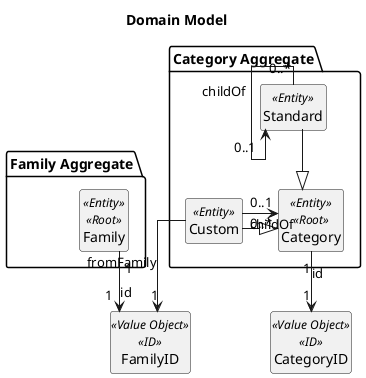
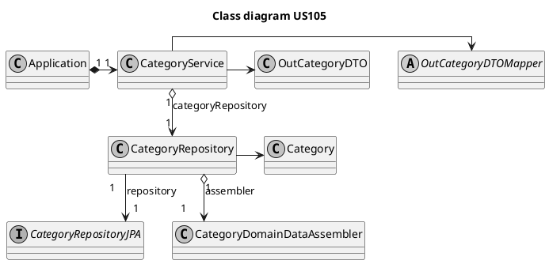
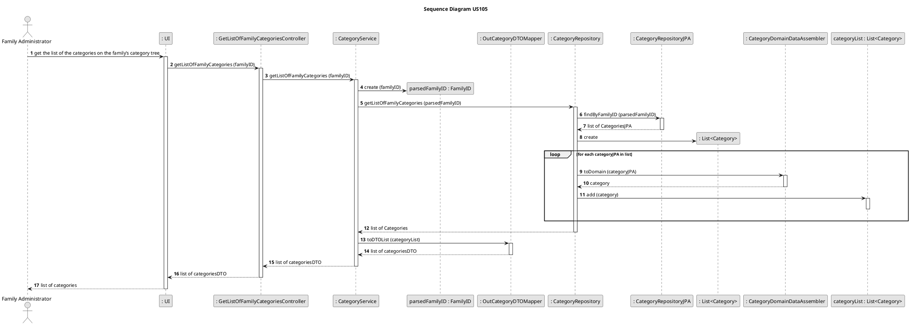

# US110
=======================================


# 1. Requirements

>__"As a family administrator, I want to get the list of the categories on the family’s category tree."__


## 1.1 Description

The family administrator has the possibility to get a list of the categories on the family's category tree.
That includes the standard categories and the custom categories that where create for this family in particular.

**Demo1** The family administrator can obtain a list of all the categories related to the family he is part of.
- Demo1.1 The standard categories define by the system manager will always be parte of the list.
- Demo1.2 To the list will be added all the existing custom categories related to this family.


# 2. Analysis


## 2.1 Domain Model




## 2.2 Product Owner 

Some answers of the product owner (PO) are important in some design decisions.
> It's not possible to add a category that already exists.

> To this date, there is no requirement describing an order or sorting for this list.


## 2.3 Decisions


## 2.4 Dependent US

The [US001](US001.md) and the [US002](US002.md) influence the implementation of this US.
The [US002](US002.md) defines the type of data structure that will be handled to obtain the list of family categories, e.g. a tree usualy needs a recursive function, however with a simple array we could simply make a copy.


## 2.5 System Sequence Diagram

```puml
skinparam monochrome true
autonumber
title SSD
actor "Family Administrator"

"Family Administrator" -> "System" : get the list of the categories on the family’s category tree
activate "Family Administrator"
activate "System"
|||
"Family Administrator" <-- "System" : list of the family's categories
deactivate "Family Administrator"
deactivate "System"

```

# 3. Design


## 3.1. Class Diagram



## 3.2. Sequence Diagram



## 3.3. Applied Design Patterns

From GRASP pattern:
Controller,
Information Expert,
Low Coupling

From SOLID:
Single Responsibility Principle

Protected Variation


## 3.4. Tests 

**Test 1:** Given that five categories are on the system, retrieve only the ones that are from the family, and the ones that are standard:

    @Test
    @DisplayName("Get list of family categories")
    void getListOfFamilyCategories() {
    //arrange

        int listSizeExpected = 4;
        int listSizeResult;

        String energy = "Energy";
        String transportation = "Transportation";
        String electricity = "Electricity";
        String bus = "Bus";
        String car = "Car";
        String children = "Children";

        FamilyID familyID = new FamilyID(UUID.randomUUID());
        FamilyID otherFamilyID = new FamilyID(UUID.randomUUID());

        // #1 standard category
        Designation designationRoot1 = new CategoryDesignation(energy);
        CategoryID rootId1 = categoryService.generateCategoryID();
        Category rootCategory1 = new Standard(designationRoot1, rootId1, true);
        categoryRepository.save(rootCategory1);

        // #2 standard category
        Designation designationRoot2 = new CategoryDesignation(transportation);
        CategoryID rootId2 = categoryService.generateCategoryID();
        Category rootCategory2 = new Standard(designationRoot2, rootId2, true);
        categoryRepository.save(rootCategory2);

        // #1 custom category
        Designation designationCustom1 = new CategoryDesignation(electricity);
        CategoryID customId1 = categoryService.generateCategoryID();
        Category customCategory1 = new Custom(designationCustom1, customId1, familyID, false);
        rootCategory1.addChild(customId1);
        categoryRepository.save(customCategory1);

        // #2 custom category
        Designation designationCustom2 = new CategoryDesignation(bus);
        CategoryID customId2 = categoryService.generateCategoryID();
        Category customCategory2 = new Custom(designationCustom2, customId2, familyID, false);
        rootCategory2.addChild(customId2);
        categoryRepository.save(customCategory2);

        // #3 custom category other family
        Designation designationCustom3 = new CategoryDesignation(car);
        CategoryID customId3 = categoryService.generateCategoryID();
        Category customCategory3 = new Custom(designationCustom3, customId3, otherFamilyID, false);
        rootCategory2.addChild(customId3);
        categoryRepository.save(customCategory3);

        // #4 custom category other family
        Designation designationCustom4 = new CategoryDesignation(children);
        CategoryID customId4 = categoryService.generateCategoryID();
        Category customCategory4 = new Custom(designationCustom4, customId4, otherFamilyID, true);
        categoryRepository.save(customCategory4);

        //act
        List<OutCategoryDTO> dtoList = categoryService.getListOfFamilyCategories(familyID.toString());
        listSizeResult = dtoList.size();

        List<String> designationList = new ArrayList<>();
        for (OutCategoryDTO dto : dtoList) {
            designationList.add(dto.getDesignation());
        }

        boolean resultEnergy = designationList.contains(energy);
        boolean resultTransportation = designationList.contains(transportation);
        boolean resultElectricity = designationList.contains(electricity);
        boolean resultBus = designationList.contains(bus);
        boolean resultCar = designationList.contains(car);
        boolean resultChildren = designationList.contains(children);

        //assert
        assertEquals(listSizeResult, listSizeExpected);
        assertTrue(resultEnergy);
        assertTrue(resultTransportation);
        assertTrue(resultElectricity);
        assertTrue(resultBus);
        assertFalse(resultCar);
        assertFalse(resultChildren);

    }

# 4. Implementation


    public interface CategoryJPARepository extends CrudRepository<CategoryJPA, String> {

    @Query("FROM CategoryJPA WHERE familyId = ?1 or familyId IS NULL")
    Iterable<CategoryJPA> findByFamilyID(String familyID);

    }


# 5. Integration/Demo

* Given the implementation of [US001](US001.md) and [US002](US002.md) the only thing necessary to implement the US was the creation of a personalized query to retrieve the necessary information from the date base.


# 6. Observations

