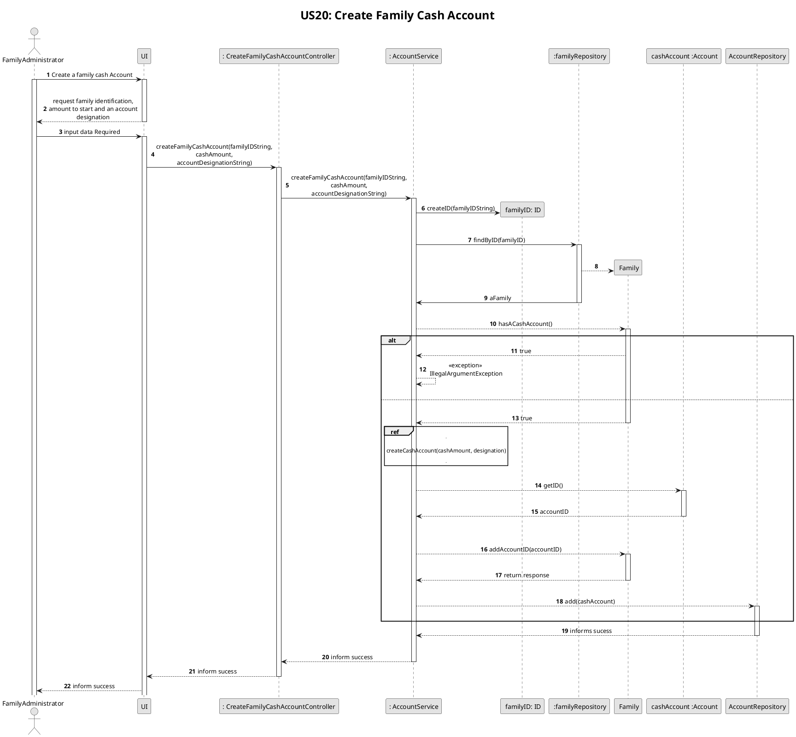
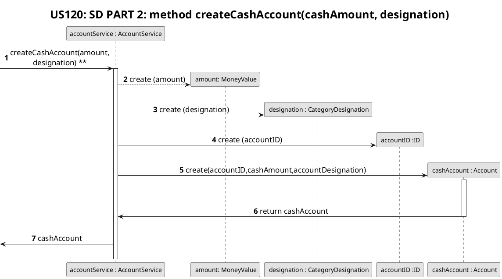
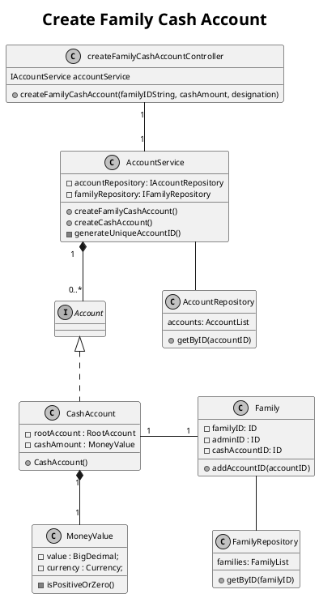

# US120
=======================================


# 1. Requirements

>__"As a family administrator, I want to create a family cash account."__

* The interpretation of this requirement was based on the purpose of any family administrator being able to create a family cash account, but first he/she has to verify if an account of that type already exists in the family. The administrator can run a function "hasCashAccount()" that returns a boolean, notifying the administrator that the family already has one or not. If there's no account, the administrator then proceeds to create the first family cash account.
* This account will store any future data inputted by the user (any family member) in numerical number, representing the amount of cash they want to store. 

# 2. Analysis

##2.1.Product Owner 

An answer from the product owner (PO) was important in the design decision.
When the family administrator creates a cash account, it wasn't clear if it could save a specific amount (the administrator would input that amount) or if it would always have 0.00 euros by default.  
- The product owner informed that it would be a good idea for the family administrator be able to set a specific amount of money when he creates a family cash account.

## 2.2. US Dependencies

**Project_V2**
This User Story depends on the following US:
    * US010

# 3. Design

## 3.1. Functionalities Flow

Changes after Sprint Review
**Project_V2**
```puml
skinparam monochrome true
autonumber
title SSD
actor "Family Administrator"

"Family Administrator" -> "System" : create a family cash account
activate "Family Administrator"
activate "System"
|||  
"Family Administrator" <-- "System" : ask cash amount, and account designation data

"Family Administrator" -> "System" : inputs data

|||
"Family Administrator" <-- "System" : returns personal cash account
deactivate "Family Administrator"
deactivate "System"

```







## 3.2. Class Diagram

**Project_V2**



This class diagram represents the connection between the UI and the business logic created by Controller Class.
All Cash Accounts  - CashAccount class - will be associated with its correspondent family by the family's Id. After being created, the family's Cash Account will be stored in the Family class.*
The CreateFamilyCashAccountController will invoke the FFMApplication object, which will store the FamilyService and the FamilyService will store the Family object.
The Family object will finally call the method createFamilyCashAccount(). This method will only create a Cash Account if one wans't already created, by running first the method hasCashAccount(), which, for a given familyId, will verify if that family has or not a cash account.     
The createFamilyCashAccount will store a non-negative double argument, which will be transformed in a ##.## format, by rounding the number up or down to the second decimal by the constructor of CashAccount. 


## 3.3. Applied Design Patterns

From GRASP design pattern was applied the principles of Controller, Information Expert and Low Coupling.
From SOLID pattern was applied the Single Responsability Principle.

## 3.4. Tests 

The input given by the family administrator to the controller will be filter by the following function:
- createFamilyCashAccount()

The above tests verify the possibility of creating a family cash account, given a familyID and a non-negative initial amount. 

**Teste 1:** Valid cash account:
    
    @Test
        @DisplayName("Create a successful family cash account")
        public void creatingACashAccountSuccessfully() {
            //Arrange
            this.app = new FFMApplication();
            Family family = new Family("F-3284739","furtado");
            String categoryDesignation = "cash";
            String familyID = family.getId();
    
            double initialAmount = 10;
    
            CreateFamilyCashAccountController createFamilyCashAccountController = new CreateFamilyCashAccountController(app);
            
            app.getFamilyService().addFamily(family);
            //Act
            boolean result = createFamilyCashAccountController.createFamilyCashAccount(familyID, initialAmount, categoryDesignation);
            
            //Assert
            assertTrue(result);
        }
        
**Teste 2:** Valid cash account, testing the boundary limits of the initial amount (initialAmount = 0 ) :

    @Test
        @DisplayName("Create a successful family cash account")
        public void creatingACashAccountSuccessfully_withAnInitialAmountOfZero() {
    
            //this test aims to verify the boundary limits of the initial amount
    
            //Arrange
            this.app = new FFMApplication();
            Family family = new Family("F-3284739","furtado");
            String categoryDesignation = "cash";
            String familyID = family.getId();
    
            double initialAmount = 0;
    
            CreateFamilyCashAccountController createFamilyCashAccountController = new CreateFamilyCashAccountController(app);
    
            app.getFamilyService().addFamily(family);
            //Act
            boolean result = createFamilyCashAccountController.createFamilyCashAccount(familyID, initialAmount, categoryDesignation);
            
            //Assert
            assertTrue(result);
        }
        
**Teste 3:** Invalid cash account because the initial amount has a negative value:

    @Test
        @DisplayName("Create a family cash account unsuccessfully")
        public void creatingACashAccountUnsuccessfully_NegativeAmount() {
            //Arrange
            this.app = new FFMApplication();
            Family family = new Family("F-3284739","furtado");
            String categoryDesignation = "cash";
            String familyID = family.getId();
    
            double initialAmount = -10;
    
            CreateFamilyCashAccountController createFamilyCashAccountController = new CreateFamilyCashAccountController(app);
    
            app.getFamilyService().addFamily(family);
    
            //Act
            boolean result = createFamilyCashAccountController.createFamilyCashAccount(familyID, initialAmount, categoryDesignation);
            
            //Assert
            assertFalse(result);
    
        }
        
**Teste 4:** Invalid cash account due to invalid categoryDesignation (does not recognize the "@" element):       
        
    @Test
        @DisplayName("Create a family cash account unsuccessfully")
        public void creatingACashAccountUnsuccessfully_InvalidDesignation() {
            //Arrange
            this.app = new FFMApplication();
            Family family = new Family("F-3284739","furtado");
            String categoryDesignation = "c@sh";
            String familyID = family.getId();
    
            double initialAmount = 10;
    
            CreateFamilyCashAccountController createFamilyCashAccountController = new CreateFamilyCashAccountController(app);
    
            app.getFamilyService().addFamily(family);
    
            //Act
            boolean result = createFamilyCashAccountController.createFamilyCashAccount(familyID, initialAmount, categoryDesignation);
            
            //Assert
            assertFalse(result);
    
        }    
        
**Teste 5:** Invalid cash account due to invalid familyId:

    @Test
        @DisplayName("Create a family cash account unsuccessfully")
        public void creatingACashAccountUnsuccessfully_InvalidFamily() {
            //Arrange
            this.app = new FFMApplication();
            Family family = new Family("3284739","furtado");
            String categoryDesignation = "c@sh";
            String familyID = family.getId();
    
            double initialAmount = 10;
    
            CreateFamilyCashAccountController createFamilyCashAccountController = new CreateFamilyCashAccountController(app);
    
            app.getFamilyService().addFamily(family);
    
            //Act
            boolean result = createFamilyCashAccountController.createFamilyCashAccount(familyID, initialAmount, categoryDesignation);
            
            //Assert
            assertFalse(result);
    
        }
        
# 4. Implementation

Has shown in the sequence diagram, the creation of a family cash account will be created by the administrator of a valid/existing family. 

    public boolean createFamilyCashAccount(String familyId, double initialAmount, String categoryDesignation) {
            Family holder = familyService.findFamily(familyId);
            if (holder != null) {
                try {
                    MoneyValue amount = new MoneyValue(BigDecimal.valueOf(initialAmount));
                    String id = generateUniqueAccountID();
                    CashAccount familyCashAccount = new CashAccount(id, holder, amount, categoryDesignation);
                    this.accounts.add(familyCashAccount);
                    return true;
                } catch (IllegalArgumentException cashAccountException) {
                    return false;
                }
            }
            return false;
    }

If the initial amount input by the family administrator is incorrect the following method will throw the corresponded exception and will not create the new family cash account.

    public CashAccount(String id, AccountHolder holder, MoneyValue initialAmount, String categoryDesignation) {
            if (holder == null) {
                throw new IllegalArgumentException("Invalid holder.");
            }
            if (!initialAmount.isPositiveOrZero()) {
                throw new IllegalArgumentException("Cash Account can't have a negative value.");
            }
            this.cashAmount = initialAmount;
            this.holder = holder;
            this.basicAccount = new BasicAccount(id, categoryDesignation);
    }

# 5. Integration/Demo

**Project_V1**
The [US120](./US120.md) to create a family cash account. This cash account will only be created if the family associated to it is a valid/existing one.
The createFamilyCashAccount method in the Family class will try to handle the Illegal Argument Exception "Cash Account can't have a negative value." that could be thrown in the class CashAccount.
When the method from Family class handles the exception it returns false and will not complete the action, to prevent possible incoherent outputs. 

**Project_V2**
After the first Sprint Review we decided to store all accounts (Cash Account included) in the class AccountService in order to alleviate some responsibilities to the classes Family and Person (initially the Cash Account would be stored in these classes).
So, now the AccountService Class will create the family Cash Account through the method createFamilyCashAccount. It will also handle some Illegal Argument Exception that could be thrown in the class CashAccount.
# 6. Observations

**Project_V1**
Throughout this project it could be possible for the family administrator (or a family member) to add or take money from the family cash account. 
Associating automatically that operation with its date could be another possibility. This way all the family members will have a history of all movements. 

**Project_V2**
Currently, there is no further relevant information to this US.