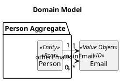
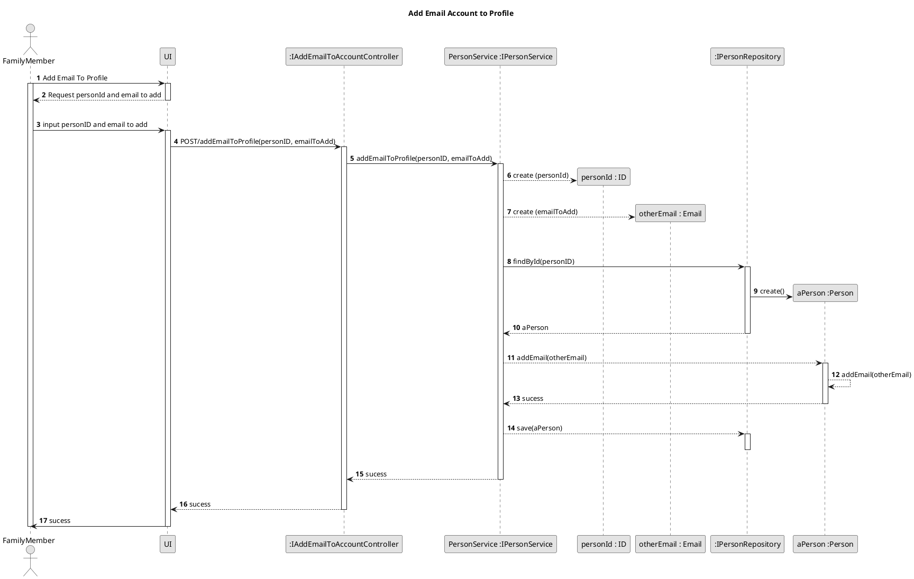

US151 - Add email to profile 
===============================================================


# 1. Requirements

>__"As a family member, I want to add an email account to my profile."__

## 1.1. Description 
* Any family member has the possibility to add an email their profile. 

# 2. Analysis
To meet this requirement, a few key pieces of data are need: 
- An ID to identify the user ( in this case will be an Email)
- Another email to be added to his profile


For this User Story, the personID will have to be input along with the email Address because with need a way to identify the Person.
We interpreted this requirement as the function of a user to add an email account to his profile information.

##2.1. Domain Model 





## 2.2. Product Owner Requirements
During the Sprint, the product owner (PO) set some specifications that contribute to the design and implementation of 
the US.

> Q: Can a person (or administrator) belong to more than one family?
- No.If a person wants to be a part of another family, they must use another email address.

- Also, a person, i.e. the member of a family, has a name, unique ID (email) and VAT number (...).
Most persons will also have one or more telephone numbers and other email accounts. 

> Q: is it correct to allow Person B to add Person A's uniqueID as a secondary email?
- Don't see a problem.


## 2.3 Decisions
- One of decisions in the beginning of the project, was about the class where the add email operation should be stored, it was decided to implement on the Person because it is an action made by a Person.
- Another decision that was made was to assume that the email to be introduced must be an email that is not assigned already to the user.
- In the event of a case a family member try to add an email list with one email address on invalid format, none of the emails of the present list are added to the email list that the person has.
- Taking into account the possibility that a person may belong to two families, he cannot have the same email to be added to both.
- The ID is unique but the other emails can be repeated.

## 2.4. US Dependencies

* This User Story has other user stories dependencies, like US150(get my profile’s information), US010 (to create a family) and US101 (add family members),
 because that is necessary to have a family in order to add family members and to create a profile information, and then an only then it is possible to add an email account to the actor's profile.
 
## 2.5. System Sequence Diagram

```puml
skinparam monochrome true
autonumber
title SSD
actor "Family Member"

"Family Member" -> "System" : add an email account to the my profile 
activate "Family Member"
activate "System"
|||  
"Family Member" <-- "System" : asks my personID and otherEmail

"Family Member" -> "System" : inputs my personID and otherEmail

|||
"Family Member" <-- "System" : returns result
deactivate "Family Member"
deactivate "System"

```
 
 
# 3. Design

## 3.1. Functionalities Flow



## 3.2. Class Diagram

The main Classes involved are:
 - AddEmailController
 - PersonRepository
 - PersonService
 - Person
 - Email
```puml

skinparam monochrome true
skinparam linetype ortho
skinparam SequenceMessageAlign left
title Class diagram US151

class "AddEmailToProfileController"
class "Person"
class "PersonService"
class "PersonRepository"
class "Email"
class "EmailList"

class AddEmailToProfileController {
 
    + addEmailToProfile(personID, emailToInput)
}

class PersonService{
    - IPersonRepository personRepository
    + addEmail(personID,emailToInput)
    + findPersonById(personID) 
    
}

class Person {
    - ID mainEmail
    - EmailList otherEmails
    +addEmail(emailToInput)
    -checkIfEmailIsRegisted(emailToInput)
}

class Email {
    - String emailAddress;
    +isValid(emailAddress)
}

class EmailList {
 - List<Email> list
 +contains(email);
 +add(email);

}


AddEmailToProfileController "1" *-- "1" PersonService : personService
PersonService ..> PersonRepository
PersonRepository "1" *-- "0..*" Person
Person --  Email
Email *---r--- EmailList

```

As shown in the sequence and class diagrams there is the class Controller that makes the connection between the UI and the business logic.
The AddEmailController will invoke the interface from PersonService, which stores the PersonService which in turns stores the Person object.
It will call its addEmailToProfile method. 
This will involve running some methods with the purpose to verify that the personID corresponds to a created person, after that it will.
After that, the value object Email is instantiated in order to see if the email has the correct form.
Later and through the Person class it will verify if the email does already exist on his account. 
This Email object will be stored on the Person object. 
All person's emails are stored in the Person class.


## 3.3. Applied Design Patterns

From GRASP design pattern was applied the principles of Controller, Information Expert and Low Coupling.
From SOLID pattern was applied the Single Responsability Principle.


## 3.4. Tests 
Email class tests that validate what is entered in the Email Address attribute

**Test 1:** Create a email with an invalid domain

	@Test
        public void CreatingEmailAddressWithInvalidDomain() {
    
            Exception exception = assertThrows(IllegalArgumentException.class, () -> {
                Email badEmail = new Email("miguel+as@gmail.com");
            });
            String exceptionMessage = exception.getMessage();
            String expectedMessage = "The email Address is not in the correct format.";
            assertEquals(exceptionMessage, expectedMessage);

**Test 2:** Create a email with an invalid domain (blank spaces in the email)
   
    @Test
       public void CreatingEmailAddressWithBlankSpaces() {
           Exception exception = assertThrows(IllegalArgumentException.class, () -> {
               Email badEmail = new Email("  ");
           });
           String exceptionMessage = exception.getMessage();
           String expectedMessage = "The email Address can't have blank spaces.";
           
           //assert
           assertEquals(exceptionMessage, expectedMessage);
       }
 
 **Test 2.1:** Create a email with an null
 
     @Test
     public void CreatingEmailAddressWithNull() {
 
         Exception exception = assertThrows(NullPointerException.class, () -> {
             Email badEmail = new Email(null);
         });
 
         String exceptionMessage = exception.getMessage();
         String expectedMessage = "The email Address can't be null";
         
         //assert
         assertEquals(exceptionMessage, expectedMessage);
     }
    
       

**Test 3:** Create a email with an valid domain
    
      @Test
       public void CreatingValidEmailAddress() {
        Email email = new Email("1120717@isep.ipp.pt");
        //assert
        Assertions.assertNotNull(email);
    }
	
In the PersonService class, it is verified that the Person exist and the inputed email is on a valid format.

**Test 4:** Add an email Address - Success case


      @Test
      void addEmailToAccount()
                  throws InvalidEmailException, InvalidDateException, InvalidVATException, ElementNotFoundException, InvalidPersonNameException {
              //arrange
              PersonRepository repository = new PersonRepository();
              PersonService personService = new PersonService(repository);
      
              FamilyID familyID = new FamilyID(UUID.randomUUID());
              TelephoneNumberList telephoneNumberList = new TelephoneNumberList();
              telephoneNumberList.add(new TelephoneNumber("225658541"));
              String personIDString = "bones@gmail.com";
              ID personID = new Email(personIDString);
              Address address = new Address("Rua Nova", "25", "4125-886", "Porto", "Portugal");
              BirthDate birthDate = new BirthDate("22/01/1995");
              PersonName name = new PersonName("Alan Turing");
              VAT vat = new VAT("123456789");
     
              Person person = new PersonBuilder(personID).
                      withAddress(address).
                      withBirthDate(birthDate).
                      withName(name).
                      withFamilyID(familyID).
                      withVat(vat).
                      withTelephoneNumbers(telephoneNumberList).
                      build(); 
              repository.add(person);
      
              String emailToAdd = "bonesTwo@gmail.com";
              boolean result;
              //act
              personService.addEmailToProfile(personIDString, emailToAdd);
              Email emailAdded = new Email(emailToAdd);
              result = person.containsEmail(emailAdded);
              //assert
              assertTrue(result);
          }
          
**Test 5:** Add an Email that Already Exists to my Account: Failure case". 
        
        @Test
        void addAnExistingEmailToAccount() throws InvalidEmailException, InvalidDateException, InvalidVATException, InvalidPersonNameException {
         //arrange
        PersonRepository repository = new PersonRepository();
        PersonService personService = new PersonService(repository);

        FamilyID familyID = new FamilyID(UUID.randomUUID());
        TelephoneNumberList telephoneNumberList = new TelephoneNumberList();
        telephoneNumberList.add(new TelephoneNumber("225658541"));
        String personIDString = "bones@gmail.com";
        ID personID = new Email(personIDString);
        Address address = new Address("Rua Nova", "25", "4125-886", "Porto", "Portugal");
        BirthDate birthDate = new BirthDate("22/01/1995");
        PersonName name = new PersonName("Alan Turing");
        VAT vat = new VAT("123456789");

        Person person = new PersonBuilder(personID).
                withAddress(address).
                withBirthDate(birthDate).
                withName(name).
                withFamilyID(familyID).
                withVat(vat).
                withTelephoneNumbers(telephoneNumberList).
                build();

        repository.add(person);

        String emailToAdd = "bones@gmail.com";

        //act
        assertThrows(IllegalArgumentException.class, () -> {
            personService.addEmailToProfile(personIDString, emailToAdd);
        });

    }
    
**Test 6:** Add an Email To an Account That does not exist - Failure case. 
 
    @Test
    @DisplayName("Add an Email To an Account That does not exist - Unsuccessful case")
    void addEmailToANonExistingAccount() throws InvalidEmailException {
        //arrange
        PersonRepository repository = new PersonRepository();
        PersonService personService = new PersonService(repository);
        String myID = "bones@gmail.com";
        Email personID = new Email(myID);
        String emailToAdd = "bonesThree@gmail.com";
        //act
        assertThrows(ElementNotFoundException.class, () -> {
            personService.addEmailToProfile(myID, emailToAdd);
        });
    }

**Test 7:** Add an Email that Already Exists in the system to my Account: Failure case"
                
    @Test
    void addAnExistingEmailToMyAccount()
            throws InvalidEmailException, InvalidDateException, InvalidVATException, InvalidPersonNameException {
        //arrange
        PersonRepository repository = new PersonRepository();
        PersonService personService = new PersonService(repository);

        FamilyID family1ID = new FamilyID(UUID.randomUUID());
        TelephoneNumberList telephoneNumberList1 = new TelephoneNumberList();
        telephoneNumberList1.add(new TelephoneNumber("225658541"));
        ID personID = new Email("alan_turing@hotmail.com");
        Address address1 = new Address("Rua Nova", "25", "4125-886", "Porto", "Portugal");
        BirthDate birthDate1 = new BirthDate("22/01/1995");
        PersonName name1 = new PersonName("Alan Turing");
        VAT vat1 = new VAT("123456789");

        Person person = new PersonBuilder(personID).
                withAddress(address1).
                withBirthDate(birthDate1).
                withName(name1).
                withFamilyID(family1ID).
                withVat(vat1).
                withTelephoneNumbers(telephoneNumberList1).
                build();

        repository.add(person);

        FamilyID family2ID = new FamilyID(UUID.randomUUID());
        TelephoneNumberList telephoneNumberList2 = new TelephoneNumberList();
        telephoneNumberList2.add(new TelephoneNumber("225658542"));
        String kinIDString = "john_neumanng@hotmail.com";
        ID kinID = new Email(kinIDString);
        Address address2 = new Address("Rua Velha", "2", "4125-100", "Porto", "Portugal");
        BirthDate birthDate2 = new BirthDate("01/01/1915");
        PersonName name2 = new PersonName("John von Neumann");
        VAT vat2 = new VAT("267222327");

        Person kin = new PersonBuilder(kinID).
                withAddress(address2).
                withBirthDate(birthDate2).
                withName(name2).
                withFamilyID(family2ID).
                withVat(vat2).
                withTelephoneNumbers(telephoneNumberList2).
                build();

        repository.add(kin);

        String repeatedEmail = "john_neumanng@hotmail.com";

        //act
        assertThrows(IllegalArgumentException.class, () -> {
            personService.addEmailToProfile(kinIDString, repeatedEmail);
        });

    }

**Test 8:** In class Person - Add several valid Email Address to a Person.  

    @Test
    void addSeveralEmailsToProfile() throws InvalidDateException, InvalidEmailException, InvalidVATException, InvalidPersonNameException {

        UUID familyid = UUID.randomUUID();
        FamilyID familyID = new FamilyID(familyid);
        TelephoneNumber telephones = new TelephoneNumber("225658541");
        Address address = new Address("Rua Nova","25","4125-886", "Porto", "Portugal");
        BirthDate birthDate = new BirthDate("22/01/1995");
        ID id = new Email("onemoretime@gmail.com");
        PersonName name = new PersonName("Joaquim Constantino");
        VAT vat = new VAT("123456789");
        Person person = new PersonBuilder(id)
                .withAddress(address)
                .withBirthDate(birthDate)
                .withName(name)
                .withFamilyID(familyID)
                .withVat(vat)
                .build();

        Email emailToAdd = new Email("joaquinWork@gmail.com");
        Email anotherToAdd = new Email("joaquin2Work@gmail.com");

        //act
        person.addEmail(emailToAdd);
        person.addEmail(anotherToAdd);
        boolean result = person.containsEmail(emailToAdd);
        boolean secondResult = person.containsEmail(emailToAdd);
        //assert
        assertTrue(result);
        assertTrue(secondResult);
    }   
      
**Test 9:** In class Person - Add an email that is already registered. 

    @Test
    void addRepeatedEmailsToProfile() throws InvalidDateException, InvalidEmailException, InvalidVATException, InvalidPersonNameException {
        //arrange
        UUID familyid = UUID.randomUUID();
        FamilyID familyID = new FamilyID(familyid);
        TelephoneNumber telephones = new TelephoneNumber("225658541");
        Address address = new Address("Rua Nova", "25", "4125-886", "Porto", "Portugal");
        BirthDate birthDate = new BirthDate("22/01/1995");
        ID id = new Email("onemoretime@gmail.com");
        PersonName name = new PersonName("Joaquim Constantino");
        VAT vat = new VAT("123456789");
        Person person = new PersonBuilder(id)
                .withAddress(address)
                .withBirthDate(birthDate)
                .withName(name)
                .withFamilyID(familyID)
                .withVat(vat)
                .build();

        Email emailToAdd = new Email("joaquinWork@gmail.com");
        Email repeatedEmailToAdd = new Email("joaquinWork@gmail.com");

        //act
        person.addEmail(emailToAdd);
        assertThrows(IllegalArgumentException.class, () -> {
            person.addEmail(repeatedEmailToAdd);
        });
    }     
            

**Test 10:** In class controller - It was created some unit tests with mockito.     
Add Email to Profile - Success case.
    
    @Test
    void addEmailToProfile() throws InvalidEmailException, ElementNotFoundException {

        String personIDString = "bones@gmail.com";
        String emailToAdd = "bonesTwo@gmail.com";
        
        doNothing().when(personService).addEmailToProfile(personIDString,emailToAdd);
        boolean result = controller.addEmailToProfile(personIDString,emailToAdd);
        assertTrue(result);
    }
    
# 4. Implementation

* Has shown in the sequence diagram, when you add an email to your profile, you need to make sure that the person id is already assigned to an existing person in a existing family. After that you need to make sure that the email that is about to be inserted it is unique and in a correct format.
This code snippet shows this validation in the method addEmail in Person Service class:


               @Transactional(rollbackFor = Exception.class)
                public boolean addEmailToProfile(String personId, String emailToAdd)
                    throws InvalidEmailException, InvalidDateException, InvalidVATException, InvalidPersonNameException, ElementNotFoundException {
                Email personID = new Email(personId);
                Email inputEmail = new Email(emailToAdd);
                Person person = personRepository.findByID(personID);
                person.addEmail(inputEmail);
                personRepository.save(person);
                return true;
            }


   

All value objects are instantiated before entering to business logic.
After verifying the Person id and the emailToAdd, the method findByID will search in the PersonRepository to verify if the person exists on the system.
Later the Person class is called which will corroborate the uniqueness of the emailToAdd. Then  
add the email to the person's email list.
If any of the conditions fail, an exception is thrown.
The following code snippet shows this validation in the method addEmails in Person class:

    
     public void addEmail(Email inputtedEmail) {
            if (!checkIfEmailIsRegistered(inputtedEmail)) {
                otherEmails.add(inputtedEmail);
            } else {
                throw new IllegalArgumentException("Email not valid. Already exists in the app");
            }
    
        }
    
    
    private boolean checkIfEmailIsRegistered(Email inputtedEmail) {
        boolean repeatedEmail = false;
        for (Email email : otherEmails.getEmailList()) {
            if (email.equals(inputtedEmail)) {
                repeatedEmail = true;
            }
        }
        if (mainEmail.equals(inputtedEmail)) {
            repeatedEmail = true;
        }
        return repeatedEmail;

    }


If the email is already registered with the person, it will not be added.
 
# 5. Integration/Demo

The [US151](./US151.md) to add an email to my user profile. 
The addEmail method in the controller class will try to handle some exception that could be throwed in the class PersonService
When the method from controller class handles the exception it returns false, which could be transmited was - the operation was not complete- which means the email address was not added.
That prevents possible incoherent outputs.

# 6. Observations

Given the possibility of creating a family member without an email, the group defined that the if the email is not valid, it will be replace by an empty list.
This brought the need to validate, in the Person and Person Service classes, the inserted email, preventing the addition of a null email address.


