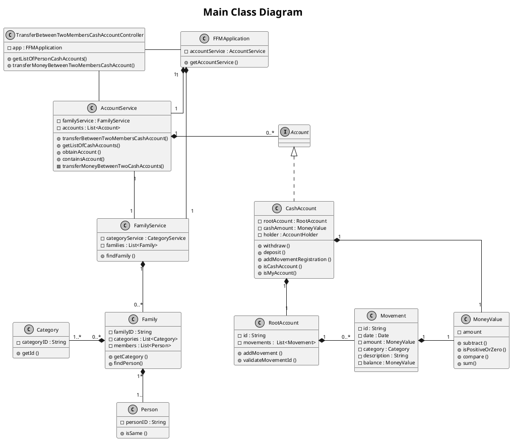

# US130
=======================================


# 1. Requirements

>__"As a family administrator, I want to transfer money from the family’s cash account to another family member’s cash account."__


## 1.1 Description
**Demo1** As family administrator, I want to select a family member's cash account in which I want to make a deposit.
- Demo1.1. select the cash account in which I want to make a deposit.
- Demo1.2. if the account selected isn't a cash account, the requirement cannot be fulfilled.

**Demo2** As family administrator, I want to register a transfer using family's cash account and the other family member's cash account.
- Demo2.1. select the cash account and add the transfer registration.
- Demo2.2. if the family member or the family don't have a cash account, the requirement cannot be fulfilled.
- Demo2.3. if the transfer input data are wrong, the requirement cannot be fulfilled.

The requirement of this US focuses on the registration of the transfer occurring between family's cash account and the family member's cash account.
To fulfill this purpose, the family administrator must select the cash account in which is supposed to make the deposit and introduce the correct data to make the transfer.
The registration of this transfer takes place in two accounts:
- in the family's account, at the same moment that the money is withdrawn from this account; 
- in the family member's account, at the same moment the money is deposited in this account.

So, the registration of this transfer is saved both in the family's cash account and in the family member's cash account.
Therefore, the family and the family member must have a cash account created and assigned. Otherwise, the requirement isn't successfully crafted.


# 2. Analysis

## 2.1 Product Owner 
The product owner (PO) set some specifications that contribute to the design and implementation of
this US.

> Q: Which data should be presented in the movement registration on the Cash Account ?
>
>A: Each movement contains a description, a category, the date of the transfer, amount of money involved and the
  balance of the cash account after the transfer.

> Q: Can the family member have more than one cash account?
>
>A: For now, each family member has one person cash account.


## 2.2 Decisions
The major decision made in this US was to save all the movements in each root account.


## 2.3 Dependent US
To implement this US it is necessary that the family and the family member have a cash account.
Therefore, these accounts must be created in order to be used at the time of the transfer.
Thus, this US depends directly on US120 and US170.

## 2.4 System sequence diagram

```puml
skinparam monochrome true
skinparam defaultFontSize 10
autonumber
title SSD
actor "Family Administrator"

"Family Member" -> "System" : get list of accounts of the family member\nto which I want to transfer the money
activate "Family Member"
activate "System"
|||  
"Family Member" <-- "System" : show list of accounts

"Family Member" -> "System" : select account
|||
"Family Member" <-- "System" : ask for input data

"Family Member" -> "System" : insert required data
|||
"Family Member" <-- "System" : inform result
deactivate "Family Member"
deactivate "System"

```


# 3. Design

## 3.1. Functionalities Flow


```puml
skinparam monochrome true
title Sequence Diagram - US130
actor FamilyAdministrator 


FamilyAdministrator -> ":UI" : Get list of the other family\nmember cash accounts
activate FamilyAdministrator
activate ":UI"
":UI" -> ": TransferMoneyFamilyToMemberController" : getListOfPersonCashAccounts(person2Id)
activate ": TransferMoneyFamilyToMemberController"

": TransferMoneyFamilyToMemberController" -> ":FFMApplication" : getAccountService()
activate ":FFMApplication" 
":FFMApplication" --> ": TransferMoneyFamilyToMemberController" : accountService
deactivate ":FFMApplication"

": TransferMoneyFamilyToMemberController" -> "accountService:\nAccountService" : getListOfCashAccounts(person2Id)
activate "accountService:\nAccountService"

 "accountService:\nAccountService" -> "listOfPersonAccounts\n:List<AccountDTO>" *: create
            
            loop for each account in system 
                "accountService:\nAccountService" -> "accountDTO:AccountDTO" *: create
                "accountService:\nAccountService" -> "accountService:\nAccountService" : listOfPersonAccounts.add(accountDTO)
            end
        


"accountService:\nAccountService" --> ": TransferMoneyFamilyToMemberController" : listOfCashAccountsDTO
deactivate "accountService:\nAccountService"
": TransferMoneyFamilyToMemberController" --> ":UI" : listOfCashAccountsDTO
deactivate ": TransferMoneyFamilyToMemberController"

":UI" --> FamilyAdministrator : List of the other family\nmember cash accounts
deactivate ":UI" 

FamilyAdministrator -> ":UI" : Transfer money from family's cash account \n to family member's cash account
activate ":UI" 
":UI" -> ": TransferMoneyFamilyToMemberController" : transferMoneyFromFamilyToMemberCashAccount(personId, familyId, \n personAccountId, amount, categoryId, description, date)
activate ": TransferMoneyFamilyToMemberController" 

": TransferMoneyFamilyToMemberController" -> ":FFMApplication" : getAccountService()
activate ":FFMApplication" 
":FFMApplication" --> ": TransferMoneyFamilyToMemberController" : accountService
deactivate ":FFMApplication"

": TransferMoneyFamilyToMemberController" -> "accountService:\nAccountService" : transferFromFamilyToPersonCashAccount(personId, familyId, \n personAccountId, amount, categoryId, description, date)
activate "accountService:\nAccountService"


 ref over "accountService:\nAccountService"

        Sequence Diagram - US130 Part II

    end ref
    
    
"accountService:\nAccountService" --> ":FFMApplication": informResult    
deactivate "accountService:\nAccountService"

":FFMApplication" --> ": TransferMoneyFamilyToMemberController": informResult 
deactivate ":FFMApplication"

": TransferMoneyFamilyToMemberController" --> ":UI" : informResult 
deactivate ": TransferMoneyFamilyToMemberController"

":UI" --> FamilyAdministrator : Inform Result 
deactivate ":UI"

deactivate FamilyAdministrator

```


```puml
skinparam monochrome true
title Sequence Diagram - US130 Part II


[-> "accountService:\nAccountService" : transferFromFamilyToPersonCashAccount(personId, familyId, \n personAccountId, amount, categoryId, description, date)
activate "accountService:\nAccountService"

"accountService:\nAccountService" -> "familyService:\nFamilyService" : findFamily(familyId)
activate "familyService:\nFamilyService"

"familyService:\nFamilyService" -> "family:\nFamily" : isSame(familyId)
activate "family:\nFamily"

"family:\nFamily" --> "familyService:\nFamilyService" : returnBoolean
deactivate "family:\nFamily"


"familyService:\nFamilyService" -> "accountService:\nAccountService" : returnFamily
deactivate "familyService:\nFamilyService"


"accountService:\nAccountService" -> "accountService:\nAccountService" : obtainAccount(familyId)
"accountService:\nAccountService" -> "accountService:\nAccountService" : obtainAccount(personId)


alt if person belongs to the family
"accountService:\nAccountService" -> "family:\nFamily" : isPersonOnTheFamily(personId)
activate "family:\nFamily"
"family:\nFamily" -> ":Person" : isSame(personId)
activate ":Person"
":Person" --> "family:\nFamily" : returnBoolean
deactivate ":Person"
"family:\nFamily" --> "accountService:\nAccountService" : returnBoolean
deactivate "family:\nFamily"
"accountService:\nAccountService" -> "accountService:\nAccountService" : getCategory(categoryId)
"accountService:\nAccountService" -> "moneyValue:\nMoneyValue" ** : create(amount)
activate "moneyValue:\nMoneyValue"
"moneyValue:\nMoneyValue" --> "accountService:\nAccountService" : moneyValue
deactivate "moneyValue:\nMoneyValue"
"accountService:\nAccountService" -> "accountService:\nAccountService" : transferMoneyBetweenTwoCashAccounts(familyAccount,\npersonAccount, amount, category, description, date)


 ref over "accountService:\nAccountService"

        Validate Transfer Between Two Accounts

    end ref

else if person does not belong to the family
"accountService:\nAccountService" --> "accountService:\nAccountService" : Message: "Is not possible to make this transfer".
end

[<-- "accountService:\nAccountService" : informResult
deactivate "accountService:\nAccountService"
```


```puml
skinparam monochrome true
autonumber
title Validate Transfer Between Two Accounts

alt if the two accounts are cash accounts
"accountService:\nAccountService" -> "originAccount:\nCashAccount" : isCashAccount()
activate "accountService:\nAccountService"
activate "originAccount:\nCashAccount"
"originAccount:\nCashAccount" --> "accountService:\nAccountService" : returnBoolean
deactivate "originAccount:\nCashAccount"

"accountService:\nAccountService" -> "destinyAccount:\nCashAccount" : isCashAccount()
activate "destinyAccount:\nCashAccount"
"destinyAccount:\nCashAccount" --> "accountService:\nAccountService" : returnBoolean
deactivate "destinyAccount:\nCashAccount"

"accountService:\nAccountService" -> "originAccount:\nCashAccount" : withdraw(moneyValue, category, description, date)
activate "originAccount:\nCashAccount" 

alt if amount is higher than the balance of \nthe account or amount is negative or zero
"originAccount:\nCashAccount" -> "moneyValue:\nMoneyValue" : compare(moneyValue)
activate "moneyValue:\nMoneyValue"
"moneyValue:\nMoneyValue" --> "originAccount:\nCashAccount" : informResult
deactivate "moneyValue:\nMoneyValue"
"originAccount:\nCashAccount" --> "originAccount:\nCashAccount" : Message: "Not enough money."
else if amount is not smaller than the balance of \nthe account and amount is positive

"originAccount:\nCashAccount" -> "moneyValue:\nMoneyValue" : subtract(moneyValue)
activate "moneyValue:\nMoneyValue"
"moneyValue:\nMoneyValue" --> "originAccount:\nCashAccount" : returnBoolean
deactivate "moneyValue:\nMoneyValue"

"originAccount:\nCashAccount" -> "originAccount:\nRootAccount" : addMovement(moneyValue,\ncategory, description, date, balance)
activate "originAccount:\nRootAccount"
"originAccount:\nRootAccount" -> "movement:\nMovement" ** : create(moneyValue, category, description, date)
activate "movement:\nMovement"
"movement:\nMovement" --> "originAccount:\nRootAccount": returnMovement
deactivate "movement:\nMovement"
"originAccount:\nRootAccount" -> "movements:\nList<Movement>" : addMovement(moneyValue,\ncategory, description, date, balance)
activate "movements:\nList<Movement>"
"movements:\nList<Movement>" --> "originAccount:\nRootAccount" : returnBoolean
deactivate "movements:\nList<Movement>"
"originAccount:\nRootAccount" --> "originAccount:\nCashAccount" : return boolean

deactivate "originAccount:\nRootAccount"
end

"originAccount:\nCashAccount" --> "accountService:\nAccountService" : returnBoolean

deactivate "originAccount:\nCashAccount"

"accountService:\nAccountService" -> "destinyAccount:\nCashAccount" : deposit(moneyValue, category, description, date)
activate "destinyAccount:\nCashAccount"

alt if amount is amount is negative or zero
"destinyAccount:\nCashAccount" --> "destinyAccount:\nCashAccount" : Message: "Not enough money."
else if amount is positive

"destinyAccount:\nCashAccount" -> "moneyValue:\nMoneyValue" : sum(moneyValue)
activate "moneyValue:\nMoneyValue"
"moneyValue:\nMoneyValue" --> "destinyAccount:\nCashAccount" : returnBoolean
deactivate "moneyValue:\nMoneyValue"
"destinyAccount:\nCashAccount" -> "destinyAccount:\nRootAccount" : addMovement(moneyValue,\ncategory, description, date, balance)
activate "destinyAccount:\nRootAccount"
"destinyAccount:\nRootAccount" -> "movement:\nMovement" ** : create(moneyValue, category, description, date)
activate "movement:\nMovement"
"movement:\nMovement" --> "destinyAccount:\nRootAccount": returnMovement
deactivate "movement:\nMovement"
"destinyAccount:\nRootAccount" -> "movements:\nList<Movement>" : addMovement(moneyValue,\ncategory, description, date, balance)
activate "movements:\nList<Movement>"
"movements:\nList<Movement>" --> "destinyAccount:\nRootAccount" : returnBoolean
deactivate "movements:\nList<Movement>"
"destinyAccount:\nRootAccount" --> "destinyAccount:\nCashAccount" : return boolean
deactivate "destinyAccount:\nRootAccount"
end


"destinyAccount:\nCashAccount" --> "accountService:\nAccountService" : returnBoolean
deactivate "destinyAccount:\nCashAccount"


else if one of the accounts is not a cash accounts
"accountService:\nAccountService" --> "accountService:\nAccountService" : Message: This transfer is only applied to cash accounts
end

deactivate "accountService:\nAccountService"
```

## 3.2. Class Diagram



## 3.3. Applied Design Patterns

From GRASP pattern:
Controller, Information Expert, Low Coupling

From SOLID:
Single Responsibility Principle

## 3.4. Tests 

The input given by the family administrator to the controller will be filter by two function:
- getListOfPersonAccounts()
- transferMoneyFromFamilyToMemberCashAccount()

**Test 1:** Test to get list of person's cash accounts:

    @Test
    void testToGetListOfPersonAccounts() {
        this.app = new FFMApplication();
        FamilyService familyService = this.app.getFamilyService();
        AccountService accountService = this.app.getAccountService();
        CategoryService categoryService = this.app.getCategoryService();
        TransferFromFamilyToMemberCashAccountController controller = new TransferFromFamilyToMemberCashAccountController(this.app);

        //create family category
        Category category = categoryService.createCategory("Food");

        //create family
        String familyID = familyService.createFamily("Verne");
        Family family = familyService.findFamily(familyID);

        //create family member
        List<String> julesPhoneNumbers = new ArrayList<String>();
        julesPhoneNumbers.add("914565807");
        List<String> julesEmails = new ArrayList<String>();
        julesEmails.add("julesverne@isep.ipp.pt");
        familyService.addFamilyMember("199184437ZX0", "Jules Verne", "08/02/1828",
                "233109510", "54", "Rua dos Dragões", "Porto", "Portugal",
                "4423-876", julesPhoneNumbers, julesEmails, familyID);


        //create member's accounts
        String personID = family.getPersonIdbyCc("199184437ZX0");
        accountService.createPersonCashAccount(personID, familyID, 100, "My Cash Account");
        List<String> holders = new ArrayList<>();
        holders.add(personID);
        accountService.addBankAccount("bank", holders, familyID);
        accountService.addBankSavingsAccount("bank saving", holders, familyID);

        //act
        controller.getListOfPersonAccounts(personID);

        //determine amount in family cash account and in person cash account after the transfer

        int size = controller.getListOfPersonAccounts(personID).size();

        //assert
        assertEquals(1, size);
    }

**Test 2:** Test to transfer a valid amount from family cash account to person cash account:

    @Test
    void testToTransferAValidAmountFromFamilyToPersonCashAccount() {
        this.app = new FFMApplication();
        FamilyService familyService = this.app.getFamilyService();
        AccountService accountService = this.app.getAccountService();
        CategoryService categoryService = this.app.getCategoryService();
        TransferFromFamilyToMemberCashAccountController controller = new TransferFromFamilyToMemberCashAccountController(this.app);

        //create family category
        Category category = categoryService.createCategory("Food");

        //create family
        String familyID = familyService.createFamily("Verne");
        Family family = familyService.findFamily(familyID);

        //create family member
        List<String> julesPhoneNumbers = new ArrayList<String>();
        julesPhoneNumbers.add("914565807");
        List<String> julesEmails = new ArrayList<String>();
        julesEmails.add("julesverne@isep.ipp.pt");
        familyService.addFamilyMember("199184437ZX0", "Jules Verne", "08/02/1828",
                "233109510", "54", "Rua dos Dragões", "Porto", "Portugal",
                "4423-876", julesPhoneNumbers, julesEmails, familyID);

        //create family cash account and member cash account
        String personID = family.getPersonIdbyCc("199184437ZX0");
        accountService.createPersonCashAccount(personID, family.getId(), 100, "My Cash Account");
        String personAccountId = accountService.getListOfPersonAccounts(personID).get(0).getId();
        accountService.createFamilyCashAccount(family.getId(), 200, "cash");
        String familyAccountId = accountService.getFamilyCashAccount(family.getId()).getId();

        //determine initial amount in family cash account and in person cash account
        MoneyValue initialFamilyAmount = accountService.obtainAccount(familyAccountId).getBalance();
        MoneyValue initialPersonAmount = accountService.obtainAccount(personAccountId).getBalance();

        //act
        boolean result = controller.transferMoneyFromFamilyToMemberCashAccount(personID, family.getId(), personAccountId, 50, category.getId(), "Dinner at MacDonald", "01/02/2021");

        //determine amount in family cash account and in person cash account after the transfer
        MoneyValue finalFamilyAmount = accountService.obtainAccount(familyAccountId).getBalance();
        MoneyValue finalPersonAmount = accountService.obtainAccount(personAccountId).getBalance();

        MoneyValue transferAmount = new MoneyValue(new BigDecimal(50));
        MoneyValue expected1 = initialFamilyAmount.subtract(transferAmount);
        MoneyValue expected2 = initialPersonAmount.sum(transferAmount);

        //verify if movements were added to the list of movements of each account
        Account familyAccount = accountService.obtainAccount(familyAccountId);
        Account personAccount = accountService.obtainAccount(personAccountId);
        int size1 = familyAccount.getListOfAllMovements().size();
        int size2 = personAccount.getListOfAllMovements().size();

        //assert
        assertEquals(expected1, finalFamilyAmount);
        assertEquals(expected2, finalPersonAmount);
        assertEquals(1, size1);
        assertEquals(1, size2);
        assertTrue(result);
    }

**Test 3:** Test to fail to transfer an invalid amount from family cash account to person cash account:

        @Test
        void testToFailIfInvalidAmount() {
        this.app = new FFMApplication();
        FamilyService familyService = this.app.getFamilyService();
        AccountService accountService = this.app.getAccountService();
        CategoryService categoryService = this.app.getCategoryService();
        TransferFromFamilyToMemberCashAccountController controller = new TransferFromFamilyToMemberCashAccountController(this.app);

        //create family category
        Category category = categoryService.createCategory("Food");

        //create family
        String familyID = familyService.createFamily("Verne");
        Family family = familyService.findFamily(familyID);

        //create family member
        List<String> julesPhoneNumbers = new ArrayList<String>();
        julesPhoneNumbers.add("914565807");
        List<String> julesEmails = new ArrayList<String>();
        julesEmails.add("julesverne@isep.ipp.pt");
        familyService.addFamilyMember("199184437ZX0", "Jules Verne", "08/02/1828",
                "233109510", "54", "Rua dos Dragões", "Porto", "Portugal",
                "4423-876", julesPhoneNumbers, julesEmails, familyID);

        //create family cash account and member cash account
        String personID = family.getPersonIdbyCc("199184437ZX0");
        accountService.createPersonCashAccount(personID, family.getId(),100, "My Cash Account");
        String personAccountId = accountService.getListOfPersonAccounts(personID).get(0).getId();
        accountService.createFamilyCashAccount(family.getId(), 200, "cash");
        String familyAccountId = accountService.getFamilyCashAccount(family.getId()).getId();

        //determine initial amount in family cash account and in person cash account
        MoneyValue initialFamilyAmount = accountService.obtainAccount(familyAccountId).getBalance();
        MoneyValue initialPersonAmount = accountService.obtainAccount(personAccountId).getBalance();

        //act
        boolean result = controller.transferMoneyFromFamilyToMemberCashAccount(personID, family.getId(), personAccountId, -50, category.getId(), "Dinner at MacDonald", "01/02/2021");

        //determine amount in family cash account and in person cash account after the transfer
        MoneyValue finalFamilyAmount = accountService.obtainAccount(familyAccountId).getBalance();
        MoneyValue finalPersonAmount = accountService.obtainAccount(personAccountId).getBalance();

        //verify if movements were added to the list of movements of each account
        Account familyAccount = accountService.obtainAccount(familyAccountId);
        Account personAccount = accountService.obtainAccount(personAccountId);
        int size1 = familyAccount.getListOfAllMovements().size();
        int size2 = personAccount.getListOfAllMovements().size();

        //assert
        assertEquals(initialFamilyAmount, finalFamilyAmount);
        assertEquals(initialPersonAmount, finalPersonAmount);
        assertEquals(0, size1);
        assertEquals(0, size2);
        assertFalse(result);
    }

**Test 4:** Test to fail to transfer a bigger amount than possible from family cash account to person cash account:

        @Test
        void testToTransferABiggerAmountThanPossibleFromFamilyToPersonCashAccount() {
        this.app = new FFMApplication();
        FamilyService familyService = this.app.getFamilyService();
        AccountService accountService = this.app.getAccountService();
        CategoryService categoryService = this.app.getCategoryService();
        TransferFromFamilyToMemberCashAccountController controller = new TransferFromFamilyToMemberCashAccountController(this.app);

        //create family category
        Category category = categoryService.createCategory("Food");

        //create family
        String familyID = familyService.createFamily("Verne");
        Family family = familyService.findFamily(familyID);

        //create family member
        List<String> julesPhoneNumbers = new ArrayList<String>();
        julesPhoneNumbers.add("914565807");
        List<String> julesEmails = new ArrayList<String>();
        julesEmails.add("julesverne@isep.ipp.pt");
        familyService.addFamilyMember("199184437ZX0", "Jules Verne", "08/02/1828",
                "233109510", "54", "Rua dos Dragões", "Porto", "Portugal",
                "4423-876", julesPhoneNumbers, julesEmails, familyID);

        //create family cash account and member cash account
        String personID = family.getPersonIdbyCc("199184437ZX0");
        accountService.createPersonCashAccount(personID, family.getId(),100, "My Cash Account");
        String personAccountId = accountService.getListOfPersonAccounts(personID).get(0).getId();
        accountService.createFamilyCashAccount(family.getId(), 200, "cash");
        String familyAccountId = accountService.getFamilyCashAccount(family.getId()).getId();

        //determine initial amount in family cash account and in person cash account
        MoneyValue initialFamilyAmount = accountService.obtainAccount(familyAccountId).getBalance();
        MoneyValue initialPersonAmount = accountService.obtainAccount(personAccountId).getBalance();

        //act
        boolean result = controller.transferMoneyFromFamilyToMemberCashAccount(personID, family.getId(), personAccountId, 300, category.getId(), "Dinner at MacDonald", "01/02/2021");

        //determine amount in family cash account and in person cash account after the transfer
        MoneyValue finalFamilyAmount = accountService.obtainAccount(familyAccountId).getBalance();
        MoneyValue finalPersonAmount = accountService.obtainAccount(personAccountId).getBalance();

        //verify if movements were added to the list of movements of each account
        Account familyAccount = accountService.obtainAccount(familyAccountId);
        Account personAccount = accountService.obtainAccount(personAccountId);
        int size1 = familyAccount.getListOfAllMovements().size();
        int size2 = personAccount.getListOfAllMovements().size();

        //assert
        assertEquals(initialFamilyAmount, finalFamilyAmount);
        assertEquals(initialPersonAmount, finalPersonAmount);
        assertEquals(0, size1);
        assertEquals(0, size2);
        assertFalse(result);
    }

**Test 5:** Test to fail to transfer an amount from family cash account to person cash account if category is invalid:

        @Test
        void testToPrintAnIllegalArgumentExceptionIfInvalidCategory() {
        this.app = new FFMApplication();
        FamilyService familyService = this.app.getFamilyService();
        AccountService accountService = this.app.getAccountService();
        TransferFromFamilyToMemberCashAccountController controller = new TransferFromFamilyToMemberCashAccountController(this.app);

        //create family category
        Category category = new Category("Food");

        //create family
        String familyID = familyService.createFamily("Verne");
        Family family = familyService.findFamily(familyID);

        //create family member
        List<String> julesPhoneNumbers = new ArrayList<String>();
        julesPhoneNumbers.add("914565807");
        List<String> julesEmails = new ArrayList<String>();
        julesEmails.add("julesverne@isep.ipp.pt");
        familyService.addFamilyMember("199184437ZX0", "Jules Verne", "08/02/1828",
                "233109510", "54", "Rua dos Dragões", "Porto", "Portugal",
                "4423-876", julesPhoneNumbers, julesEmails, familyID);

        //create family cash account and member cash account
        String personID = family.getPersonIdbyCc("199184437ZX0");
        accountService.createPersonCashAccount(personID, family.getId(), 100, "My Cash Account");
        String personAccountId = accountService.getListOfPersonAccounts(personID).get(0).getId();
        accountService.createFamilyCashAccount(family.getId(), 200, "cash");
        String familyAccountId = accountService.getFamilyCashAccount(family.getId()).getId();

        //determine initial amount in family cash account and in person cash account
        MoneyValue initialFamilyAmount = accountService.obtainAccount(familyAccountId).getBalance();
        MoneyValue initialPersonAmount = accountService.obtainAccount(personAccountId).getBalance();

        //act
        boolean result = controller.transferMoneyFromFamilyToMemberCashAccount(personID, family.getId(), personAccountId, 50, category.getId(), "Dinner at MacDonald", "01/02/2021");

        //determine amount in family cash account and in person cash account after the transfer
        MoneyValue finalFamilyAmount = accountService.obtainAccount(familyAccountId).getBalance();
        MoneyValue finalPersonAmount = accountService.obtainAccount(personAccountId).getBalance();

        //verify if movements were added to the list of movements of each account
        Account familyAccount = accountService.obtainAccount(familyAccountId);
        Account personAccount = accountService.obtainAccount(personAccountId);
        int size1 = familyAccount.getListOfAllMovements().size();
        int size2 = personAccount.getListOfAllMovements().size();

        //assert
        assertEquals(initialFamilyAmount, finalFamilyAmount);
        assertEquals(initialPersonAmount, finalPersonAmount);
        assertEquals(0, size1);
        assertEquals(0, size2);
        assertFalse(result);
    }

**Test 6:** Test to try to transfer an amount if an account don't exist:

        @Test
        void testToTransferAmountFromFamilyToPersonCashAccountIfAccountDontExist() {
        this.app = new FFMApplication();
        FamilyService familyService = this.app.getFamilyService();
        AccountService accountService = this.app.getAccountService();
        CategoryService categoryService = this.app.getCategoryService();
        TransferFromFamilyToMemberCashAccountController controller = new TransferFromFamilyToMemberCashAccountController(this.app);

        //create family category
        Category category = categoryService.createCategory("Food");

        //create family
        String familyID = familyService.createFamily("Verne");
        Family family = familyService.findFamily(familyID);

        //create family member
        List<String> julesPhoneNumbers = new ArrayList<String>();
        julesPhoneNumbers.add("914565807");
        List<String> julesEmails = new ArrayList<String>();
        julesEmails.add("julesverne@isep.ipp.pt");
        familyService.addFamilyMember("199184437ZX0", "Jules Verne", "08/02/1828",
                "233109510", "54", "Rua dos Dragões", "Porto", "Portugal",
                "4423-876", julesPhoneNumbers, julesEmails, familyID);

        //create family cash account
        String personID = family.getPersonIdbyCc("199184437ZX0");
        accountService.createFamilyCashAccount(family.getId(), 200, "cash");
        String familyAccountId = accountService.getFamilyCashAccount(family.getId()).getId();

        //determine initial amount in family cash account and in person cash account
        MoneyValue initialFamilyAmount = accountService.obtainAccount(familyAccountId).getBalance();

        //act
        boolean result = controller.transferMoneyFromFamilyToMemberCashAccount(personID, family.getId(), null , 50, category.getId(), "Dinner at MacDonald", "28/01/2021");

        //determine amount in family cash account and in person cash account after the transfer
        MoneyValue finalFamilyAmount = accountService.obtainAccount(familyAccountId).getBalance();

        //verify if movements were added to the list of movements of each account
        Account familyAccount = accountService.obtainAccount(familyAccountId);
        int size1 = familyAccount.getListOfAllMovements().size();

        //assert
        assertEquals(initialFamilyAmount, finalFamilyAmount);
        assertEquals(0, size1);
        assertFalse(result);
    }

**Test 7:** Test to fail to transfer an amount from family cash account to person bank account:

        @Test
        void testToTryToTransferMoneyFromFamilyCashAccountToPersonBankAccount() {
        this.app = new FFMApplication();
        FamilyService familyService = this.app.getFamilyService();
        AccountService accountService = this.app.getAccountService();
        CategoryService categoryService = this.app.getCategoryService();
        TransferFromFamilyToMemberCashAccountController controller = new TransferFromFamilyToMemberCashAccountController(this.app);

        //create family category
        Category category = categoryService.createCategory("Food");

        //create family
        String familyID = familyService.createFamily("Verne");
        Family family = familyService.findFamily(familyID);

        //create family member
        List<String> julesPhoneNumbers = new ArrayList<String>();
        julesPhoneNumbers.add("914565807");
        List<String> julesEmails = new ArrayList<String>();
        julesEmails.add("julesverne@isep.ipp.pt");
        familyService.addFamilyMember("199184437ZX0", "Jules Verne", "08/02/1828",
                "233109510", "54", "Rua dos Dragões", "Porto", "Portugal",
                "4423-876", julesPhoneNumbers, julesEmails, familyID);

        //create family cash account and member's bank account
        String personID = family.getPersonIdbyCc("199184437ZX0");
        List<String> holders = new ArrayList<>();
        holders.add(personID);
        accountService.addBankAccount("bank", holders, familyID);

        String personAccountId = accountService.getListOfPersonAccounts(personID).get(0).getId();
        accountService.createFamilyCashAccount(family.getId(), 200, "cash");
        String familyAccountId = accountService.getFamilyCashAccount(family.getId()).getId();

        //determine initial amount in family cash account and in person cash account
        MoneyValue initialFamilyAmount = accountService.obtainAccount(familyAccountId).getBalance();
        MoneyValue initialPersonAmount = accountService.obtainAccount(personAccountId).getBalance();

        //act
        boolean result = controller.transferMoneyFromFamilyToMemberCashAccount(personID, family.getId(), personAccountId, 50, category.getId(), "Dinner at MacDonald", "01/02/2021");

        //determine amount in family cash account and in person cash account after the transfer
        MoneyValue finalFamilyAmount = accountService.obtainAccount(familyAccountId).getBalance();
        MoneyValue finalPersonAmount = accountService.obtainAccount(personAccountId).getBalance();

        //verify if movements were added to the list of movements of each account
        Account familyAccount = accountService.obtainAccount(familyAccountId);
        Account personAccount = accountService.obtainAccount(personAccountId);
        int size1 = familyAccount.getListOfAllMovements().size();
        int size2 = personAccount.getListOfAllMovements().size();

        //assert
        assertEquals(initialFamilyAmount, finalFamilyAmount);
        assertEquals(initialPersonAmount, finalPersonAmount);
        assertEquals(0, size1);
        assertEquals(0, size2);
        assertFalse(result);
    }

**Test 8:** Test to transfer money to a person who is not a member of the family:

        @Test
        void testToTransferAnAmountFromFamilyToPersonWhoIsNotInFamily() {
        this.app = new FFMApplication();
        FamilyService familyService = this.app.getFamilyService();
        AccountService accountService = this.app.getAccountService();
        CategoryService categoryService = this.app.getCategoryService();
        TransferFromFamilyToMemberCashAccountController controller = new TransferFromFamilyToMemberCashAccountController(this.app);

        //create family category
        Category category = categoryService.createCategory("Food");

        //create families
        String family1ID = familyService.createFamily("Verne");
        Family family1 = familyService.findFamily(family1ID);
        String family2ID = familyService.createFamily("Copernico");
        Family family2 = familyService.findFamily(family2ID);

        //create a person who does not belong to Copernico family
        List<String> julesPhoneNumbers = new ArrayList<String>();
        julesPhoneNumbers.add("914565807");
        List<String> julesEmails = new ArrayList<String>();
        julesEmails.add("julesverne@isep.ipp.pt");
        familyService.addFamilyMember("199184437ZX0", "Jules Verne", "08/02/1828",
                "233109510", "54", "Rua dos Dragões", "Porto", "Portugal",
                "4423-876", julesPhoneNumbers, julesEmails, family1ID);

        //create Jules cash account
        String personID = family1.getPersonIdbyCc("199184437ZX0");
        accountService.createPersonCashAccount(personID, family1ID, 100, "My Cash Account");
        String personAccountId = accountService.getListOfPersonAccounts(personID).get(0).getId();

        //create Copernico family cash account
        accountService.createFamilyCashAccount(family2.getId(), 200, "cash");
        String familyAccountId = accountService.getFamilyCashAccount(family2.getId()).getId();

        //determine initial amount in family cash account and in person cash account
        MoneyValue initialFamilyAmount = accountService.obtainAccount(familyAccountId).getBalance();
        MoneyValue initialPersonAmount = accountService.obtainAccount(personAccountId).getBalance();

        //act
        boolean result = controller.transferMoneyFromFamilyToMemberCashAccount(personID, family2ID, personAccountId, 50, category.getId(), "Dinner at MacDonald", "28/01/2021");

        //determine amount in family cash account and in person cash account after the transfer
        MoneyValue finalFamilyAmount = accountService.obtainAccount(familyAccountId).getBalance();
        MoneyValue finalPersonAmount = accountService.obtainAccount(personAccountId).getBalance();

        //verify if movements were added to the list of movements of each account
        Account familyAccount = accountService.obtainAccount(familyAccountId);
        Account personAccount = accountService.obtainAccount(personAccountId);
        int size1 = familyAccount.getListOfAllMovements().size();
        int size2 = personAccount.getListOfAllMovements().size();

        //assert
        assertEquals(initialFamilyAmount, finalFamilyAmount);
        assertEquals(initialPersonAmount, finalPersonAmount);
        assertEquals(0, size1);
        assertEquals(0, size2);
        assertFalse(result);
    }
        
# 4. Implementation

As shown in the sequence diagram, the first step in this US is to obtain the list of the family member's accounts.

This code snippet shows that:

     public List<AccountDTO> getListOfCashAccounts(String holderId) {
        List<AccountDTO> listOfPersonAccount = new ArrayList<>();
        for (Account account : accounts) {
            if (account.isMyAccount(holderId) && account.isCashAccount()) {
                AccountDTO accountDTO = account.createDTO();
                listOfPersonAccount.add(accountDTO);
            }
        }
        return listOfPersonAccount;
    }

The second step consists in the fact that the administrator chooses a family member and is able to transfer an amount from the family's cash acount to the family member's cash account.

    
        public boolean transferFromFamilyToPersonCashAccount(String personId, String familyId, String personAccountId,
                                                         double amount, String categoryId, String description, String date) {

        Family family = familyService.findFamily(familyId);

        if (!containsAccount(familyId) || !containsAccount(personId)) {
            throw new IllegalArgumentException("This account does not exists");
        }

        try {
            Category category = family.getCategory(categoryId);
            String familyCashAccountID = getFamilyCashAccount(familyId).getId();
            Account familyAccount = obtainAccount(familyCashAccountID);
            Account personAccount = obtainAccount(personAccountId);
            MoneyValue money = new MoneyValue(new BigDecimal(amount));
            boolean isTheAccountHolder = personAccount.isMyAccount(personId);

            if (isTheAccountHolder && family.isPersonOnTheFamily(personId)) {
                transferMoneyBetweenTwoCashAccounts(familyAccount, personAccount, money, category, description, date);
                return true;

            } else {
                throw new IllegalArgumentException("Is not possible to make this transfer");
            }

        } catch (NoSuchElementException | IllegalArgumentException exception) {
            return false;
        }
    }

The method described above allows the transfer of the amount entered by the family administrator from the family's account to the account of the family member, if both have a cash account.
In addition, the method checks whether the family member is the holder of the account to which the transfer will be made and whether this person is part of the administrator's family.

This method use the concept of "withdraw" and "deposit" that are being implemented in a private method:

        private void transferMoneyBetweenTwoCashAccounts(Account originAccount, Account destinyAccount, MoneyValue money, Category category,
        String description, String date) {

        if (originAccount.isCashAccount() && destinyAccount.isCashAccount()) {

            originAccount.withdraw(money);
            originAccount.addMovementRegistration(money.toNegative(), category, description, date);
            destinyAccount.deposit(money);
            destinyAccount.addMovementRegistration(money, category, description, date);

        } else {
            throw new IllegalArgumentException("This transfer is only applied to cash accounts");
        }
    }

As we can see, if it is a valid amount, it will be withdrawn from the family's cash account and this movement is added to the list of movements in the family's cash account.
The same amount is deposited in the family member's cash account and this movement is added to the list of movements in the family member's cash account.

# 5. Integration/Demo

This US is related to [US120](../sp1/US120.md) and to [US170](./US170.md), since is necessary to create a family's cash account and a family member's cash account in order to make a transfer between these accounts.

# 6. Observations