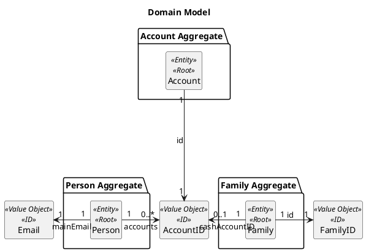
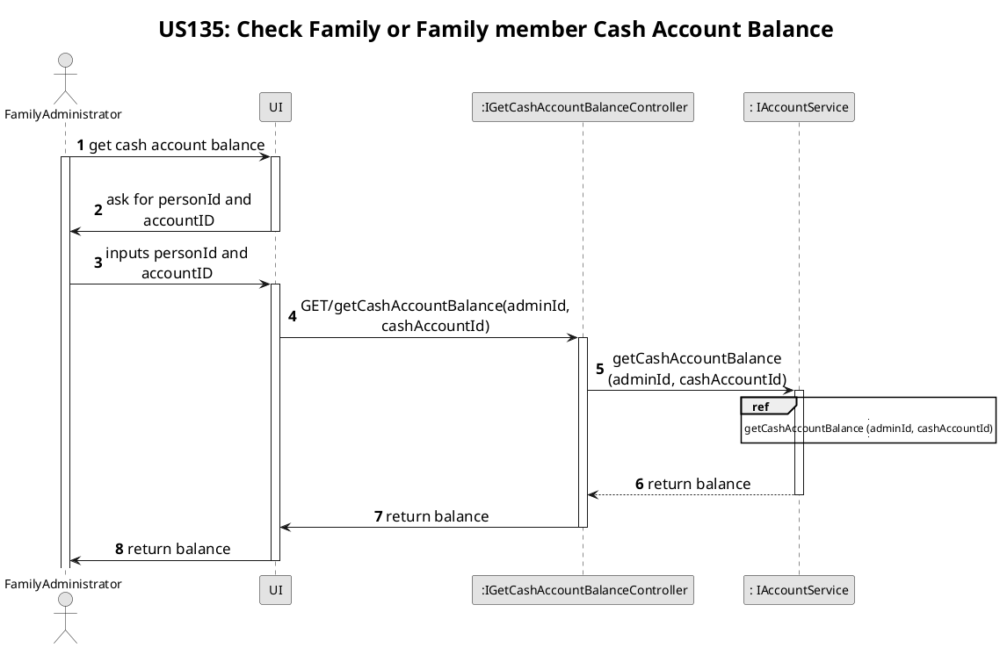
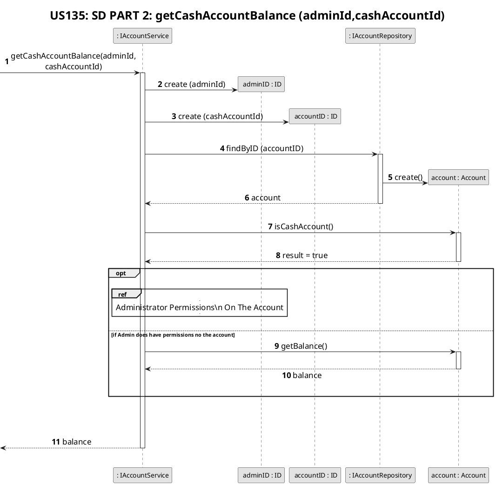
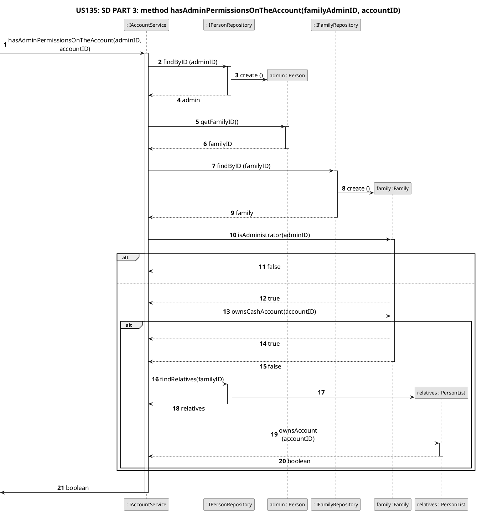
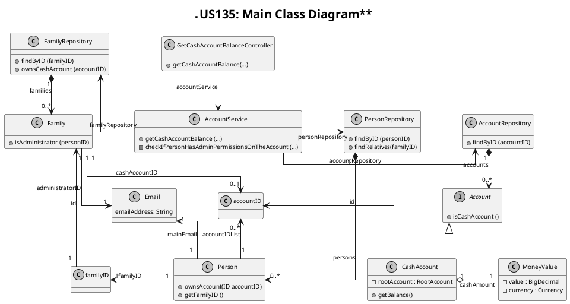

# US135
=======================================


# 1. Requirements

>__"As a family administrator, I want to check the balance of the family’s cash account or of a given family member."__

## 1.1 Description

* A family administration has the possibility to check the cash account balance from his family or from any cash account from any member of his family. 

# 2. Analysis

To meet this requirement, a few key pieces of data are need: 
- A administratorID that identifies the family administrator to check if he has permission to access the balance of his family's cash account, or his relative's cash account.
- A cashAccountID to identify the cash account for check his balance.

For this User Story and in this sprint, the familyAdminID will have to be input along with the cashAccountId because with need a way to identify the entity the admin that will access the balance of the cash account.
We interpreted this requirement as the family Administrator wants to check the balance of his family account or simply the balance of one of their relatives.

## 2.1 Domain Model




## 2.2 Product Owner 

During the Sprint, the product owner (PO) set some specifications that contribute to the design and implementation of 
the US.

> A Family has only one Cash Account

> A Family Member can have more than one.

> The balance calculation can vary for each type of account.

## 2.3 Decisions

At this point there is no interaction to user by a UI so, in this sprint, administratorID is request to verify that the person, or the family is the holder of the given account.
In successfully scenario the balance of chosen account is obtain by the respective controller.

The balance is an attribute from the Account class. This attribute is updated each time a transaction is added to the ledger.

## 2.4 Dependent US

* This User Story has other user stories dependencies, like [US170](./US170.md) (As a family member, I want to create a personal cash account),
  [US120](./US120.md)  (As a family administrator, I want to create a family cash account.) because that is necessary create a family, or a person cash account, 
  and then an only then it is possible to check the cash account balance.

## 2.4 System Sequence Diagram US

```puml
skinparam monochrome true
autonumber
title SSD
actor "Family Administrator"

"Family Administrator" -> "System" : get balance of cash account
activate "Family Administrator"
activate "System"
|||  
"Family Administrator" <-- "System" : select cash account ID
|||
"Family Administrator" -> "System" : inputs administratorID and cashAccountID
|||
"Family Administrator" <-- "System" : returns cash account balance
deactivate "Family Administrator"
deactivate "System"

```

# 3. Design

## 3.1. Functionalities Flow

The Sequence Diagrams for this US are shown below:








## 3.2. Class Diagram

The main Classes involved are:
 - GetCashAccountBalanceController
 - AccountService
 - Account    
 - CashAccount
 - MoneyValue
 - AccountRepository
 - PersonRepository
 - FamilyRepository



As shown in the sequence and class diagrams there is the class Controller that makes the connection between the UI and the application services.
The AccountService will be responsible to access the Domain layer. 
Through the getCashAccountBalance method it will verify first if the holder exists in the system, could be it a family or a person. 
Later you will inspect if the account, related to the introduced CashAccountId exists, and then check if the entered account is a cash account, 
also if it belongs to the specific holder. In the positive case it will execute the getBalance method from MoneyValue class.


## 3.3. Applied Design Patterns

From GRASP design pattern was applied the principles of Controller, Information Expert and Low Coupling.
From SOLID pattern was applied the Single Responsability Principle.

## 3.4. Tests 

Environment initialisation to be tested:
         
         @BeforeEach
            public void initialize() {
                this.app = new FFMApplication();
                FamilyService familyService = this.app.getFamilyService();
                this.accountService = this.app.getAccountService();
                Family family = new Family("F-44578","Costa");
                familyService.addFamily(family);
                this.familyID = family.getId();
                List<String> emails = new ArrayList<>();
                emails.add("newEmail@gmail.com");
                List<String> phones = new ArrayList<>();
                phones.add("912341278");
                this.personID1 = "P-001";
                family.addMember(
                        personID1,
                        "151729336ZX7",
                        "Mariana",
                        "22/04/1984",
                        "236571788",
                        "36",
                        "Rua das Pereiras",
                        "Coimbra",
                        "Portugal",
                        "4529-521",
                        phones, emails);
                List<String> emails2 = new ArrayList<>();
                emails2.add("newEmail@hotmail.com");
                this.personID2 = "P-002";
                family.addMember(
                        personID2,
                        "156875276ZX6",
                        "Joaquim",
                        "10/08/1999",
                        "264996305",
                        "36",
                        "Rua das Pereiras",
                        "Coimbra",
                        "Portugal",
                        "4529-521",
                        phones, emails2);
            }
   
**Test 1:** As a family Administrator i want to check my family cash account

	
	     @Test
            void viewFamilyCashAccountBalance() {
     
                double initialAmount = 100.5;
                String categoryDesignation = "Winter Expenses";
                accountService.createFamilyCashAccount(familyID, initialAmount, categoryDesignation);
                String accountID = accountService.getFamilyCashAccount(familyID).getId();
                String holderId = familyID;
        
                MoneyValue expected = new MoneyValue(new BigDecimal("100.5"));
                MoneyValue result = accountService.viewCashAccountBalance(holderId, accountID);
                assertEquals(0, result.compare(expected));
                assertEquals(expected, result);
            }
            
**Test 2:** As a family Administrator i want to check my person cash account.

           @Test
                void viewMyPersonCashAccountBalance() {

                    double initialAmount = 450.5;
                    String categoryDesignation = "Paiting";
                    accountService.createPersonCashAccount(person1ID,familyID,initialAmount,categoryDesignation);
                    String accountID = accountService.getListOfCashAccounts(person1ID).get(0).getId();
                    String holderId = person1ID;
            
                    MoneyValue expected = new MoneyValue(new BigDecimal(450.5));
            
                    MoneyValue result = accountService.viewCashAccountBalance(holderId, accountID);
                    assertEquals(expected, result);
                }
         
            
**Test 3:** Failure - As a family Administrator I want to check the balance from a non-existing account.
       
        @Test
        void viewAccountBalanceFromAnNonExistingAccount() {
        
        double initialAmount = 2000;
        String categoryDesignation = "Investments";
        accountService.createFamilyCashAccount(familyID, initialAmount, categoryDesignation);
        String accountID = accountService.getFamilyCashAccount(familyID).getId();
        String invalidAccountId = "7654sad-67asdf";
        String holderId = familyID;

        Exception exception = assertThrows(IllegalArgumentException.class, () -> {
            accountService.viewCashAccountBalance(holderId, invalidAccountId);
        });

        String expectedMessage= "Account not found.";
        String resultMessage = exception.getMessage();
        assertEquals(expectedMessage,resultMessage);
    }
    
**Test 4:** Failure - As a family Administrator I want to check the balance from a non-existing account. 
   
     @Test
      void viewAccountBalanceFromANonExistentFamily() {
 
         double initialAmount = 2000;
         String categoryDesignation = "Investments";
         accountService.createFamilyCashAccount(familyID, initialAmount, categoryDesignation);
         String accountID = accountService.getFamilyCashAccount(familyID).getId();
         String holderId = familyID;
         String invalidFamilyId = "sdaikgasiuyh234";
 
         Exception exception= assertThrows(IllegalArgumentException.class, () -> {
             accountService.viewCashAccountBalance(invalidFamilyId, accountID);
         });
 
         String expectedMessage= "This account holder does not exists";
         String resultMessage = exception.getMessage();
         assertEquals(expectedMessage,resultMessage);
     }
     
**Test 5:** Failure - As a family Administrator i want to check my person bank account balance
       
    @Test
    void viewMyPersonBankAccountBalance() {

        double initialAmount = 300;
        String cashAccountDesignation = "Projects";
        String bankAccountDesignation = "Investments";
        List<String> holders = new ArrayList<>();
        holders.add(person1ID);
        accountService.createPersonCashAccount(person1ID, familyID, initialAmount, cashAccountDesignation);
        accountService.addBankAccount(bankAccountDesignation, holders, familyID);
        String accountID = accountService.getListOfPersonAccounts(person1ID).get(1).getId();
        String holderId = person1ID;

        Exception ex =  assertThrows(IllegalArgumentException.class, () -> {
            accountService.viewCashAccountBalance(holderId, accountID);
        });
        String expected = "It is not a CashAccount.";
        String result = ex.getMessage();
        assertEquals(expected,result);
    }
            
**Test 6:** Failure - Test Failure : As a Family Administrator I want to check a non-existent cash person Cash Account
        
        @Test
        void viewAnAccountBalanceOfANoneExistentAccount() {

        double initialAmount = 300;
        String categoryDesignation = "Holidays";
        accountService.createPersonCashAccount(personID, familyId, initialAmount, categoryDesignation);
        String accountID = accountService.getListOfCashAccounts(personID).get(0).getId();
        String invalidAccountID = "ew9oyr8xafbsdn";
        String holderId = personID;

        Optional <MoneyValue> expected = Optional.empty();

        Optional <MoneyValue> result = viewCashAccountBalanceController.viewCashAccountBalance(holderId, invalidAccountID);
        // Assert - ver que de facto está vazio
        assertEquals(expected,result);
        // Devolve falso porque não têm um valor
        assertFalse(result.isPresent());
    }           
            
# 4. Implementation
Has shown in the sequence diagram, the account service is responsible for obtain balance from an account instance. 
When you want to check the balance from an cashAccount,
you need to make sure that the holder and the account exists in the system. 
After that you need to make sure that the account is an cashAccount and belongs to the 
specific holder. Then it will call the method get balance from MoneyValue.
If an error occurs an exception is throws to controller.


This code snippet shows this validation in the method viewCashAccountBalance in AccountService class:

         public Optional<MoneyValue> getCashAccountBalance(String adminIDString, String accountIDString) throws ElementNotFoundException, InvalidEmailException {
  
          ID adminId = new Email(adminIDString);
          AccountID accountID = new AccountID(UUID.fromString(accountIDString));
          Account account = accountRepository.findByID(accountID);
  
          if (!account.isCashAccount()) {
              throw new IllegalArgumentException("It's not a cash account");
          }
  
          if (checkIfPersonHasAdminPermissionsOnTheAccount(adminId, accountID)) {
              return Optional.of(account.getBalance());
          }
  
          throw new IllegalArgumentException("Balance can not be checked");
      }
      
      
         private boolean checkIfPersonHasAdminPermissionsOnTheAccount(ID adminID, AccountID accountID) throws ElementNotFoundException {
      
              Person admin = personRepository.findByID(adminID);
              ID familyID = admin.getFamilyID();
              Family family = familyRepository.findByID(familyID);
      
              //Chek if I am the administrator
              if (!(family.isAdministrator(adminID))) {
                  return false;
              }
      
              //Check if families cash account
              if (family.ownsCashAccount(accountID)) {
                  return true;
              }
      
              //Check if relatives cash account
              PersonList relatives = personRepository.findRelatives(familyID);
              return relatives.ownsAccount(accountID);
          }

      
      
      

If all conditions are met, the Money value get balance method is called.

# 5. Integration/Demo
This US is integrate with the different account holder's (person or family), 
since the balance can be updated differently in each account, 
being this US responsible for only transmitting the balance value when requested.


# 6. Observations

To deal with the possibility of null, 
the viewCashAccountBalanceController return a Optional class with a MoneyValue. 
In case of failure it will return Optional.empty(), 
which translate into a kind of non-performance of the required operation 
(which in this case is obtaining a balance).