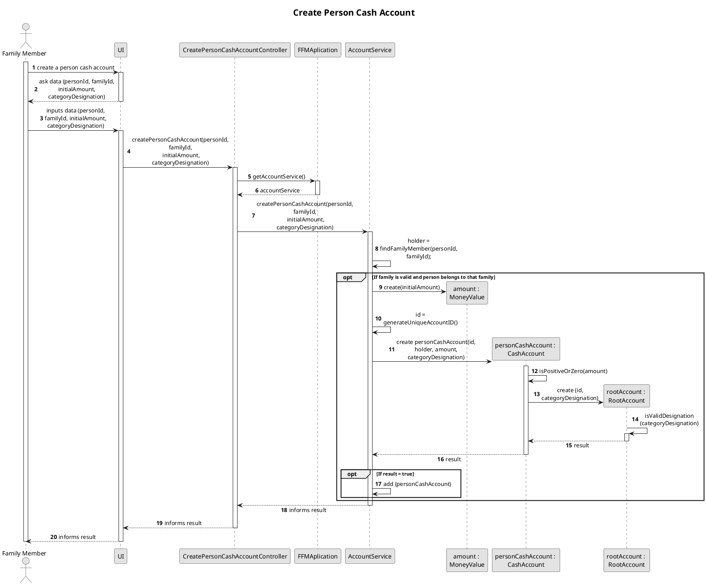
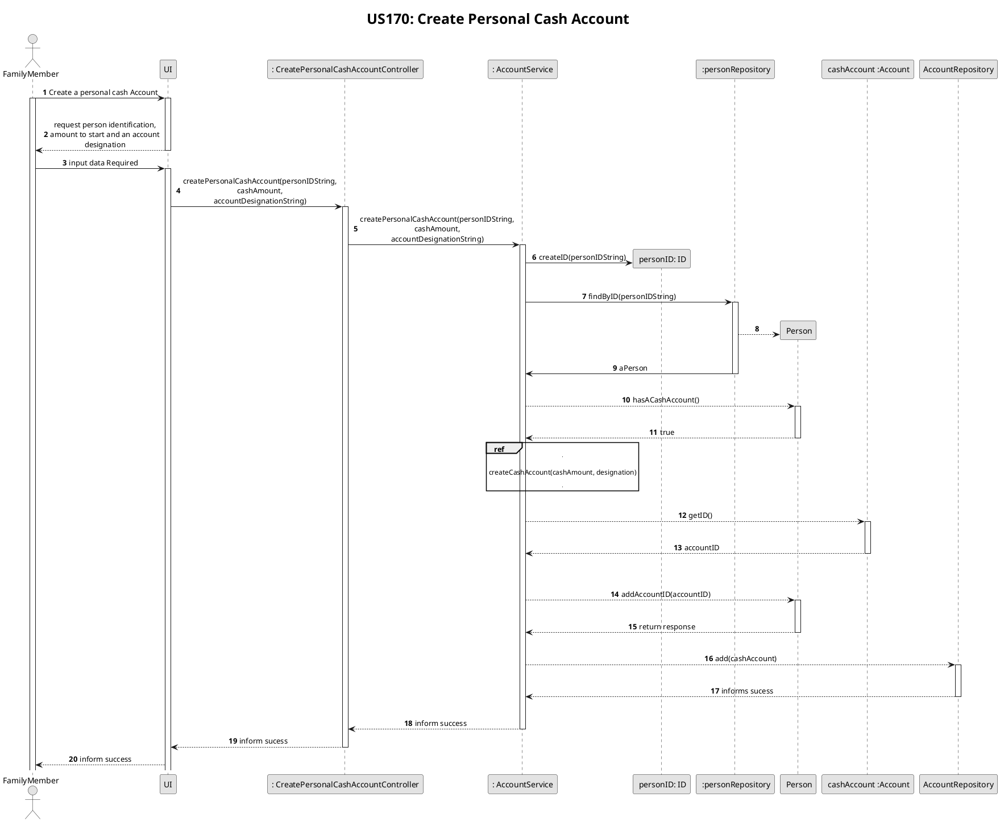
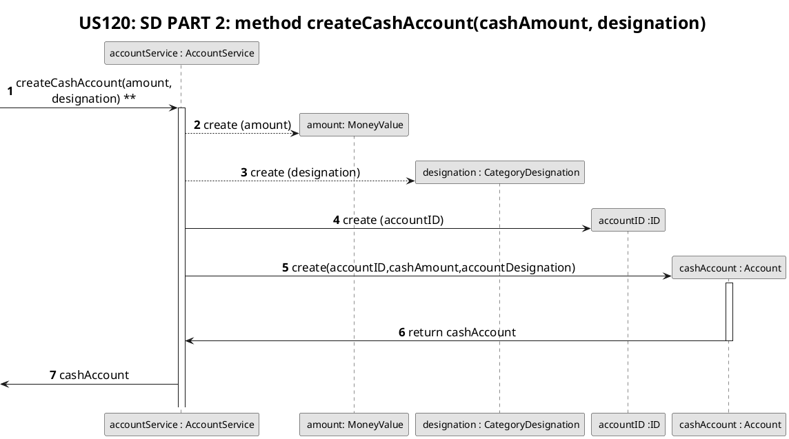
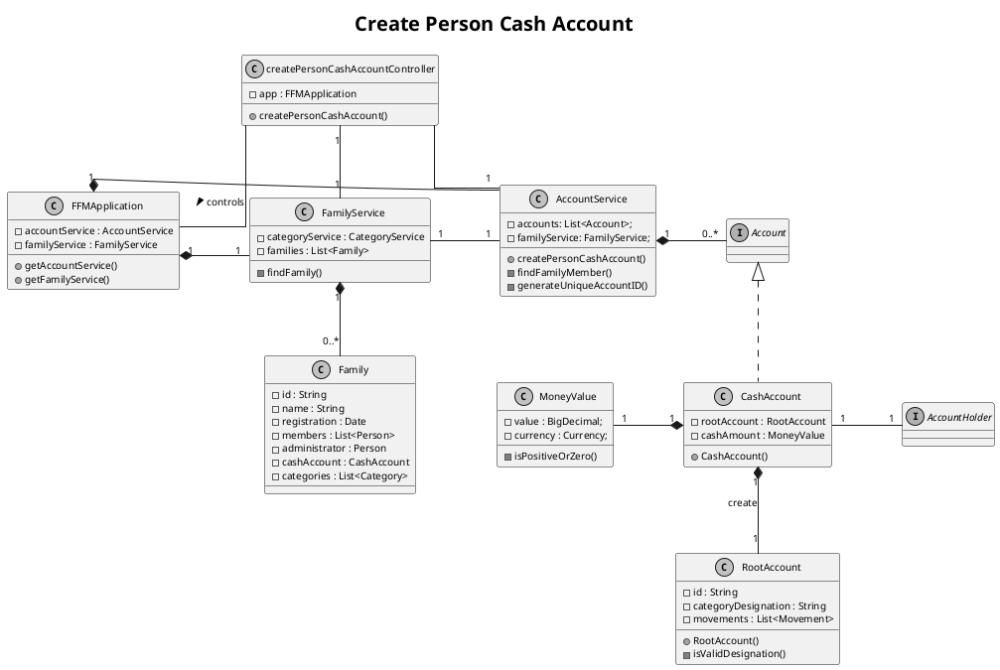
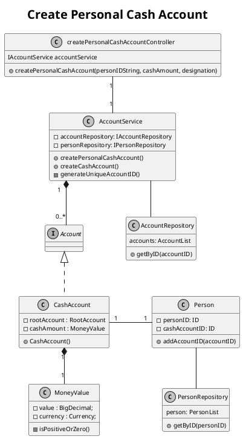

# US170
=======================================


# 1. Requirements

>__"As a family member, I want to create a personal cash account."__

* The interpretation of this requirement was based on the purpose of any family member being able to create a personal cash account, but only if the amount of money has a non-negative value. The function "initialAmount.isPositiveOrZero()" will return a boolean, notifying the user that the amount is positive or not. If it's positive, the cash account will be successfully created.
* This account will store any future data inputted by the user in numerical number, representing the amount of cash they want to store. 

# 2. Analysis

##2.1.Product Owner 

An answer from the product owner (PO) was important in the design decision.
When the family member creates a cash account, it wasn't clear if by saving a specific amount (the family member would input that amount) if it would be rounded up/down to the second decimal.  
- The product owner informed that, for now, that issue isn't a concern.

## 2.2. US Dependencies

This User Story depends on the following US:
    * US101 - As a family administrator, I want to add family members.
    

# 3. Design

## 3.1. Functionalities Flow

```puml
skinparam monochrome true
autonumber
title SSD
actor "Family Member"

"Family Member" -> "System" : create a personal cash account
activate "Family Member"
activate "System"
|||  
"Family Member" <-- "System" : ask required data

"Family Member" -> "System" : inputs data

|||
"Family Member" <-- "System" : returns personal cash account
deactivate "Family Member"
deactivate "System"

```





Changes after Sprint Review
P2

```puml
skinparam monochrome true
autonumber
title SSD
actor "Family Member"

"Family Member" -> "System" : create a personal cash account
activate "Family Member"
activate "System"
|||  
"Family Member" <-- "System" : ask required data

"Family Member" -> "System" : inputs data

|||
"Family Member" <-- "System" : returns personal cash account
deactivate "Family Member"
deactivate "System"

```







## 3.2. Class Diagram

**Project_V2**



Changes after Sprint Review



## 3.3. Applied Design Patterns

From GRASP design pattern we applied the principles of Controller, Information Expert and Low Coupling.
From SOLID pattern we applied the Single Responsability Principle.

## 3.4. Tests 

The input given by the family member to the controller will be filter by the following function:
- createPersonCashAccount()

The above tests verify the possibility of creating a person cash account, given a personId, familyID, initial amount and a categoryDesignation. 

    @BeforeEach
    public void createPerson() {
        this.app = new FFMApplication();
        FamilyService familyService = app.getFamilyService();
        this.accountService = app.getAccountService();
        family = new Family("F-2192","Abreu");
        familyService.addFamily(family);
        this.familyID = family.getId();

        List<String> emails = new ArrayList<>();
        emails.add("newEmail@gmail.com");
        List<String> phones = new ArrayList<>();
        phones.add("912341278");
        String id1 = "P-001";
        family.addMember(
                id1,
                "160836719ZZ1",
                "Mariana",
                "22/04/1984",
                "236571788",
                "36",
                "Rua das Pereiras",
                "Coimbra",
                "Portugal",
                "4529-521",
                phones, emails);
        this.person1ID = family.getPersonIdByCc("160836719ZZ1");
        mariana = family.findPerson(person1ID);

        List<String> emails2 = new ArrayList<>();
        emails2.add("anotherEmail@gmail.com");
        List<String> phones2 = new ArrayList<>();
        phones2.add("912341558");
        String id2 = "P-002";
        family.addMember(
                id2,
                "156516497ZV7",
                "Henrique",
                "05/02/1989",
                "248958461",
                "36",
                "Rua das Pereiras",
                "Coimbra",
                "Portugal",
                "4529-521",
                phones2, emails2);
        this.person2ID = family.getPersonIdByCc("156516497ZV7");

    }
    
**Teste 1:** Valid cash account:
    
    @Test
    @DisplayName("Create a successful person cash account")
    public void creatingACashAccountSuccessfully() {
        //arrange
        double initialAmount = 10;

        String categoryDesignation = "cash";
        
        //act
        CreatePersonCashAccountController createPersonCashAccountController = new CreatePersonCashAccountController(app);

        boolean result = createPersonCashAccountController.createPersonCashAccount(MiguelID, CostaID, initialAmount, categoryDesignation);
        
        //assert
        assertTrue(result);
    }
        
**Teste 2:** Valid cash account, testing the boundary limits of the initial amount (initialAmount = 0 ) :
    
    @Test
    @DisplayName("Create a successful person cash account")
    public void creatingACashAccountSuccessfully() {
    
        //arrange
        double initialAmount = 10;

        String categoryDesignation = "cash";
        
        //act
        CreatePersonCashAccountController createPersonCashAccountController = new CreatePersonCashAccountController(app);

        boolean result = createPersonCashAccountController.createPersonCashAccount(MiguelID, CostaID, initialAmount, categoryDesignation);
        
        //assert
        assertTrue(result);
    }
            
**Teste 3:** Invalid cash account to invalid amount:
    
    @Test
        @DisplayName("Create a person cash account unsuccessfully")
        public void creatingACashAccountUnsuccessfully_negativeAmount() {
            //arrange
            double initialAmount = -15;
    
            String categoryDesignation = "cash";
            //act
            CreatePersonCashAccountController createPersonCashAccountController = new CreatePersonCashAccountController(app);
    
            boolean result = createPersonCashAccountController.createPersonCashAccount(miguelID, costaID, initialAmount, categoryDesignation);
            //assert
            assertFalse(result);
    
        }
        
**Teste 4:** Invalid cash account due to invalid personId:

    @Test
        @DisplayName("Create a person cash account unsuccessfully")
        public void creatingACashAccountUnsuccessfully_invalidPersonId() {
            //arrange
            double initialAmount = 15;
            String fakeId = "p1o25";
            String categoryDesignation = "cash";
            //act
            CreatePersonCashAccountController createPersonCashAccountController = new CreatePersonCashAccountController(app);
    
            boolean result = createPersonCashAccountController.createPersonCashAccount(fakeId, costaID, initialAmount, categoryDesignation);
            //assert
            assertFalse(result);
    
        }        
    
**Test 5:**  Invalid cash account due to invalid familyId:

    @Test
        @DisplayName("Create a person cash account unsuccessfully")
        public void creatingACashAccountUnsuccessfully_invalidFamilyId() {
            //arrange
            double initialAmount = 10;
            String fakeFamilyId = "p1o25";
            String categoryDesignation = "cash";
            //act
            CreatePersonCashAccountController createPersonCashAccountController = new CreatePersonCashAccountController(app);
    
            boolean result = createPersonCashAccountController.createPersonCashAccount(miguelID, fakeFamilyId, initialAmount, categoryDesignation);
            //assert
            assertFalse(result);
    
        }    
    
**Test 6:**  Invalid cash account due to invalid categoryDesignation:

    @Test
        @DisplayName("Create a person cash account unsuccessfully")
        public void creatingACashAccountUnsuccessfully_invalidDesignation() {
            //arrange
            double initialAmount = 10;
    
            String categoryDesignation = "c@sh";
            //act
            CreatePersonCashAccountController createPersonCashAccountController = new CreatePersonCashAccountController(app);
    
            boolean result = createPersonCashAccountController.createPersonCashAccount(miguelID, costaID, initialAmount, categoryDesignation);
            //assert
            assertFalse(result);
    
        }      
    
    
# 4. Implementation
Has shown in the sequence diagram, the creation of a person cash account will be made by the person him/herself. The following method in the AccountService will ask the constructor of the class CashAccount to create a personal cash account cash with the data give and catch any Illegal Argument Exception thrown by the class CashAccount's constructor.
    
    public boolean createPersonCashAccount(String personId, String familyId, double initialAmount, String categoryDesignation) {
        try {
            MoneyValue amount = new MoneyValue(BigDecimal.valueOf(initialAmount));
            Person holder = findFamilyMember(personId, familyId);
            String id = generateUniqueAccountID();
            CashAccount personCashAccount = new CashAccount(id, holder, amount, categoryDesignation);
            this.accounts.add(personCashAccount);
            return true;
        } catch (IllegalArgumentException cashAccountException) {
           return false;
        }
    }
    

If the initial amount input by the family member is incorrect the following method will throw the corresponded exception and will not create the new personal cash account.

    public CashAccount(String id, AccountHolder holder, MoneyValue initialAmount, String categoryDesignation) {
        if (holder == null) {
               throw new IllegalArgumentException("Invalid holder.");
        }
        if (!initialAmount.isPositiveOrZero()) {
               throw new IllegalArgumentException("Cash Account can't have a negative value.");
        }
        this.cashAmount = initialAmount;
        this.holder = holder;
        this.rootAccount = new RootAccount(id, categoryDesignation);
    }
       
# 5. Integration/Demo

The [US170](./US170.md) to create a personal cash account. This cash account will only be created if the person and its family are valid.
The createPersonCashAccount method in the AccountService class will handle some Illegal Argument Exception that could be thrown in the class CashAccount.
When the method from AccountService class handles the exception it returns false and will not complete the action, to prevent possible incoherent outputs. 

# 6. Observations
Currently, there is no further relevant information to this US.

