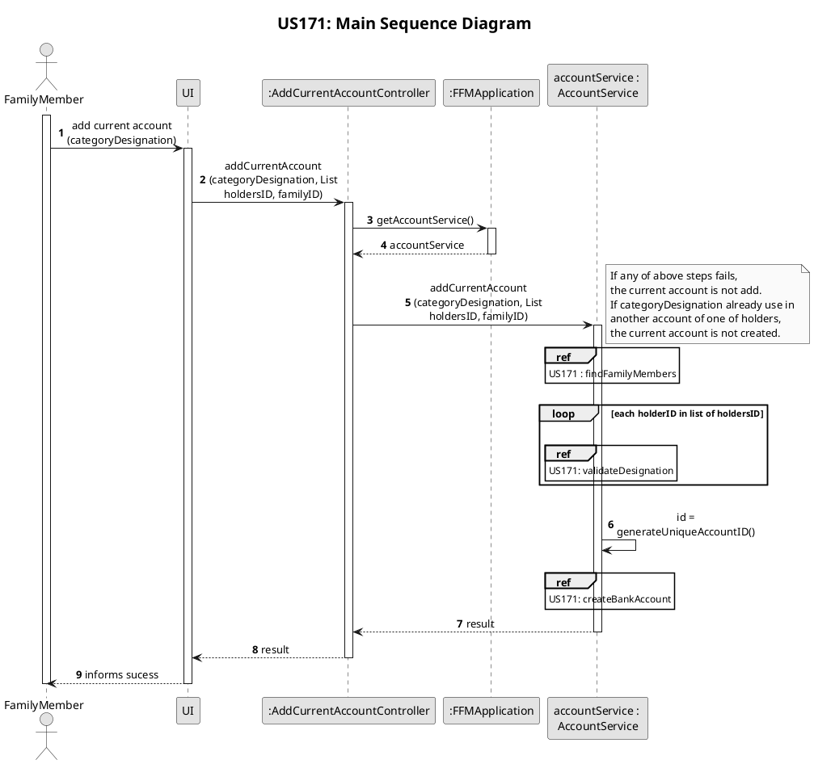
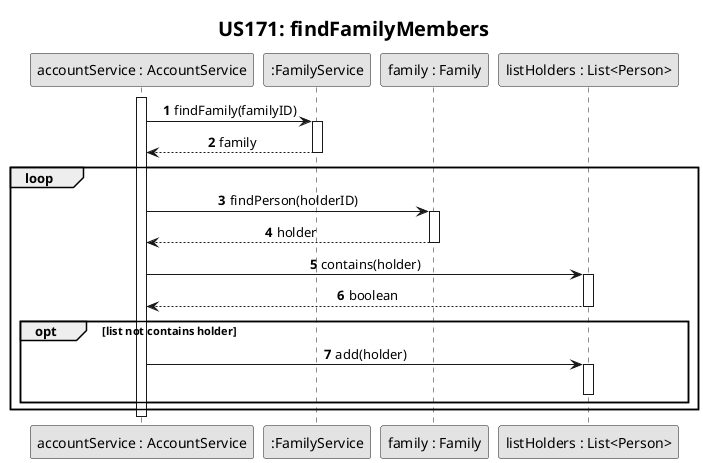
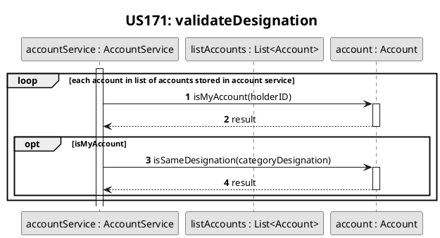
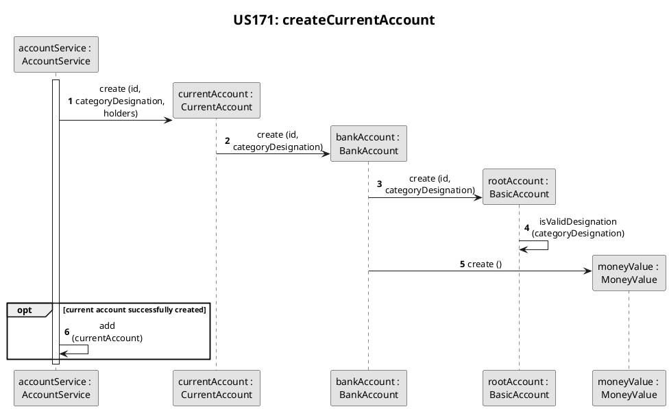
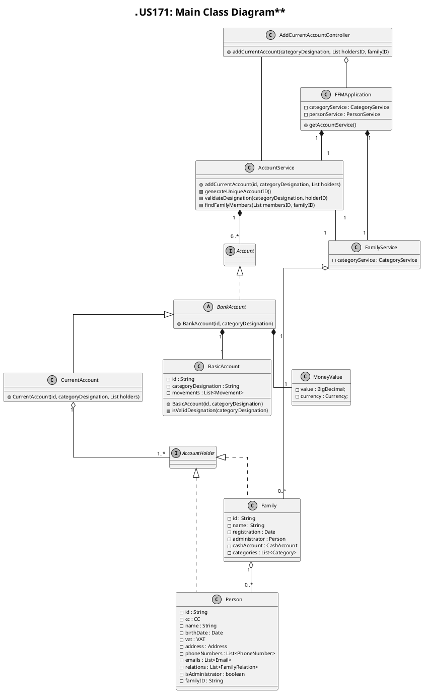

# US171
=======================================


# 1. Requirements

>__"As a family member, I want to add a bank account I have."__

## 1.1 Description
All family members have the possibility to add a current bank account to their personal accounts.

**Demo1** As a family member, I want to add a current account I have.
- Demo1.1 - I  define the necessary data to add a current account.
- Demo1.2 - Furthermore, I can select other members of my family to also be account holders.
- Demo1.3 - I receive information about operation success.

# 2. Analysis
## 2.1 Product Owner 
During the Sprint, the product owner (PO) set some specifications that contributed to the design and implementation of 
the US.
> Accounts must have a categoryDesignation that allows it to be identified.

> The most reasonable solution would be for the initial amount to be set when loading a bank statement.

> A current bank account, but not a credit card account, can be held by more than one family member.

## 2.2 Decisions
To accomplish this requirement, we need the following data:
- the list of holder's ID
- the family's ID
- the categoryDesignation for the current account

According to the switchtwentytwenty goals and the PO requests, it was decided:
- The Bank Account mentioned in this US is designate Current Account within this switchtwentytwenty.
- The Current account categoryDesignation is mandatory and cannot be left blank or empty.
- Each personal account (current, savings, credit card and cash accounts) of each member has a unique categoryDesignation among their accounts.
- If the account has more than one holder, their categoryDesignation cannot exist in any personal account of one of holders.
- At this point there is no interaction to user by a UI so, in this sprint, list of holder's ID and family's ID is request
- If the family or holders aren't found or other problem occurs during the process a false will be returned.

## 2.3 Dependent US
This US depends on US related to create family and add members, such [US010](/docs/user_stories/sp1/US010.md) and [US101](/docs/user_stories/sp1/US101.md). No other User-stories depend on the current User Story,
however, [US172](/docs/user_stories/sp2/US172.md) and [US173](/docs/user_stories/sp2/US173.md) are closely related to it.

## 2.4 System Sequence Diagram
The System Sequence Diagram for this US are shown below:
```puml
skinparam monochrome true
autonumber
title **US171: System Sequence Diagram**
actor "Family Member" as User
skinparam sequenceMessageAlign center

User -> ":System" : create current account
activate User
activate ":System"
User <-- ":System" : request data
deactivate ":System"
User -> ":System" : input required data
activate ":System"
User <-- ":System" : informs sucess
deactivate ":System"
deactivate User
```
# 3. Design

## 3.1. Functionalities Flow
The Sequence Diagrams for this US are shown below:







## 3.2. Class Diagram
The Class Diagram for this US is shown below:


## 3.3. Applied Design Patterns
In this US we adopted the following GRASP principles: Controller, Information Expert, Low Coupling and High Cohesion
Also adopted the SOLID principles: Single Responsibility Principle.

## 3.4. Tests 
The following presented tests set up were design to evaluate the requirement of this US:

Environment initialisation to be tested:

    @BeforeEach
    public void initialize() {
        this.app = new FFMApplication();
        FamilyService familyService = this.app.getFamilyService();
        Family family = new Family("F-7584","Costa");
        familyService.addFamily(family);
        this.familyID = family.getId();
        List<String> emails = new ArrayList<>();
        emails.add("newEmail@gmail.com");
        List<String> phones = new ArrayList<>();
        phones.add("912341278");
        this.personID1 = "P-001";
        family.addMember(
                personID1,
                "151729336ZX7",
                "Mariana",
                "22/04/1984",
                "236571788",
                "36",
                "Rua das Pereiras",
                "Coimbra",
                "Portugal",
                "4529-521",
                phones, emails);
        List<String> emails2 = new ArrayList<>();
        emails2.add("newEmail@hotmail.com");
        this.personID2 = "P-002";
        family.addMember(
                personID2,
                "156875276ZX6",
                "Joaquim",
                "10/08/1999",
                "264996305",
                "36",
                "Rua das Pereiras",
                "Coimbra",
                "Portugal",
                "4529-521",
                phones, emails2);
    }

**Test 1:** Current Account with one holder

    @Test
    @DisplayName("Create a current bank account successfully: one holder")
    public void addBankAccount_OneHolder() {
        AddBankAccountController addCurrentAccountController = new AddBankAccountController(this.app);
        List<String> holders = new ArrayList<>();
        holders.add(personID1);
        boolean result = addCurrentAccountController.addBankAccount(
                "Conta Ordenado",
                holders,
                this.familyID);
        assertTrue(result);
    }

**Test 2:** Current Account with more than one holders

    @Test
    @DisplayName("Create a current bank account successfully: two holder")
    public void addBankAccount_TwoHolders() {
        AddBankAccountController addCurrentAccountController = new AddBankAccountController(this.app);
        List<String> holders = new ArrayList<>();
        holders.add(personID1);
        holders.add(personID2);
        boolean result = addCurrentAccountController.addBankAccount(
                "Conta Ordenado",
                holders,
                this.familyID);
        assertTrue(result);
    }

**Test 3:** Designation already use in another account from same holder
    
    @Test
    @DisplayName("Failure to create a current bank account: same categoryDesignation in another account of same person")
    public void FailureAddBankAccount_SameDesignationInAnotherAccountSamePerson() {
        AddBankAccountController addCurrentAccountController = new AddBankAccountController(this.app);
        List<String> holders = new ArrayList<>();
        holders.add(personID1);
        addCurrentAccountController.addBankAccount(
                "Conta Banco",
                holders,
                this.familyID);

        boolean result = addCurrentAccountController.addBankAccount(
                "Conta Banco",
                holders,
                this.familyID);

        assertFalse(result);
    }

**Test 4:** Invalid Designation
    
    @Test
    @DisplayName("Failure create a current bank account: invalid categoryDesignation")
    public void FailureAddBankAccount_InvalidDesignation() {
        AddBankAccountController addCurrentAccountController = new AddBankAccountController(this.app);
        List<String> holders = new ArrayList<>();
        holders.add(personID1);
        boolean result = addCurrentAccountController.addBankAccount(
                "  ",
                holders,
                this.familyID);

        assertFalse(result);
    }    

# 4. Implementation

As shown below, the account service is responsible for adding the current account since all accounts are store here. 
There is a validation of holders (if are from same family) and account categoryDesignation. Then a unique account id is generated, and a current account is instantiated. If an error occurs in this process the account is not create.

    public boolean addCurrentAccount(String categoryDesignation, List<String> holdersID, String familyID) {
        List<Person> holders = findFamilyMembers(holdersID, familyID);
        for (String id : holdersID) {
            validateDesignation(categoryDesignation, id);
        }
        CurrentAccount currentAccount;
        try {
            String id = generateUniqueAccountID();
            currentAccount = new CurrentAccount(id, categoryDesignation, holders);
            this.accounts.add(currentAccount);
            return true;
        } catch (IllegalArgumentException exception) {
            return false;
        }
    }

# 5. Integration/Demo
Even though [US172](./US171.md) and [US173](./US173.md) do not depend on this User-story, they are connected to it
since all this accounts (CurrentAccount, BankAccount and CreditAccount) inherit from the same abstract class, the BankAccount.

# 6. Observations
Currently, there is no further relevant information to this US.