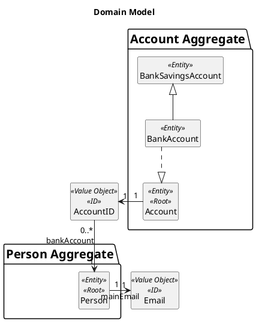
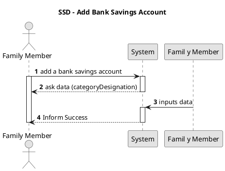
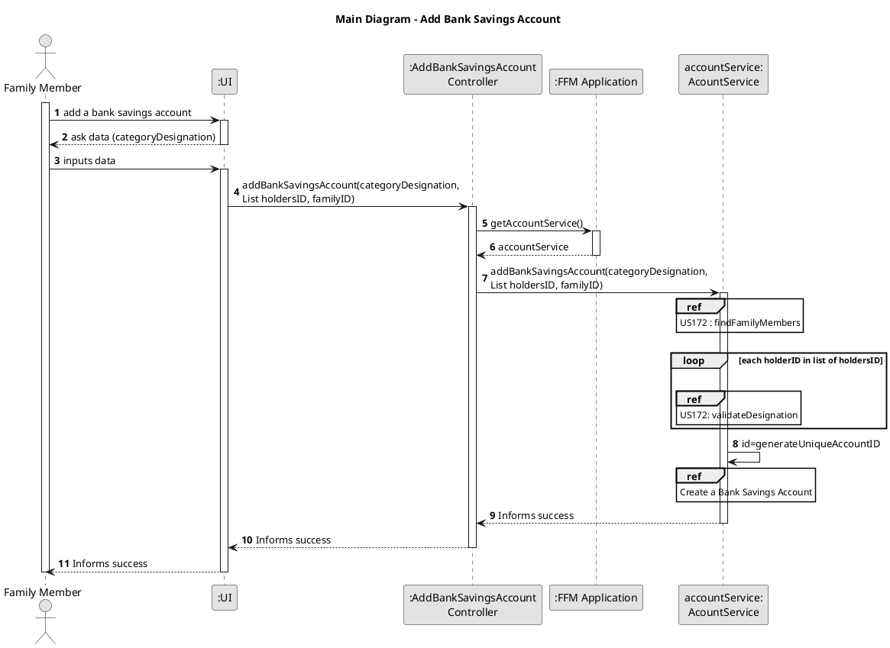
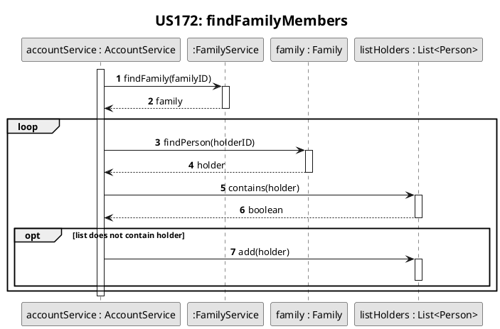
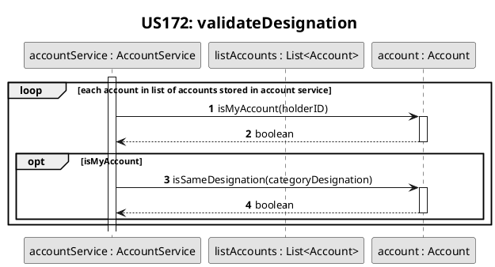
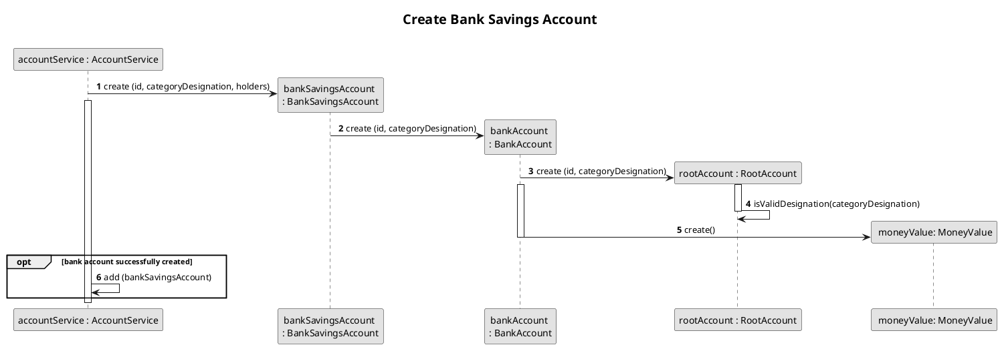
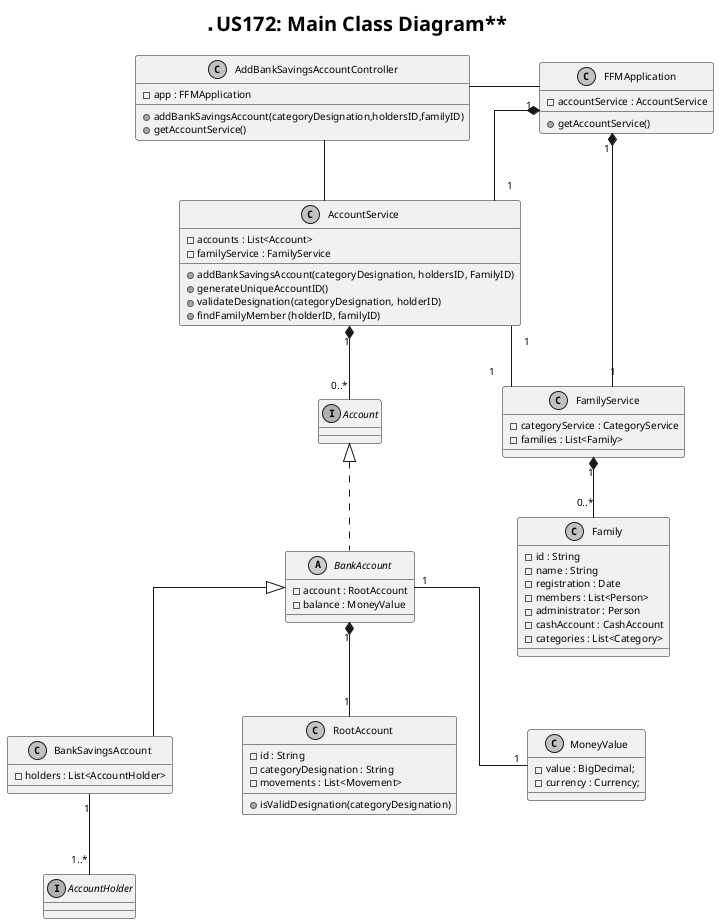

# US172
=======================================

# 1. Requirements

>__"As a family member, I want to add a bank savings account I have."__

## 1.1 Description
**Demo1** As a Family Member, I want to add a bank savings account I have.

- Demo1.1. Add a bank savings account with unique categoryDesignation to the family member's account

- Demo1.2. If the bank savings account has the same categoryDesignation as any other account of the same
user (current account or credit account), the requirement cannot be fulfilled.

This requirement was interpreted as a direct possibility for a family member to add
a bank savings account to the system.

# 2. Analysis

##2.1 Domain Model Context
Domain Model

## 2.2 Product Owner

Some questions were asked to the product owner (PO) in order to make some important design decisions.

> Q: Is it mandatory for the accounts (bank or chash accounts) to have a desingnation?
> 
> A: They should have an understandable categoryDesignation

> Q: When Adding/Creating an Account, is it mandatory for the user to
> type the amount of money it has at the moment or can they
> insert that information later on?

> A: I don't know if it makes sense to assign an initial value to
> an account like that. Inserting an initial approximate value that
> will be corrected  once the movements are logged in is another possibility

> Q: Can a bank account belong to more than one family member?

> A: Yes. A real bank account can have two holders.

## 2.3 Decisions

It was decided that a bank savings accounts can have an unlimited number of holders to reflect
what happens in real life.
Each personal account (current account, bank savings account, credit card and cash accounts) 
of each member must have a unique categoryDesignation (this categoryDesignation,however, can exist in other members' accounts).
For this US, it was decided that the same account can only be shared by members that belong to the same family.

## 2.4 Dependent US

This US depends on US010 and on US101. No other User-stories depend on the current User Story,
however, US171 and US173 are closely related to it.

## 2.5 System Sequence Diagram

# 3. Design

## 3.1. Functionalities Flow

The sequence diagram above represents the main aspects of the process of adding
a bank savings account. First, the Family member inserts the data, ie, the desired categoryDesignation for the bank savings account
in the UI, which is then passed to the account service where the system adds the family member to the list of holders of the account.
After this process, the system checks if the categoryDesignation for the account is valid. This includes making sure that
the user does not use this same categoryDesignation for other accounts.
If this process is successful, a bank savings account is then created.
After this process, The application can have one of two answers:

-inform success if the bank savings account added to the system

-inform failure if adding the bank savings account to the family member's accounts fails.
This sequence diagram ,as well as the ones below, represent only the first situation (the success case), where the bank savings account is successfuly created
and added to the system.

The sequence diagram above represents what happens during the creation of a bank savings account in more detail.
If successful, the account is then added to the AccountService class, and the success of the operation will then be reported to the user.

## 3.2. Class Diagram

In the diagram class diagram above, the Controller class is the class that makes the connection
between the UI and the business logic. The FFMApplication connects the Controller class to the
AccountService class. After being validated, the bank savings account will then be added to the AccountService class.

## 3.3. Applied Design Patterns

From GRASP pattern:
Controller,
Information Expert,
Low Coupling

From SOLID:
Single Responsibility Principle

## 3.4. Tests 

When creating a bank savings account, certain criteria must be met. Their description will be made
in the section Implementation of this document. The following tests assure that some of these criteria
are met :

**Necessary Environment**

    @BeforeEach
    public void initialize() {
    this.app = new FFMApplication();
    FamilyService familyService = this.app.getFamilyService();
    Family family = new Family("F-8374","Castro");
    familyService.addFamily(family);
    this.familyID = family.getId();
    List<String> emails = new ArrayList<>();
    emails.add("castroEmail@gmail.com");
    List<String> phones = new ArrayList<>();
    phones.add("912345678");
    String id1 = "P-001";
    family.addMember(
    id1,
    "151729336ZX7",
    "Teresa",
    "22/04/1984",
    "236571788",
    "22",
    "Rua das Macieiras",
    "Leiria",
    "Portugal",
    "4609-452",
    phones, emails);
    List<String> emails2 = new ArrayList<>();
    emails2.add("newEmail@hotmail.com");
    String id2 = "P-002";
    family.addMember(
    id2,
    "156875276ZX6",
    "Carlos",
    "10/08/1962",
    "264996305",
    "22",
    "Rua das Macieiras",
    "Leiria",
    "Portugal",
    "4609-452",
    phones, emails2);
    this.personID = family.getPersonIdByCc("151729336ZX7");
    this.personID2 = family.getPersonIdByCc("156875276ZX6");
    }
**Test 1:** Bank Savings Account with one holder

     @Test
    @DisplayName("Create a bank savings account successfully")
    public void addBankSavingsAccount() {
        AddBankSavingsAccountController addBankSavingsAccountController = new AddBankSavingsAccountController(this.app);
        List<String> holders = new ArrayList<>();
        holders.add(personID);
        boolean result = addBankSavingsAccountController.addBankSavingsAccount(
                "Conta Poupança",
                holders,
                this.familyID);
        Assertions.assertTrue(result);
    }

**Test 2:** Bank Savings Account with more than one holder
    
    @Test
    @DisplayName("Create bank savings account successfully: two holders")
    public void addBankSavingsAccount_TwoHolders() {
    AddBankSavingsAccountController addBankSavingsAccountController = new AddBankSavingsAccountController(this.app);
    List<String> holders = new ArrayList<>();
    holders.add(personID);
    holders.add(personID2);
    boolean result = addBankSavingsAccountController.addBankSavingsAccount(
    "Conta  Poupança",
    holders,
    this.familyID);
    assertTrue(result);
    }
  

**Test 3:** Designation already use in another account from same holder
   
    @Test
    @DisplayName("Failure to create a bank savings account: same categoryDesignation in another account of same person")
    public void FailureAddBankSavingsAccount_SameDesignationInAnotherAccount() {
    AddBankSavingsAccountController addBankSavingsAccountController = new AddBankSavingsAccountController(this.app);
    List<String> holders = new ArrayList<>();
    holders.add(personID);
    addBankSavingsAccountController.addBankSavingsAccount(
    "Conta Poupança",
    holders,
    this.familyID);

        boolean result = addBankSavingsAccountController.addBankSavingsAccount(
                "Conta Poupança",
                holders,
                this.familyID);

        Assertions.assertFalse(result);
    }
    

**Test 4:** Invalid Designation

    @Test
    @DisplayName("Failure to create a bank savings account: invalid categoryDesignation")
    public void FailureAddBankSavingsAccount_InvalidDesignation() {
        AddBankSavingsAccountController addBankSavingsAccountController = new AddBankSavingsAccountController(this.app);
        List<String> holders = new ArrayList<>();
        holders.add(personID);
        boolean result = addBankSavingsAccountController.addBankSavingsAccount(
                "  ",
                holders,
                this.familyID);

        Assertions.assertFalse(result);
    }

        
# 4. Implementation

The following portion was obtained from the AccountService class:

    public boolean addBankSavingsAccount(String categoryDesignation, List<String> holdersID, String familyID) {
        List<Person> holders = findFamilyMembers(holdersID, familyID);
        for (String id : holdersID) {
            validateDesignation(categoryDesignation, id);
        }
        BankSavingsAccount bankSavingsAccount;
        try {
            String id = generateUniqueAccountID();
            bankSavingsAccount = new BankSavingsAccount(id, categoryDesignation, holders);
            this.accounts.add(bankSavingsAccount);
            return true;
        } catch (IllegalArgumentException exception) {
            return false;
        }
    }

In this portion of code, the account categoryDesignation is validated,i.e, it is asserted whether the account name is already being used by the same user in another account.
The holders undergo a validation as well to assert if they belong to the same family. Then a unique account id is generated, and a credit account is instantiated.

In the text that follows, other important aspects that are not depicted by the code above, are described.
when creating an account of any type, the categoryDesignation given to the account by the family member is validated:
-the categoryDesignation cannot be null or empty
-the description cannot have certain special characters.

the valid categoryDesignation is then transformed, and the first letters are capitalized as well as all the extra space characters
(in the beginning, middle or end of the categoryDesignation) are removed.

When creating the bank savings account,there are some criteria that, if not met, can stop the
whole process. For example, the list of holders:
-cannot be null
-must be filled.

If any of these validations is not respected the BankSavingsAccount is not created, and the process is
finished. as a result, the family member will be informed that the process was not successful.

Even though this is not represented in the portion of code above, other important validation is also made in order to create a BankSavingsAccount:
-the categoryDesignation of the bank savings account cannot match the categoryDesignation of other personal accounts (bank accounts or cash accounts) held by the same user.

# 5. Integration/Demo

Even though [US171](./US171.md) and [US173](./US173.md) do not depend on this User-story, they are connected to it
since all the accounts (CurrentAccount, BankAccount and CreditAccount)  inherit from the same abstract class, the BankAccount.
Even though the different accounts (CurrentAccount, BankAccount and CreditAccount) share a parent class, the CreditAccount created in the US173 differs from the accounts created in this US(BankSavingsAccount) and from US171 (CurrentAccount)
due to the fact that a credit account, unlike the other bank accounts, can only have a single holder.

# 6. Observations

Currently, there is no further relevant information to this US.