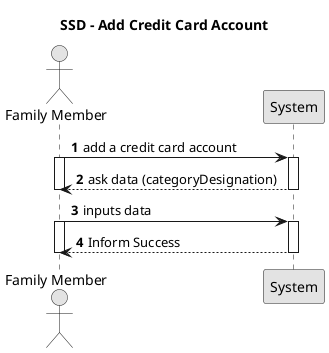
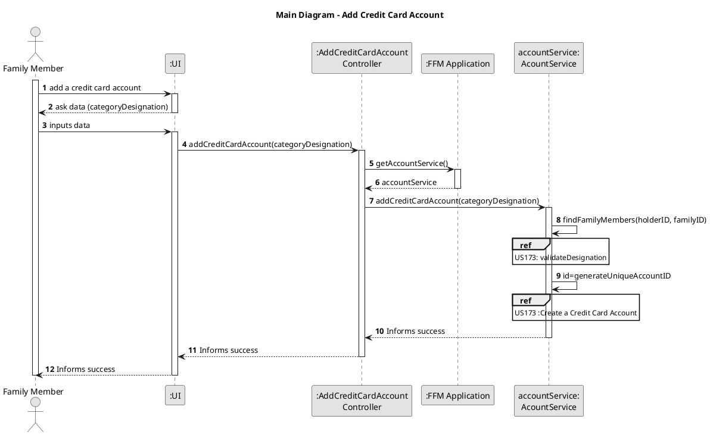
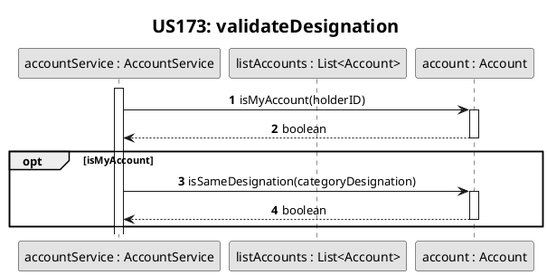
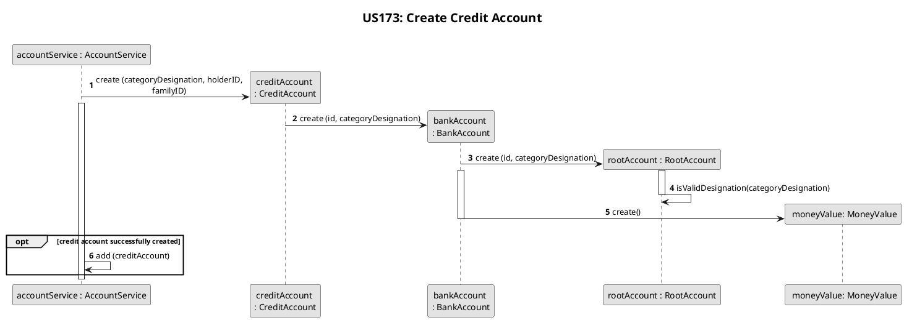
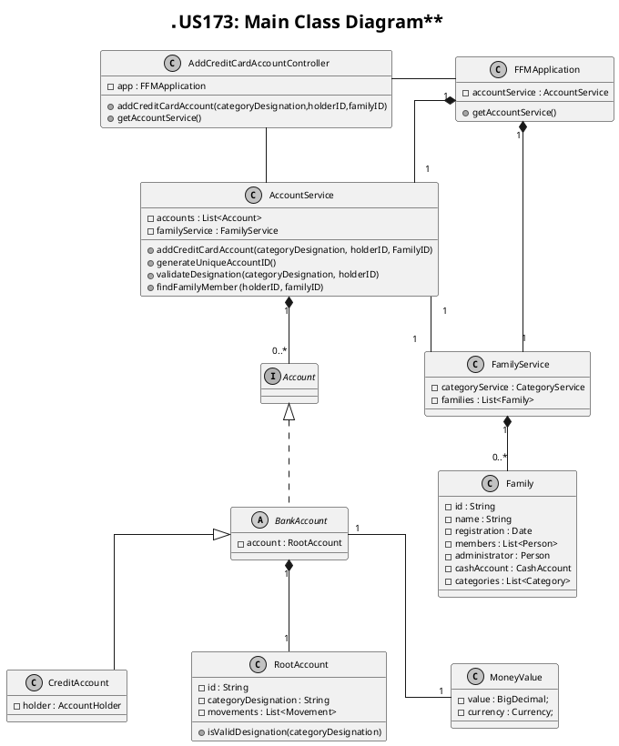

    # US173
=======================================

# 1. Requirements

>__"As a family member, I want to add a credit card account I have."__

## 1.1 Description
**Demo1** As a Family Member, I want to add a credit card account I have.

- Demo1.1. Add a credit card account with a unique categoryDesignation to the family member's account list

- Demo1.2. If the credit card account has the same categoryDesignation as any other account of the same
  user (bank account or basic bank account), the requirement cannot be fulfilled.

This requirement was interpreted as a direct possibility for a family member to add
a credit card account to the system.
# 2. Analysis

## 2.1 Product Owner 

The following questions were asked to the product owner in other to
help make important decisions about the design

> Q: Is it mandatory for the accounts (bank or chash accounts) to have a desingnation?
>
> A: They should have an understandable categoryDesignation

> Q: When Adding/Creating an Account, is it mandatory for the user to
> type the amount of money it has at the moment or can they
> insert that information later on?

> A: I don't know if it makes sense to assign an initial value to
> an account like that. Inserting an initial approximate value that
> will be corrected  once the movements are logged in is another possibility

> Q: Can a bank account belong to more than one family member?

> A: Yes,a real bank account can have two holders but the same is
> not true for a credit card account.

## 2.2 Decisions
It was decided that the credit account can have a single holder in contrast to what happens with the bank savings account and the bank account, that can have unlimited number of holders.
## 2.3 Dependent US

This US depends on US010 and on US101. There are no User-stories dependent on the current
User Story, however, US171 and US173 are closely related to it.

## 2.4 System Sequence Diagram

# 3. Design

## 3.1. Functionalities Flow

The sequence diagram above represents the main aspects of the process of adding
a credit card account. First, the Family member inserts the data, ie, the desired categoryDesignation for the credit account
in the UI, which is then passed to the account service where the system checks if the categoryDesignation for the account is valid. This includes making sure that
the user does not use this same categoryDesignation for other accounts.
If this process is successful, a bank savings account is then created.
After this process, The application can have one of two answers:

-inform success if the credit account added to the system

-inform failure if adding the credit account to the family member's accounts fails.
This sequence diagram ,as well as the ones below, represent only the first situation (the success case), where the credit account is successfuly created
and added to the system.

The sequence diagram above represents what happens during the creation of a credit account in more detail.
If successful, the account is then added to the AccountService class, and the success of the operation will then be reported to the user.

## 3.2. Class Diagram

In the diagram class diagram above, the Controller class is the class that makes the connection
between the UI and the business logic. The FFMApplication connects the Controller class to the
AccountService class. After being validated, the credit account will then be added to the AccountService class.

## 3.3. Applied Design Patterns

From GRASP pattern:
Controller,
Information Expert,
Low Coupling

From SOLID:
Single Responsibility Principle

## 3.4. Tests

When creating a credit account, certain criteria must be met. Their description will be made
in the section Implementation of this document. The following tests assure that some of these criteria
are met :

**Necessary Environment**
    
    @BeforeEach
    public void initialize() {
    this.app = new FFMApplication();
    FamilyService familyService = this.app.getFamilyService();
    Family family = new Family("F-2837","Castro");
    familyService.addFamily(family);
    this.familyID = family.getId();
    List<String> emails = new ArrayList<>();
    emails.add("castroEmail@gmail.com");
    List<String> phones = new ArrayList<>();
    phones.add("912345678");
    String id1 = "P-001";
    family.addMember(
    id1,
    "151729336ZX7",
    "Teresa",
    "22/04/1984",
    "236571788",
    "22",
    "Rua das Macieiras",
    "Leiria",
    "Portugal",
    "4609-452",
    phones, emails);
    List<String> emails2 = new ArrayList<>();
    emails2.add("newEmail@hotmail.com");
    String id2 = "P-002";
    family.addMember(
    id2,
    "156875276ZX6",
    "Carlos",
    "10/08/1962",
    "264996305",
    "22",
    "Rua das Macieiras",
    "Leiria",
    "Portugal",
    "4609-452",
    phones, emails2);
    this.personID = family.getPersonIdByCc("151729336ZX7");
    this.personID2 = family.getPersonIdByCc("156875276ZX6");
    }

**Test 1:** Create one credit account, that can only have a single holder, sucessfully 
   
    @Test
    @DisplayName("Create a credit card account successfully")
    public void addCreditCardAccount() {
    AddCreditCardAccountController addCreditCardAccountController = new AddCreditCardAccountController(this.app);
    boolean result = addCreditCardAccountController.addCreditCardAccount(
    "Conta Credito",
    this.personID,
    this.familyID);
    Assertions.assertTrue(result);
    }

**Test 2:** Designation already use in another account from same holder

    @Test
    @DisplayName("Failure to create a credit card account: same categoryDesignation in another account of same person")
    public void FailureAddCreditCardAccount_SameDesignationInAnotherAccount() {
    AddCreditCardAccountController addCreditCardAccountController = new AddCreditCardAccountController(this.app);
    addCreditCardAccountController.addCreditCardAccount(
    "Conta Credito",
    this.personID,
    this.familyID);

        boolean result = addCreditCardAccountController.addCreditCardAccount(
                "Conta Credito",
                this.personID,
                this.familyID);

        Assertions.assertFalse(result);
    }

**Test 3:** Different members can have accounts with the same categoryDesignation
    
    @Test
    @DisplayName("Create credit card account successfully: same categoryDesignation in another person's account")
    public void addCreditCardAccount_SameDesignationInAnotherPersonAccount() {
    AddCreditCardAccountController addCreditCardAccountController = new AddCreditCardAccountController(this.app);
    addCreditCardAccountController.addCreditCardAccount(
    "Conta Credito",
    this.personID,
    this.familyID);

     boolean result = addCreditCardAccountController.addCreditCardAccount(
                "Conta Credito",
                this.personID2,
                this.familyID);

        Assertions.assertTrue(result);
    }

**Test 4:** Invalid Designation

    @Test
    @DisplayName("Failure to create a credit card account: invalid categoryDesignation")
    public void FailureAddCreditCardAccount_InvalidDesignation() {
    AddCreditCardAccountController addCreditCardAccountController = new AddCreditCardAccountController(this.app);
    boolean result = addCreditCardAccountController.addCreditCardAccount(
    "  ",
    this.personID,
    this.familyID);

    Assertions.assertFalse(result);
    }

# 4. Implementation

The following portion was obtained from the AccountService class:

    public boolean addCreditCardAccount(String categoryDesignation, String holderID, String familyID) {
    Person holder = findFamilyMember(holderID, familyID);
    validateDesignation(categoryDesignation, holderID);
    CreditAccount creditAccount;
    try {
    String id = generateUniqueAccountID();
    creditAccount = new CreditAccount(id, categoryDesignation, holder);
    this.accounts.add(creditAccount);
    return true;
    } catch (IllegalArgumentException exception) {
    return false;
    }

In this portion of code, the account categoryDesignation is validated,i.e, it is asserted whether the account name is already being used by the same user in another account.
Then a unique account id is generated, and a credit account is instantiated.

In the text that follows, other important aspects that are not depicted by the code above, are described.
 when creating an account of any type, the categoryDesignation given to the account by the family member is validated:
-the categoryDesignation cannot be null or empty
-the description cannot have certain special characters.

the valid categoryDesignation is then transformed, and the first letters are capitalized as well as all the extra space characters
(in the beginning, middle or end of the categoryDesignation) are removed.

Another important aspect to consider when creating a CreditAccount, is the fact the account can only have a single holder and that holder cannot be null
If any of these validations fails, the CreditAccount is not created, and the process is
finished. As a result, the family member will be informed that the process was not successful.

If successful, the credit account is created and stored in the account service.

# 5. Integration/Demo

Even though [US171](./US171.md) and [US172](./US172.md) do not depend on this User-story, they are connected to it
since all the accounts (CurrentAccount, BankAccount and CreditAccount)  inherit from the same abstract class, the BankAccount.
Even though the different accounts (CurrentAccount, BankAccount and CreditAccount) share a parent class, the CreditAccount created in this US differs from the accounts created in US171 (CurrentAccount) and from US172 (BankSavingsAccount)
due to the fact that a credit account, unlike the other bank accounts, can only have a single holder.

# 6. Observations

Currently, there is no further relevant information to this US.