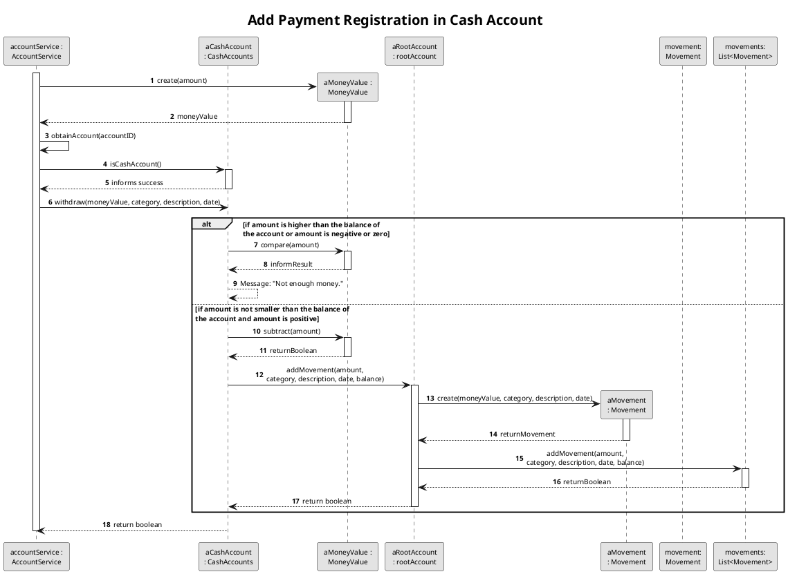
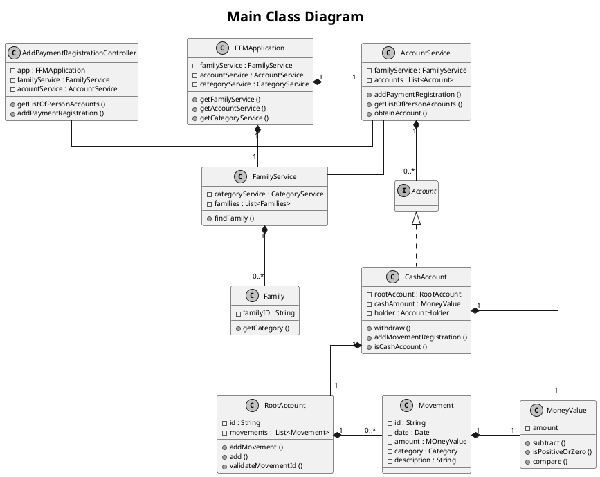

# US181
=======================================


# 1. Requirements

>__"As a family member, I want to register a payment that I have made using one of my cash accounts."__

## 1.1 Description
**Demo1** As a family member, I want to select the cash account in which I want to add a payment registration
- Demo1.1. select the cash account in which I want to add the payment registration.
- Demo1.2. if the account selected isn't a cash account, the requirement cannot be fulfilled.  

**Demo2** As a family member, I want to register a payment using one of my cash accounts.
- Demo2.1. select the cash account and add the payment registration.
- Demo2.2. if the person doesn't have a cash account, the requirement cannot be fulfilled.  
- Demo2.3. if the payment input data are wrong, the requirement cannot be fulfilled.

The requirement of this US focuses on the registration of one payment made through a person's cash account. To fulfill 
this purpose, the family member must select the cash account and  introduce the correct data to make registration. 
This registration is saved in the person's cash account, therefore, the family member must have an account created and 
assigned. Otherwise, the requirement isn't successfully crafted.

# 2. Analysis

## 2.1 Product Owner 
During the Sprint, the product owner (PO) set some specifications that contribute to the design and implementation of 
the US.

> Q: Which data should be presented in the movement registration on the Cash Account ?
- Each movement contains its description, the category, the date of the payment, amount of money involved, and the 
balance of the cash account after the payment.

> Q: Can the family member have more than one cash account? 
- For now, each family member has one personal cash account.

## 2.2 Decisions
-The major decision made in this US was to save all the movements in each root account.

## 2.3 Dependent US
To deliver this US, it is required that the family member has one cash account, which references to the US170.

## 2.4 System Sequence Diagram
```puml
skinparam monochrome true
autonumber
title SSD
actor "Family Member"

"Family Member" -> "System" : get list of person's cash accounts 
activate "Family Member"
activate "System"
|||  
"Family Member" <-- "System" : show list of accounts

"Family Member" -> "System" : select account
|||
"Family Member" <-- "System" : ask for imput data

"Family Member" -> "System" : insert required data
|||
"Family Member" <-- "System" : inform result
deactivate "Family Member"
deactivate "System"

```

# 3. Design

## 3.1. Functionalities Flow
```puml
@startuml
skinparam defaultFontSize 10
skinparam sequenceMessageAlign center
skinparam monochrome true
title Main Sequence Diagram
skinparam titleFontSize 20
autonumber
'UserStory Ententies'
actor "Family Member" as FamilyMember
participant UI
participant " : AddPaymentRegistrationController" as AddPaymentRegistrationController
participant " : FFMApplication" as FFMApplication
participant " accountService : \nAccountService" as AccountService
participant " familyService : \nFamilyService" as FamilyService
participant " aFamily \n: Family" as Family

FamilyMember -> UI : get the list of all of my accounts
activate FamilyMember
activate UI
UI -> AddPaymentRegistrationController : getListOfPersonAccounts(personID)
activate AddPaymentRegistrationController
AddPaymentRegistrationController -> FFMApplication : getAccountService();
activate FFMApplication
FFMApplication --> AddPaymentRegistrationController : accountService 
deactivate FFMApplication
AddPaymentRegistrationController -> AccountService: getListOfPersonAccounts(personID)
activate AccountService

AccountService -> "listOfPersonAccounts\n:List<AccountDTO>" *: create()
          
    loop for each account in system 
                AccountService -> "accountDTO:AccountDTO" *: create()
                AccountService -> AccountService : listOfPersonAccounts.add(accountDTO)
    end

AccountService --> AddPaymentRegistrationController : listOfDTOAccounts
deactivate AccountService
AddPaymentRegistrationController --> UI : listOfDTOAccounts
deactivate AddPaymentRegistrationController
UI --> FamilyMember : listOfDTOAccounts
deactivate UI
deactivate FamilyMember

FamilyMember -> UI : select cash account
activate FamilyMember
activate UI
UI --> FamilyMember : cashAccountID
deactivate UI
deactivate FamilyMember

FamilyMember -> UI : add payment registration\n in cash account
activate UI
activate FamilyMember
UI -> AddPaymentRegistrationController : addPaymentRegistration\n(familyID, accountID, amount \ncategoy, description, date)
activate AddPaymentRegistrationController

AddPaymentRegistrationController -> FFMApplication : getAcountService();
activate FFMApplication
FFMApplication --> AddPaymentRegistrationController : accountService
deactivate FFMApplication
AddPaymentRegistrationController -> AccountService : addPaymentRegistration(accountID, amount \ncategoy, description, date)
activate AccountService

activate AccountService
AccountService -> FamilyService : findFamily(familyID)
activate FamilyService
FamilyService --> AccountService : returns family
deactivate FamilyService
AccountService -> Family : getCategory(category)
activate Family
Family --> AccountService : category
deactivate Family
deactivate AccountService

ref over AccountService : Add Payment Registration \nin Cash Account

AccountService --> AddPaymentRegistrationController : informs success
deactivate AccountService
AddPaymentRegistrationController --> UI : informs success
deactivate AddPaymentRegistrationController
UI --> FamilyMember : informs sucess
deactivate UI
deactivate FamilyMember

@endpmul
'______________________________________________________________________________________________________________________'
```
In this US, the fist step consists on the family member choosing the account in which the person wants to register the 
payment. In this case, all of its accounts are presented, like bank accounts, savings accounts,... and he must choose the 
cashaccount. This list of accounts are saved in the account service. In order to the AddPaymentRegistrationController 
to provide the list of the person's account, all the accounts on the service are checked and all the ones that have the
person ID as its attribute are presented to the person account list as a DTO.
After that, the person selects the cash account in which the payment is going to be added, and introduces the data 
required to add the movement registration. The necessary input data are: the family ID, the account ID, the amount of 
the payment,  the category in which is the movement is included, the description and the date.
The category involved in this process is introduced as a CategoryDTO, and it's tranformed into a Category Object 
within the Business Domain. This category provided must exist in the family list of categories,whether the category ID 
represents a standard category, or represents a customized category (both saved in the family attributes information).
If the Category doesn't exist in the family data, the movement isn't created, and the process stops. For that, the
Account Service, which goes to the Family Service, finds the family and checks the category.


The final process is to create and add the movement in the cash account. The first part is to transform the input amount
in a MoneyValue object, since this amount represents money, which is a class that must obey some rules. The next step is
to remove the money from the cash amount in the person's cash account. This is the most important part of the process, since
it is the one that validates the achievement of this US. If the amount is negative or less than the amount that the 
cash account has at that moment, the requirement isn't fulfilled. If this process is successful, the movement is 
created and register in the person's cash account.

## 3.2. Class Diagram


As demonstrated in the Class Diagram, a Controller class makes the connection between the UI and the business logic, and
the FFMApplication establishes the connection with the Family Service, which stores each Family, and the Account Service.
All the accounts are saved in the Account Service. Each Cash Account keeps a Root Account where each of the movements are 
saved. To add a movement to the account, it is necessary to add all the necessary attributes, which must be validated.

## 3.3. Applied Design Patterns

From GRASP pattern:
Controller,
Information Expert,
Low Coupling

From SOLID:
Single Responsibility Principle

## 3.4. Tests 
*The tests set up were created and designed to best approach both main methods required:*
- getListOfPersonAccounts()
- addPaymentRegistration()

**List of all the Person's Accounts:** 

*Test 1:* Get all the Person's different accounts
    
    @Test
       @DisplayName("Get all the Person's diferent accounts")
       public void getAllPersonsDifferentAccounts(){
           //arrange
               //start application and services
               this.app = new FFMApplication();
               FamilyService familyService = this.app.getFamilyService();
               AccountService accountService = this.app.getAccountService();
               CategoryService categoryService = this.app.getCategoryService();
               AddPaymentRegistrationController controller = new AddPaymentRegistrationController(this.app);
               //create family category
               Category category = categoryService.createCategory("Food");
               //create family
               String familyID = familyService.createFamily("Banner");
               Family family = familyService.findFamily(familyID);
           //create family member
           List<String> jonhPhoneNumbers = new ArrayList<String>();
           jonhPhoneNumbers.add("914565807");
           List<String> johnEmails = new ArrayList<String>();
           johnEmails.add("john@isep.ipp.pt");
           familyService.addFamilyMember("199184437ZX0", "John Banner", "08/04/1996",
                   "233109510", "54", "Rua dos Dragões", "Porto", "Portugal",
                   "4423-876", jonhPhoneNumbers, johnEmails, familyID);
           //create family member accounts
           String personID = family.getPersonIdbyCc("199184437ZX0");
           List<String> holders = new ArrayList<>();
           holders.add(personID);
           accountService.createPersonCashAccount(personID, family.getId(), 1000, "My Cash Account");
           accountService.addBankAccount("My Bank Account", holders, familyID);
           accountService.addCreditCardAccount("My Credit Account", personID, familyID);
           accountService.addBankSavingsAccount("My Savings Account", holders, familyID);
   
           //act
           List<AccountDTO> result = controller.getListOfPersonAccounts(personID);
   
           //assert
           assertEquals(4, result.size());
   
       }

*Test 2:* Get all the Person's Cash accounts.            
      
       @Test
          @DisplayName("Get all the Person's Cash accounts")
          public void getAllPersonsCashAccounts(){
              //arrange
              //start application and services
              this.app = new FFMApplication();
              FamilyService familyService = this.app.getFamilyService();
              AccountService accountService = this.app.getAccountService();
              CategoryService categoryService = this.app.getCategoryService();
              AddPaymentRegistrationController controller = new AddPaymentRegistrationController(this.app);
              //create family category
              Category category = categoryService.createCategory("Food");
              //create family
              String familyID = familyService.createFamily("Banner");
              Family family = familyService.findFamily(familyID);
              //create family member
              List<String> jonhPhoneNumbers = new ArrayList<String>();
              jonhPhoneNumbers.add("914565807");
              List<String> johnEmails = new ArrayList<String>();
              johnEmails.add("john@isep.ipp.pt");
              familyService.addFamilyMember("199184437ZX0", "John Banner", "08/04/1996",
                      "233109510", "54", "Rua dos Dragões", "Porto", "Portugal",
                      "4423-876", jonhPhoneNumbers, johnEmails, familyID);
              //create family member accounts
              String personID = family.getPersonIdbyCc("199184437ZX0");
              List<String> holders = new ArrayList<>();
              holders.add(personID);
              accountService.createPersonCashAccount(personID, family.getId(), 1000, "My Cash Account");
      
              //act
              List<AccountDTO> result = controller.getListOfPersonAccounts(personID);
      
              //assert
              assertEquals(1, result.size());
      
          }
              
*Test 3:* Get all the Person's Cash accounts.             

          @Test
              @DisplayName("Person doesn't have any account")
              public void getAllPersonsCashAccounts_EmptyList(){
                  //arrange
                  //start application and services
                  this.app = new FFMApplication();
                  FamilyService familyService = this.app.getFamilyService();
                  AccountService accountService = this.app.getAccountService();
                  CategoryService categoryService = this.app.getCategoryService();
                  AddPaymentRegistrationController controller = new AddPaymentRegistrationController(this.app);
                  //create family category
                  Category category = categoryService.createCategory("Food");
                  //create family
                  String familyID = familyService.createFamily("Banner");
                  Family family = familyService.findFamily(familyID);
                  //create family member
                  List<String> jonhPhoneNumbers = new ArrayList<String>();
                  jonhPhoneNumbers.add("914565807");
                  List<String> johnEmails = new ArrayList<String>();
                  johnEmails.add("john@isep.ipp.pt");
                  familyService.addFamilyMember("199184437ZX0", "John Banner", "08/04/1996",
                          "233109510", "54", "Rua dos Dragões", "Porto", "Portugal",
                          "4423-876", jonhPhoneNumbers, johnEmails, familyID);
                  //create family member accounts
                  String personID = family.getPersonIdbyCc("199184437ZX0");
          
                  //act
                  List<AccountDTO> result = controller.getListOfPersonAccounts(personID);
          
                  //assert
                  assertEquals(0, result.size());
          
              }

**Add Payment Registration in Person Cash Account** 

*Test 1:* Add 1 Movement to Cash Account Successfully

    @Test
        @DisplayName("Add 1 Movement to Cash Account Successfully")
        public void addMovementSuccessfully_1payment() {
            //arrange
                //start application and services
                this.app = new FFMApplication();
                FamilyService familyService = this.app.getFamilyService();
                AccountService accountService = this.app.getAccountService();
                CategoryService categoryService = this.app.getCategoryService();
                AddPaymentRegistrationController controller = new AddPaymentRegistrationController(this.app);
                //create family category
                Category category = categoryService.createCategory("Food");
                //create family
                String familyID = familyService.createFamily("Banner");
                Family family = familyService.findFamily(familyID);
                //create family member
                List<String> jonhPhoneNumbers = new ArrayList<String>();
                jonhPhoneNumbers.add("914565807");
                List<String> johnEmails = new ArrayList<String>();
                johnEmails.add("john@isep.ipp.pt");
                familyService.addFamilyMember("199184437ZX0", "John Banner", "08/04/1996",
                        "233109510", "54", "Rua dos Dragões", "Porto", "Portugal",
                        "4423-876", jonhPhoneNumbers, johnEmails, familyID);
                //create family member cashAccount
                String personID = family.getPersonIdbyCc("199184437ZX0");
                accountService.createPersonCashAccount(personID, family.getId(),1000, "My Cash Account");
                String accountID = accountService.getListOfPersonAccounts(personID).get(0).getId();
    
            //act
                boolean result = controller.addPaymentRegistration(family.getId(),accountID,150, category.getId(), "Dinner at MacDonald", "01/02/2021" );
                int size = accountService.obtainAccount(accountID).getListOfAllMovements().size();
            //assert
                assertTrue(result);
                assertEquals(1, size );
        }

*Test 2:* Add 2 Movement to Cash Account Successfully

    @Test
        @DisplayName("Add 2 Movement to Cash Account Successfully")
        public void addMovementSuccessfully_3payments() {
            //arrange
            //start application and services
            this.app = new FFMApplication();
            FamilyService familyService = this.app.getFamilyService();
            AccountService accountService = this.app.getAccountService();
            CategoryService categoryService = this.app.getCategoryService();
            AddPaymentRegistrationController controller = new AddPaymentRegistrationController(this.app);
            //create family category
            Category category = categoryService.createCategory("Food");
            //create family
            String familyID = familyService.createFamily("Banner");
            Family family = familyService.findFamily(familyID);
            //create family member
            List<String> jonhPhoneNumbers = new ArrayList<String>();
            jonhPhoneNumbers.add("914565807");
            List<String> johnEmails = new ArrayList<String>();
            johnEmails.add("john@isep.ipp.pt");
            familyService.addFamilyMember("199184437ZX0", "John Banner", "08/04/1996",
                    "233109510", "54", "Rua dos Dragões", "Porto", "Portugal",
                    "4423-876", jonhPhoneNumbers, johnEmails, familyID);
            //create family member cashAccount
            String personID = family.getPersonIdbyCc("199184437ZX0");
            accountService.createPersonCashAccount(personID, family.getId(),190, "My Cash Account");
            String accountID = accountService.getListOfPersonAccounts(personID).get(0).getId();
    
            //act
            boolean payment1 = controller.addPaymentRegistration(family.getId(),accountID,150, category.getId(), "Dinner at MacDonald", "01/02/2021" );
            boolean payment2 = controller.addPaymentRegistration(familyID, accountID,30, category.getId(),"Lunch" ,"01/02/2021");
            boolean payment3 =  controller.addPaymentRegistration(familyID, accountID,40, category.getId(),"Breakfast" ,"01/02/2021");
            int size = accountService.obtainAccount(accountID).getListOfAllMovements().size();
            //assert
            assertTrue(payment1);
            assertTrue(payment2);
            assertFalse(payment3);
            assertEquals(2, size);
        }

*Test 3:* Add Movement to Cash Account without category invalid

    @Test
        @DisplayName("Add Movement to Cash Account without category invalid")
        public void addMovementWithoutCategory() {
            //arrange
            //start application and services
            this.app = new FFMApplication();
            FamilyService familyService = this.app.getFamilyService();
            AccountService accountService = this.app.getAccountService();
            CategoryService categoryService = this.app.getCategoryService();
            AddPaymentRegistrationController controller = new AddPaymentRegistrationController(this.app);
            //create family category
            Category category = new Category("Food");
            //create family
            String familyID = familyService.createFamily("Banner");
            Family family = familyService.findFamily(familyID);
            //create family member
            List<String> jonhPhoneNumbers = new ArrayList<String>();
            jonhPhoneNumbers.add("914565807");
            List<String> johnEmails = new ArrayList<String>();
            johnEmails.add("john@isep.ipp.pt");
            familyService.addFamilyMember("199184437ZX0", "John Banner", "08/04/1996",
                    "233109510", "54", "Rua dos Dragões", "Porto", "Portugal",
                    "4423-876", jonhPhoneNumbers, johnEmails, familyID);
            //create family member cashAccount
            String personID = family.getPersonIdbyCc("199184437ZX0");
            accountService.createPersonCashAccount(personID, family.getId(),1000, "My Cash Account");
            String accountID = accountService.getListOfPersonAccounts(personID).get(0).getId();
    
            //act
            boolean result = controller.addPaymentRegistration(family.getId(),accountID,150, category.getId(), 
            "Dinner at MacDonald", "01/02/2021" );
    
            //assert
            assertFalse(result);
    
        }
        
*Test 4:* Add Movement to Cash Account without enough money in CashAccount

     @Test
        @DisplayName("Add Movement to Cash Account without enough money in CashAccount")
        public void addMovementWithoutEnoughMoneyInCashAccount() {
            //arrange
            //start application and services
            this.app = new FFMApplication();
            FamilyService familyService = this.app.getFamilyService();
            AccountService accountService = this.app.getAccountService();
            CategoryService categoryService = this.app.getCategoryService();
            AddPaymentRegistrationController controller = new AddPaymentRegistrationController(this.app);
            //create family category
            Category category = categoryService.createCategory("Food");
            //create family
            String familyID = familyService.createFamily("Banner");
            Family family = familyService.findFamily(familyID);
            //create family member
            List<String> jonhPhoneNumbers = new ArrayList<String>();
            jonhPhoneNumbers.add("914565807");
            List<String> johnEmails = new ArrayList<String>();
            johnEmails.add("john@isep.ipp.pt");
            familyService.addFamilyMember("199184437ZX0", "John Banner", "08/04/1996",
                    "233109510", "54", "Rua dos Dragões", "Porto", "Portugal",
                    "4423-876", jonhPhoneNumbers, johnEmails, familyID);
            //create family member cashAccount
            String personID = family.getPersonIdbyCc("199184437ZX0");
            accountService.createPersonCashAccount(personID, family.getId(),10, "My Cash Account");
            String accountID = accountService.getListOfPersonAccounts(personID).get(0).getId();
    
            //act
            boolean result = controller.addPaymentRegistration(family.getId(),accountID,150, category.getId(),
             "Dinner at MacDonald", "01/02/2021" );
    
            //assert
            assertFalse(result);
    
        }
        
*Test 5:* Add Movement to Cash Account With Negative Amount

     @Test
        @DisplayName("Add Movement to Cash Account With Negative Amount")
        public void addMovementWithNegativeAmount() {
            //arrange
            //start application and services
            this.app = new FFMApplication();
            FamilyService familyService = this.app.getFamilyService();
            AccountService accountService = this.app.getAccountService();
            CategoryService categoryService = this.app.getCategoryService();
            AddPaymentRegistrationController controller = new AddPaymentRegistrationController(this.app);
            //create family category
            Category category = categoryService.createCategory("Food");
            //create family
            String familyID = familyService.createFamily("Banner");
            Family family = familyService.findFamily(familyID);
            //create family member
            List<String> jonhPhoneNumbers = new ArrayList<String>();
            jonhPhoneNumbers.add("914565807");
            List<String> johnEmails = new ArrayList<String>();
            johnEmails.add("john@isep.ipp.pt");
            familyService.addFamilyMember("199184437ZX0", "John Banner", "08/04/1996",
                    "233109510", "54", "Rua dos Dragões", "Porto", "Portugal",
                    "4423-876", jonhPhoneNumbers, johnEmails, familyID);
            //create family member cashAccount
            String personID = family.getPersonIdbyCc("199184437ZX0");
            accountService.createPersonCashAccount(personID, family.getId(),1000, "My Cash Account");
            String accountID = accountService.getListOfPersonAccounts(personID).get(0).getId();
    
            //act
            boolean result = controller.addPaymentRegistration(family.getId(),accountID,-150, category.getId(), 
            "Dinner at MacDonald", "01/02/2021" );
    
            //assert
            assertFalse(result);
    
        }

*Test 6:* Add Movement to Cash Account With Enough Amount Successfully     
        
         @Test
            @DisplayName("Add 1 Movement to Cash Account with enough money Successfully")
            public void addMovementSuccessfully_1paymentEnoughMoney() {
                //arrange
                //start application and services
                this.app = new FFMApplication();
                FamilyService familyService = this.app.getFamilyService();
                AccountService accountService = this.app.getAccountService();
                CategoryService categoryService = this.app.getCategoryService();
                AddPaymentRegistrationController controller = new AddPaymentRegistrationController(this.app);
                //create family category
                Category category = categoryService.createCategory("Food");
                //create family
                String familyID = familyService.createFamily("Banner");
                Family family = familyService.findFamily(familyID);
                //create family member
                List<String> jonhPhoneNumbers = new ArrayList<>();
                jonhPhoneNumbers.add("914565807");
                List<String> johnEmails = new ArrayList<>();
                johnEmails.add("john@isep.ipp.pt");
                familyService.addFamilyMember("199184437ZX0", "John Banner", "08/04/1996",
                        "233109510", "54", "Rua dos Dragões", "Porto", "Portugal",
                        "4423-876", jonhPhoneNumbers, johnEmails, familyID);
                //create family member cashAccount
                String personID = family.getPersonIdByCc("199184437ZX0");
                accountService.createPersonCashAccount(personID, family.getId(),150, "My Cash Account");
                String accountID = accountService.getListOfPersonAccounts(personID).get(0).getId();
        
                //act
                boolean result = controller.addPaymentRegistration(family.getId(),accountID,150, category.getId(), "Dinner at MacDonald", "01/02/2021" );
                int size = accountService.obtainAccount(accountID).getListOfAllMovements().size();
                //assert
                assertTrue(result);
                assertEquals(1, size );
            }


# 4. Implementation
*As demonstrated in de "Main Sequence Diagram", the first part of this US is to acquire the list of all the different 
accounts that belong to a certain person. The list is showed as a DTO object. The approach to best implement the 
detailed process in the  "List of all the person's Account" Sequence Diagram was:*

    /**
     * Returns a list of all the Accounts of a given person
     *
     * @param personId - person id
     * @return list of all the Accounts of a given person
     */
    public List<AccountDTO> getListOfPersonAccounts(String personId) {
        List<AccountDTO> listOfPersonAccount = new ArrayList<>();
        for (Account account : accounts) {
            if (account.isMyAccount(personId)) {
                AccountDTO accountDTO = account.createDTO();
                listOfPersonAccount.add(accountDTO);
            }
        }
        return listOfPersonAccount;
    }
    
*As described by the method above, for each of the accounts present in the Account Service, it is verified if the 
person's ID matches with the person ID in each account. If it is equal, it is added to the list and then returned as 
a DTO object.

*In the second part of the US, the Family Member selects the cash account in which he wants to add the payment 
registration. This process is described by the method above.*
     
     /**
         * Add payment Registration
         *
         * @param amount      - payment amount
         * @param categoryID  - category ID
         * @param description - payment description
         * @return Returns true if movement is correctly added.
         */
        public boolean addPaymentRegistration(String familyID, String accountID, double amount,
                                              String categoryID, String description, String date) {
    
            Family family = familyService.findFamily(familyID);
    
            MoneyValue money = new MoneyValue(new BigDecimal(amount));
            Account cashAccount = obtainAccount(accountID);
            boolean result = false;
            if (cashAccount.isCashAccount()) {
                try {
                    Category category = family.getCategory(categoryID);
                    cashAccount.withdraw(money);
                    cashAccount.addMovementRegistration(money.toNegative(), category, description, date);
                    result = true;
                } catch (IllegalArgumentException | NoSuchElementException exception) {
                    result = false;
                }
            }
            return result;
    
        }

*The first part of the method is to validate the familyID in the input data. With this variable, it is possible to find the
family register in the application and access to its category list (customize or standard). If the category ID matches 
a family category, the payment amount is withdrawn from the person's cash account, and a movement is created, and added to 
the person cash account list of movements. In this process is created a MoneyValue object which correspondes to 
the object that represents the money variable.
If the Category isn't valid or if the person's cash account doesn't have enough money to withdraw the payment amount, the
process stops with an error message.*

# 5. Integration/Demo
*The [US170](./US170.md) is, at the moment, one of the dependencies that exists in this US, since it is necessary to
create a person's cash account in which the family member wants to add the payment registration.*
*Another connection is the  [US001](../sp1/US001.md), since it is necessary for a family to have at least one 
category in the family's category list, to register the payment.*

# 6. Observations
*There isn't further relevant information related to this US, at the moment.*