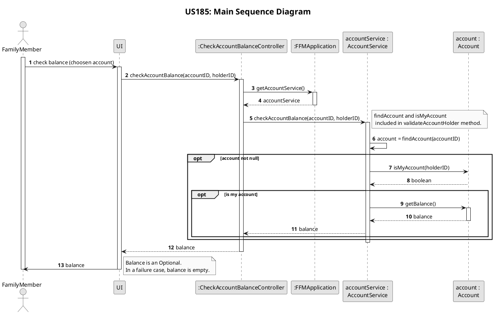
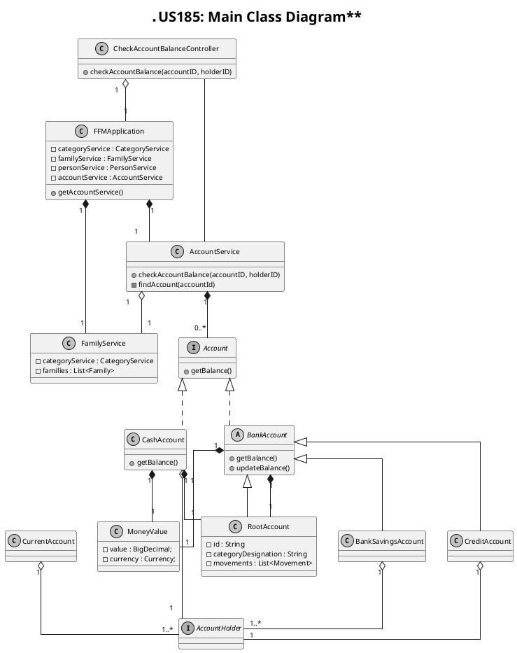

# US185
=======================================


# 1. Requirements

>__"As a family member, I want to check the balance of one of my accounts."__

## 1.1 Description
All family members have the possibility to check the balance of one of their personal accounts.

**Demo1** As a family member, I want to check the balance of one of my accounts.
- Demo1.1 - I select the account that I want to check the balance.
- Demo1.2 - I receive balance of choosen account.

# 2. Analysis
## 2.1 Product Owner 
During the Sprint, the product owner (PO) set some specifications that contribute to the design and implementation of 
the US.
> The balance calculation can vary for each type of account.

## 2.2 Decisions
To accomplish this requirement, we need the following data:
- the holder's ID and account's ID

According switchtwentytwenty goals and PO requests we decide:
- Only a holder can check account balance.
- At this point there is no interaction to user by a UI so, in this sprint, person´s ID is request to verify that the person is the holder of the chosen account.
- If the account isn't found or other problem occurs during the process an empty Optional will be returned.

## 2.3 Dependent US
This US is similar to [US135](/docs/user_stories/sp2/US135.md), since both obtain an account balance, the difference is that in [US135](/docs/user_stories/sp2/US135.md) the family administrator can check the balance of both family and personal accounts, and in this US the family member can only check the balance of one of his account.

## 2.4 System Sequence Diagram
The System Sequence Diagram for this US are shown below:
```puml
skinparam monochrome true
autonumber
title **US185: System Sequence Diagram**
actor "Family Member" as User
skinparam sequenceMessageAlign center


User -> ":System" : check account balance
activate User
activate ":System"
User <-- ":System" : request to select account
deactivate ":System"
note right: not implemented in this US \nshow list of personal accounts
||15||
User -> ":System" : input selected account
activate ":System"
User <-- ":System" : informs balance
deactivate ":System"
deactivate User
```

# 3. Design

## 3.1. Functionalities Flow
The Sequence Diagrams for this US are shown below:


## 3.2. Class Diagram
The Class Diagram for this US is shown below:

As shown in the class diagram there is a Controller class the makes the connection between the UI and the business logic.
All accounts are store in the AccountService class.
All accounts related to banking inherit from the BankAccount class, that implements the Account interface and has an instance of RootAccount as attribute.
By other side, cash accounts implements Account interface and has also an instance of RootAccount as attribute.

## 3.3. Applied Design Patterns
In this US we adopted the following GRASP principles: Controller, Information Expert, Low Coupling.
Also adopted the SOLID principles: Single Responsibility Principle.

## 3.4. Tests 
The following presented tests set up were design to evaluate the requirement of this US:

Environment initialisation to be tested:

    @BeforeEach
    public void initialize() {
        this.app = new FFMApplication();
        FamilyService familyService = this.app.getFamilyService();
        this.accountService = this.app.getAccountService();
        Family family = new Family("F-44578","Costa");
        familyService.addFamily(family);
        this.familyID = family.getId();
        List<String> emails = new ArrayList<>();
        emails.add("newEmail@gmail.com");
        List<String> phones = new ArrayList<>();
        phones.add("912341278");
        this.personID1 = "P-001";
        family.addMember(
                personID1,
                "151729336ZX7",
                "Mariana",
                "22/04/1984",
                "236571788",
                "36",
                "Rua das Pereiras",
                "Coimbra",
                "Portugal",
                "4529-521",
                phones, emails);
        List<String> emails2 = new ArrayList<>();
        emails2.add("newEmail@hotmail.com");
        this.personID2 = "P-002";
        family.addMember(
                personID2,
                "156875276ZX6",
                "Joaquim",
                "10/08/1999",
                "264996305",
                "36",
                "Rua das Pereiras",
                "Coimbra",
                "Portugal",
                "4529-521",
                phones, emails2);
    }
    
**Test 1:** Check account balance successfully

    @Test
    @DisplayName("Check account balance successfully: bank account")
    void checkAccountBalance_CurrentAccount() {
        CheckAccountBalanceController checkAccountBalanceController = new CheckAccountBalanceController(app);
        List<String> holders = new ArrayList<>();
        holders.add(personID1);
        accountService.addCurrentAccount("Conta", holders, familyID);
        String accountID = accountService.getListOfPersonAccounts(personID1).get(0).getId();
        CurrentAccount account = (CurrentAccount) accountService.obtainAccount(accountID);
        Category category = new Category("compras");
        Movement movement1 = new Movement(new MoneyValue(new BigDecimal(50)), category, "entrada", "01/02/1995", new MoneyValue(new BigDecimal(0)));
        Movement movement2 = new Movement(new MoneyValue(new BigDecimal("-25.33")), category, "entrada", "01/02/1995",
                new MoneyValue(new BigDecimal(0)));
        Movement movement3 = new Movement(new MoneyValue(new BigDecimal("5.71")), category, "entrada", "01/02/1995",
                new MoneyValue(new BigDecimal(0)));
        List<Movement> movements = new ArrayList<>();
        movements.add(movement1);
        movements.add(movement2);
        movements.add(movement3);
        account.setMovements(movements);
        Optional<MoneyValue> balance = checkAccountBalanceController.checkAccountBalance(accountID, personID1);
        MoneyValue expected = new MoneyValue(new BigDecimal("30.38"));
        MoneyValue result = balance.get();
        assertEquals(expected,result);
    }
    
**Test 2:** Failure check account balance : family cash account  

    @Test
    @DisplayName("Failure check account balance: not found account")
    public void failureCheckAccountBalance_NotfoundAccount() {
        CheckAccountBalanceController checkAccountBalanceController = new CheckAccountBalanceController(app);
        List<String> holders = new ArrayList<>();
        holders.add(personID1);
        accountService.addCurrentAccount("Conta", holders, familyID);
        String fakeAccountID = accountService.getListOfPersonAccounts(personID1).get(0).getId().concat("A");
        Optional<MoneyValue> balance = checkAccountBalanceController.checkAccountBalance(fakeAccountID, personID1);
        assertFalse(balance.isPresent());
        assertEquals(balance,Optional.empty());
    } 
    
**Test 3:** Failure check account balance : not account holder     
        
    @Test
    @DisplayName("Failure check account balance: not account's holder")
    public void failureCheckAccountBalance_NotAccountHolder() {
        CheckAccountBalanceController checkAccountBalanceController = new CheckAccountBalanceController(app);
        List<String> holders = new ArrayList<>();
        holders.add(personID1);
        accountService.addCurrentAccount("Conta", holders, familyID);
        String accountID = accountService.getListOfPersonAccounts(personID1).get(0).getId();
        Optional <MoneyValue> balance = checkAccountBalanceController.checkAccountBalance(accountID, personID2);
        assertFalse(balance.isPresent());
    }     
       
# 4. Implementation
As shown below, the account service is responsible for obtain balance from an account instance.
Each account type has a specific method to get balance.
There is a validation of account and if person is account holder.
If an error occurs an exception is throws by validateAccountHolder method to controller.

    public MoneyValue checkAccountBalance(String accountID, String holderID) {
        validateAccountHolder(accountID, holderID);
        Account account = this.obtainAccount(accountID);
        return account.getBalance();
    }


# 5. Integration/Demo
This US is integrate with the different accounts, since the balance can be updated differently in each account, being this US responsible for only transmitting the balance value when requested.

# 6. Observations
The output of this functionality for error cases could be changed.