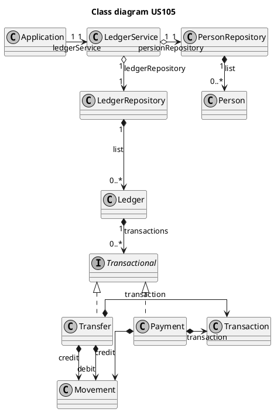
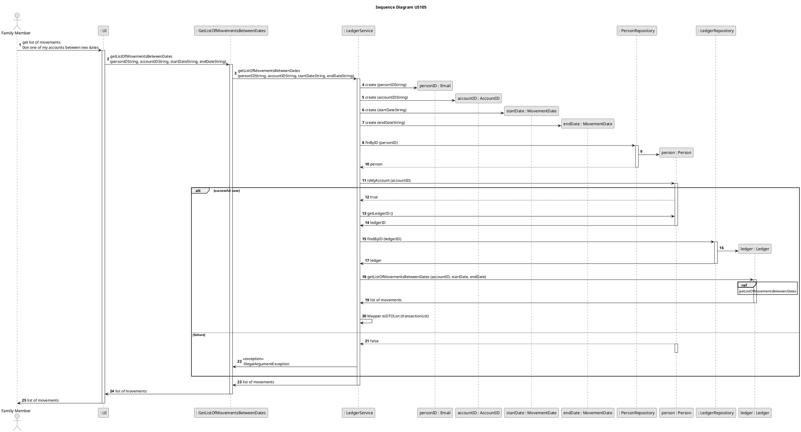
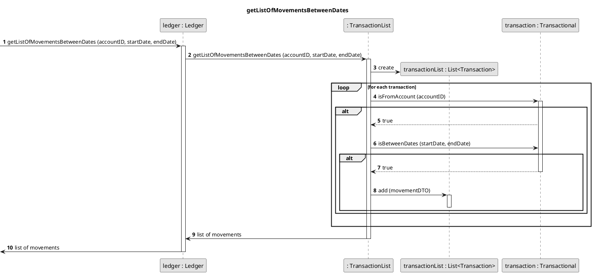

# US186
=======================================


# 1. Requirements

>__"As a family member, I want to get the list of movements on one of my accounts between two dates."__

## 1.1 Description
All family members have the possibility to obtain a list of all transactions of a given account between two defined dates.

**Demo1** As family member, I want to get the list of movements on one of my accounts between two dates.
- Demo1.1. I select the account that I want to check from a list of all my accounts.
- Demo1.2. I define the time frame.
- Demo1.3. I get a list of all the transactions between the defined dates, or an empty list if none is found.

# 2. Analysis

## 2.1 Domain Model

```puml
@startuml

skinparam linetype ortho
hide empty members
hide circles
skinparam monochrome true
title Domain Model

package "Person Aggregate"{
  class Person <<Entity>> <<Root>> {}
}

package "Account Aggregate"{
  class Account <<Entity>> <<Root>> {}
}

package "Ledger Aggregate"{
  class Ledger <<Entity>> <<Root>> {}
}

class Email <<Value Object>> <<ID>> {}
class AccountID <<Value Object>> <<ID>> {}

class Transaction <<Value Object>> {}
class Transfer <<Value Object>> {}
class Payment <<Value Object>> {}
class Movement <<Value Object>> {}


'----------Associations----------

Person "1" -u> "1" Email :  "               mainEmail"
Person "1" -> "0..*" AccountID : "accounts"
Person "1" -> "1" LedgerID : ledger
Account "1" --> "1" AccountID : "           id"
Ledger "1" --> "1" LedgerID : "id"

Ledger "1" -> "0..*" Transaction : transactions

Transaction <|-- Transfer
Transaction <|- Payment

Transfer -> Movement : credit
Transfer -> Movement : debit

Payment -> Movement : debit
 
@enduml
```

## 2.2 Product Owner 
Some answers of the product owner (PO) are important in some design decisions.
> The date of entry of the movement in the system, 
> as well as the date of the registration of the movement given by the user ou by the financial entity, should be stored.
> 
> The returned list of movements should just take into account the date of registration as described above.

> The "between two dates" corresponds to days and not hours or smaller chunks of time. 

> Given that a transfer is formed by a credit and a debit movement, this list should only return the movement that corresponds to the account's holder. 

> Value, description, account id, movement type, category, balance after transaction are the information that will be available as answer to the US.

## 2.3 Decisions
It was decided that if no movement between the time frame is found, and empty list is returned.
The initial date and the final date are also included as a valid date for the movements that are being searched.

## 2.4 Dependent US
The way [US181](US181.md) is implemented will define the way the transactions are accessed and stored in the system.
It also establishes how the date of the movement is formatted.

## 2.5 System Sequence Diagram

```puml
skinparam monochrome true
autonumber
title SSD
actor "Family Member"

"Family Administrator" -> "System" : get list of movements on one of my accounts between two dates
activate "Family Administrator"
activate "System"
|||  
"Family Administrator" <-- "System" : show list of accounts

"Family Administrator" -> "System" : select account
|||
"Family Administrator" <-- "System" : ask for time frame

"Family Administrator" -> "System" : insert required data
|||
"Family Administrator" <-- "System" : list of movements between the defined dates
deactivate "Family Administrator"
deactivate "System"
```

# 3. Design

## 3.1 Class Diagram



## 3.2. Sequence Diagram



[//]: <> (=================================================================================)



## 3.3. Applied Design Patterns

From GRASP principle:
Controller,
Information Expert,
Low Coupling and High Cohesion

From SOLID:
Single Responsibility Principle

## 3.4. Tests 


**Teste 1:** Get a list of movements of cash account between two dates.

    @Test
    @DisplayName("Get list of movements between dates")
    void getListOfMovementsBetweenDates() throws InvalidDateException, InvalidEmailException, PersonAlreadyInSystemException, InvalidVATException, InvalidPersonNameException, ElementNotFoundException, AccountNotCreatedException, InvalidMovementTypeException, ParseException {
        //arrange
        int result;
        int expected = 1;

        //create family and administrator

        ID adminID = new Email(adminEmail);

        List<String> phoneNumbers = new ArrayList<>();
        phoneNumbers.add("912343546");
        INFamilyAndAdminDTO dto = new INFamilyAndAdminDTO.INFamilyAndAdminDTOBuilder()
                .withPersonName("Margaret Hamilton")
                .withBirthDate("1/12/1904")
                .withCity("Porto")
                .withHouseNumber("14")
                .withCountry("Portugal")
                .withStreet("Logical Street")
                .withPhoneNumbers(phoneNumbers)
                .withZipCode("2100-345")
                .withVAT("213025086")
                .withEmail(adminEmail)
                .withFamilyName("Hamilton")
                .build();
        familyAndMemberService.startFamily(dto);
        Person admin = personRepository.findByID(adminID);

        //create cash account for administrator
        MoneyValue amountValue = new MoneyValue(new BigDecimal(100));
        AccountDesignation accountDesignation = new AccountDesignation("My cash account");
        ID accountID = new AccountID(UUID.randomUUID());

        Account cashAccount = new CashAccount(accountID, amountValue, accountDesignation);
        admin.addAccountID(accountID);
        this.accountRepository.add(cashAccount);

        //add movements

        TransactionDate betweenDateOne = new TransactionDate("2021-04-02");
        MoneyValue moneyValue = new MoneyValue(new BigDecimal("110"));
        Custom customCategory = new Custom(new CategoryDesignation("Food"), new CategoryID(UUID.randomUUID()), new FamilyID(UUID.randomUUID()), true);

        TransferDomainDTO transferDomainMemberToMemberDTOOne = new TransferDomainDTO.TransferBuilder()
                .withAmount(new MoneyValue(BigDecimal.valueOf(50)))
                .withOriginAccountID(accountID)
                .withDestinationAccountID(new AccountID(UUID.randomUUID()))
                .withCategoryID(new CategoryID(UUID.randomUUID()))
                .withDate(betweenDateOne)
                .withReceiverID(new Email("alan_turing@hotmail.com"))
                .withSenderID(new Email(adminEmail))
                .withCreditMovement(new MovementType(Constants.CREDIT))
                .withDebitMovement(new MovementType(Constants.DEBIT))
                .withDescription(new TransactionDescription("Cromos"))
                .build();

        Transfer transferOne = new Transfer(transferDomainMemberToMemberDTOOne, moneyValue, customCategory);

        ID ledgerID = admin.getLedgerID();
        Ledger ledger = ledgerRepository.findByID(ledgerID);

        ledger.addTransaction(transferOne);

        //define dates
        String startDate = "2021-04-01";
        String endDate = "2021-04-05";

        //act
        Optional<List<OUTMovementDTO>> optional = ledgerService.getListOfMovementsBetweenDates(adminEmail, accountID.toString(), startDate, endDate);
        result = optional.get().size();

        //assert
        assertEquals(result, expected);
    }

**Teste 2:** Get an empty list of movements because nothing was found between the given dates.

@Test
@DisplayName("Get list of movements between dates - empty list")
void getListOfMovementsBetweenDatesEmptyList() throws InvalidDateException, InvalidEmailException, PersonAlreadyInSystemException, InvalidVATException, InvalidPersonNameException, ElementNotFoundException, AccountNotCreatedException, InvalidMovementTypeException, ParseException {
//arrange

        //create family and administrator
        ID adminID = new Email(adminEmail);

        List<String> phoneNumbers = new ArrayList<>();
        phoneNumbers.add("912343546");
        INFamilyAndAdminDTO dto = new INFamilyAndAdminDTO.INFamilyAndAdminDTOBuilder()
                .withPersonName("Margaret Hamilton")
                .withBirthDate("1/12/1904")
                .withCity("Porto")
                .withHouseNumber("14")
                .withCountry("Portugal")
                .withStreet("Logical Street")
                .withPhoneNumbers(phoneNumbers)
                .withZipCode("2100-345")
                .withVAT("213025086")
                .withEmail(adminEmail)
                .withFamilyName("Hamilton")
                .build();
        familyAndMemberService.startFamily(dto);
        Person admin = personRepository.findByID(adminID);

        //create cash account for administrator
        MoneyValue amountValue = new MoneyValue(new BigDecimal(500));
        AccountDesignation accountDesignation = new AccountDesignation("My other cash account");
        ID accountID = new AccountID(UUID.randomUUID());

        Account cashAccount = new CashAccount(accountID, amountValue, accountDesignation);
        admin.addAccountID(accountID);
        this.accountRepository.add(cashAccount);

        //add movements

        TransactionDate outsideDates = new TransactionDate("2021-04-02");
        MoneyValue moneyValue = new MoneyValue(new BigDecimal("110"));
        Custom customCategory = new Custom(new CategoryDesignation("Food"), new CategoryID(UUID.randomUUID()), new FamilyID(UUID.randomUUID()), true);

        TransferDomainDTO transferDomainMemberToMemberDTOOne = new TransferDomainDTO.TransferBuilder()
                .withAmount(new MoneyValue(BigDecimal.valueOf(50)))
                .withOriginAccountID(accountID)
                .withDestinationAccountID(new AccountID(UUID.randomUUID()))
                .withCategoryID(new CategoryID(UUID.randomUUID()))
                .withDate(outsideDates)
                .withReceiverID(new Email("alan_turing@hotmail.com"))
                .withSenderID(new Email(adminEmail))
                .withCreditMovement(new MovementType(Constants.CREDIT))
                .withDebitMovement(new MovementType(Constants.DEBIT))
                .withDescription(new TransactionDescription("Cromos"))
                .build();

        Transfer transferOne = new Transfer(transferDomainMemberToMemberDTOOne, moneyValue, customCategory);

        ID ledgerID = admin.getLedgerID();
        Ledger ledger = ledgerRepository.findByID(ledgerID);

        ledger.addTransaction(transferOne);

        //define dates
        String startDate = "2021-05-01";
        String endDate = "2021-05-05";

        //act
        Optional<List<OUTMovementDTO>> optional = ledgerService.getListOfMovementsBetweenDates(adminEmail, accountID.toString(), startDate, endDate);

        //assert
        assertFalse(optional.isPresent());
    
**Teste 3:** Get correct list of movements even with swapped dates.

    @Test
    @DisplayName("Get list of movements between dates - start and end dates wrong order")
    void getListOfMovementsBetweenDatesDatesWrongOrder() throws InvalidDateException, InvalidEmailException, PersonAlreadyInSystemException, InvalidVATException, InvalidPersonNameException, ElementNotFoundException, AccountNotCreatedException, InvalidMovementTypeException, ParseException {
        //arrange
        int result;
        int expected = 2;

        //create family and administrator

        ID adminID = new Email(adminEmail);

        List<String> phoneNumbers = new ArrayList<>();
        phoneNumbers.add("912343546");
        INFamilyAndAdminDTO dto = new INFamilyAndAdminDTO.INFamilyAndAdminDTOBuilder()
                .withPersonName("Margaret Hamilton")
                .withBirthDate("1/12/1904")
                .withCity("Porto")
                .withHouseNumber("14")
                .withCountry("Portugal")
                .withStreet("Logical Street")
                .withPhoneNumbers(phoneNumbers)
                .withZipCode("2100-345")
                .withVAT("213025086")
                .withEmail(adminEmail)
                .withFamilyName("Hamilton")
                .build();
        familyAndMemberService.startFamily(dto);
        Person admin = personRepository.findByID(adminID);

        //create cash account for administrator
        MoneyValue amountValue = new MoneyValue(new BigDecimal(100));
        AccountDesignation accountDesignation = new AccountDesignation("My cash account");
        ID accountID = new AccountID(UUID.randomUUID());

        Account cashAccount = new CashAccount(accountID, amountValue, accountDesignation);
        admin.addAccountID(accountID);
        this.accountRepository.add(cashAccount);

        //add movements

        TransactionDate betweenDateOne = new TransactionDate("2021-04-02");
        MoneyValue moneyValue = new MoneyValue(new BigDecimal("110"));
        Custom customCategory = new Custom(new CategoryDesignation("Food"), new CategoryID(UUID.randomUUID()), new FamilyID(UUID.randomUUID()), true);

        TransferDomainDTO transferDomainMemberToMemberDTOOne = new TransferDomainDTO.TransferBuilder()
                .withAmount(new MoneyValue(BigDecimal.valueOf(50)))
                .withOriginAccountID(accountID)
                .withDestinationAccountID(new AccountID(UUID.randomUUID()))
                .withCategoryID(new CategoryID(UUID.randomUUID()))
                .withDate(betweenDateOne)
                .withReceiverID(new Email("alan_turing@hotmail.com"))
                .withSenderID(new Email(adminEmail))
                .withCreditMovement(new MovementType(Constants.CREDIT))
                .withDebitMovement(new MovementType(Constants.DEBIT))
                .withDescription(new TransactionDescription("Cromos"))
                .build();

        Transfer transferOne = new Transfer(transferDomainMemberToMemberDTOOne, moneyValue, customCategory);

        TransactionDate otherDate = new TransactionDate("2021-04-01");

        TransferDomainDTO transferDomainMemberToMemberDTOTwo = new TransferDomainDTO.TransferBuilder()
                .withAmount(new MoneyValue(BigDecimal.valueOf(10)))
                .withOriginAccountID(accountID)
                .withDestinationAccountID(new AccountID(UUID.randomUUID()))
                .withCategoryID(new CategoryID(UUID.randomUUID()))
                .withDate(otherDate)
                .withReceiverID(new Email("alan_turing@hotmail.com"))
                .withSenderID(new Email(adminEmail))
                .withCreditMovement(new MovementType(Constants.CREDIT))
                .withDebitMovement(new MovementType(Constants.DEBIT))
                .withDescription(new TransactionDescription("Cromos"))
                .build();

        Transfer transferTwo = new Transfer(transferDomainMemberToMemberDTOTwo, moneyValue, customCategory);

        ID ledgerID = admin.getLedgerID();
        Ledger ledger = ledgerRepository.findByID(ledgerID);

        ledger.addTransaction(transferOne);
        ledger.addTransaction(transferTwo);

        //define dates
        String startDate = "2021-04-01";
        String endDate = "2021-04-05";

        //act
        Optional<List<OUTMovementDTO>> optional = ledgerService.getListOfMovementsBetweenDates(adminEmail, accountID.toString(), endDate, startDate);
        result = optional.get().size();

        //assert
        assertEquals(result, expected);
    }

        
# 4. Implementation
As defined bellow, the input dates are used as references for the time frame.
The only verification is if the date of the movement, aka TransactionDate, is after the end date or before the start one.
This simple mathematical expression offers a quick way to confirm this.
The compare method returns 0 if same date, -1 if the date comes before the date given as argument, and 1 if the date comes after. 

    /**
     * Verifies id given TransactionDate is between two other dates.
     *
     * @param startDate - initial date
     * @param endDate   - end date
     * @return true if this date is between the two given dates
     */
    public boolean isBetween(TransactionDate startDate, TransactionDate endDate) {
        return startDate.compare(this) * this.compare(endDate) >= 0; //inclusive given dates
    }

# 5. Integration/Demo

The movements are store inside a Transaction.
When the transaction is a Transfer we need to deal with two movements, credit and debit.
First, we check if the Transaction it is between dates.
After that, we ask which of the movements is related to the account that we want to consult.

# 6. Observations
