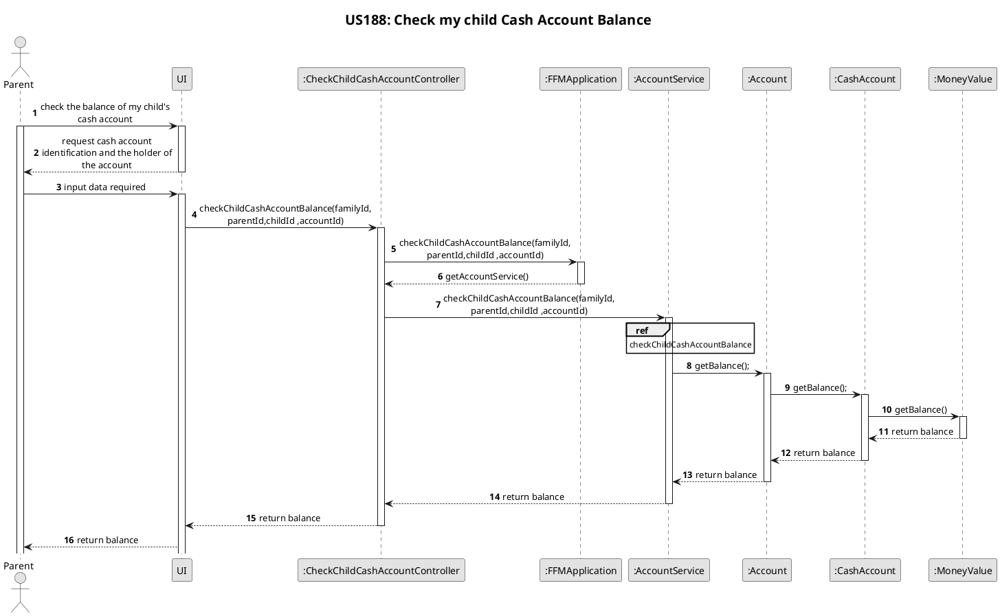
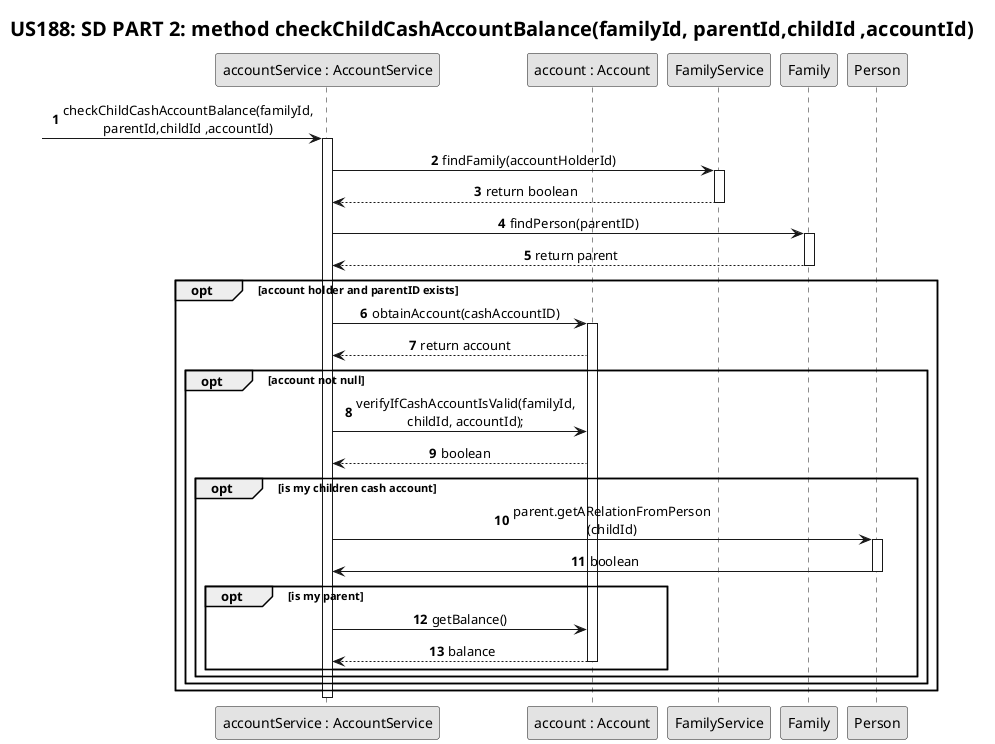
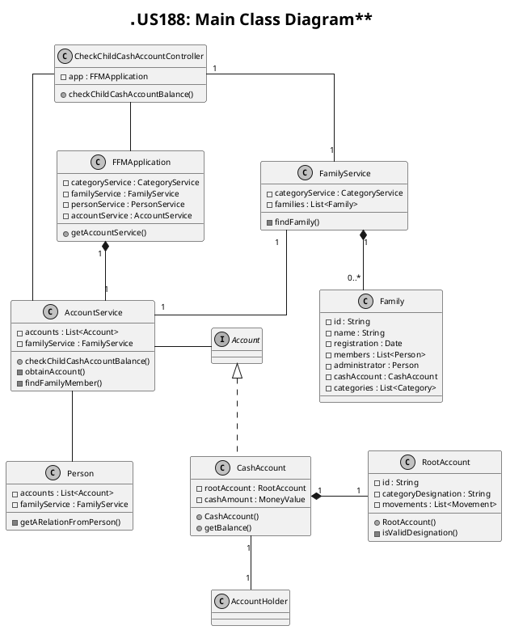

# US188
=======================================


# 1. Requirements

>__"As a parent, I want to check the balance of one of my children’s cash account."__

## 1.1 Description
Any parents in a family have the possibility to check the balance of one of their children cash accounts.
# 2. Analysis

**Demo1** As a parent, I want to check the balance of my children account.
- Demo1.1 - I select the account, and the identification of the family which child I want to see the account.
- Demo1.2 - I receive balance of chosen account.

## 2.1 Product Owner 
During the Sprint, the product owner (PO) set some specifications that contribute to the design and implementation of 
the US.

Q: That the "parent" referred to in the US refers to any member and that, for this, family relationships are extended to allow relationships between two members other than the administrator ?
> A: It can be any pair of family members. If you do not meet the requirements, it is not possible to consult the balance.

## 2.2 Decisions
To accomplish this requirement, we need the following data:
- The parent's ID
- The familyID
- The childID
- The account of the child ID

According switchtwentytwenty goals and PO requests we decide:
- At this point there is no interaction with the UI, soo it was decided that personID, familyId, childID and accountID 
are requested to verify if both of parent and child belong to an existing family in the system.
- If the account isn't found or other problem occurs during the process an empty Optional will be returned.

## 2.3 Dependent US
Also is dependent of [US104](/docs/user-stories/sp1/US104.md) because it is necessary to find out if the two people introduced are in fact a father and one of his children.

# 3. Design

## 3.1. Functionalities Flow
The System Sequence Diagrams for this US is shown below:

```puml
skinparam monochrome true
autonumber
title SSD
actor "Family Member"

"Family Member" -> "System" : check the balance of my child cash account
activate "Family Member"
activate "System"
|||  

"Family Member" <-- "System" : ask for input data

"Family Member" -> "System" : insert required data
|||
"Family Member" <-- "System" : returns balalnce of the personal cash account
deactivate "Family Member"
deactivate "System"
```

The Sequence Diagrams for this US is shown below:





## 3.2. Class Diagram

The main Classes involved are:
 - CheckChildCashAccountController
 - Application
 - AccountService
 - Account    
 - CashAccount
 - MoneyValue
 - Person




## 3.3. Applied Design Patterns

From GRASP design pattern was applied the principles of Controller, Information Expert and Low Coupling.
From SOLID pattern was applied the Single Responsability Principle.


## 3.4. Tests 
The input given by the family member to the controller will be filter by the following function:
- checkChildCashAccountBalance()

The above tests verify the possibility of a parent being able to check its child cash account balance, given a personId, familyID, initial amount and a categoryDesignation. 

    @BeforeEach
    public void initialize() {
        app = new FFMApplication();
        FamilyService familyService = this.app.getFamilyService();
        Family family = new Family("Costa");
        familyService.addFamily(family);
        CostaID = family.getId();
        List<String> emails = new ArrayList<>();
        emails.add("newEmail@gmail.com");
        List<String> phones = new ArrayList<>();
        phones.add("912341278");
        family.addMember(
                "151729336ZX7",
                "Mariana",
                "22/04/1984",
                "236571788",
                "36",
                "Rua das Pereiras",
                "Coimbra",
                "Portugal",
                "4529-521",
                phones, emails);
        MiguelID = family.getPersonIdByCc("151729336ZX7");
    }

**Teste 1:** Success check child cash account:
    
    @Test
    @DisplayName("Success check account balance.")
    public void successCheckChildCashAccountBalance() {

        //act
        String parentDenomination = Utils.getSystemParentDenomination();
        PersonService personService = app.getPersonService();
        personService.createRelation(this.person2ID,this.person1ID,parentDenomination,this.familyID);
        RelationType relationType = RelationType.newInstance("child");
        accountService.createPersonCashAccount(this.person2ID,this.familyID,10.5,"cash");
        String accountID = accountService.getListOfCashAccounts(this.person2ID).get(0).getId();
        //arrange
        MoneyValue expected = new MoneyValue(new BigDecimal(10.5));
        MoneyValue balance = accountService.checkChildCashAccountBalance(this.familyID, this.person1ID, this.person2ID, accountID, relationType);
        //assert
        assertEquals(expected, balance);
    }
        
**Teste 2:** Failure check account balance - the family of the holder does not exist:
    
    @Test
    @DisplayName("Failure check account balance: the family of the holder does not exist.")
    public void failureCheckChildCashAccountBalance_FamilyDoesNotExist() {

        RelationType relationType = RelationType.newInstance("cousin");
        Exception exception = Assertions
                .assertThrows(IllegalArgumentException.class, () -> accountService.checkChildCashAccountBalance("familyID", this.person1ID, this.person2ID, "accountID", relationType));
        String exceptionMessage = exception.getMessage();
        String expectedMessage = "Family not found.";
        Assertions.assertEquals(expectedMessage, exceptionMessage);
    }
        
**Teste 3:** Failure check account balance - parent  not found:

    @Test
    @DisplayName("Failure check account balance: parent  not found.")
    public void failureCheckChildCashAccountBalance_ParentNotFound() {
        accountService.createPersonCashAccount(this.person1ID,this.familyID,10,"cash");
        String accountID = accountService.getListOfCashAccounts(this.person1ID).get(0).getId();
        RelationType relationType = RelationType.newInstance("cousin");
        Exception exception = Assertions
                .assertThrows(IllegalArgumentException.class, () -> accountService.checkChildCashAccountBalance(this.familyID,"carlos" , this.person1ID, accountID, relationType));
        String exceptionMessage = exception.getMessage();
        String expectedMessage = "Person not found.";
        Assertions.assertEquals(expectedMessage, exceptionMessage);
    }        
    
**Test 4:**  Failure check account balance - The Holder does not exists:

    @Test
    @DisplayName("Failure check account balance: The Holder does not exists.")
    public void failureCheckChildCashAccountBalance_NotHolder() {

        accountService.createPersonCashAccount(this.person1ID,this.familyID,10,"cash");
        String accountID = accountService.getListOfCashAccounts(this.person1ID).get(0).getId();
        RelationType relationType = RelationType.newInstance("child");
        Exception exception = Assertions
                .assertThrows(IllegalArgumentException.class, () -> accountService.checkChildCashAccountBalance(this.familyID, this.person1ID, "carlos", accountID, relationType));
        String exceptionMessage = exception.getMessage();
        String expectedMessage = "Relation not founded";
        Assertions.assertEquals(expectedMessage, exceptionMessage);
    }   
    
**Test 5:**  Failure check account balance - It is not a CashAccount:

    @Test
    @DisplayName("Failure check account balance: It is not a CashAccount.")
    public void failureCheckChildCashAccountBalance_NotACashAccount() {

        String parentDenomination = Utils.getSystemParentDenomination();
        PersonService personService = app.getPersonService();

        personService.createRelation(this.person2ID,this.person1ID,parentDenomination,this.familyID);

        List<String> holders = new ArrayList<>();
        holders.add(this.person1ID);
        accountService.createPersonCashAccount(this.person1ID, this.familyID, 200, "cash");
        accountService.addCurrentAccount("current", holders, this.familyID);
        String accountID = accountService.getListOfPersonAccounts(this.person1ID).get(1).getId();
        RelationType relationType = RelationType.newInstance("parent");
        Exception ex =  assertThrows(IllegalArgumentException.class, () ->accountService.checkChildCashAccountBalance(this.familyID, this.person2ID, this.person1ID, accountID, relationType));
        String expected = "It is not a CashAccount.";
        String result = ex.getMessage();
        assertEquals(expected,result);
    }      

**Test 6:**  Failure check account balance - Account does not exist:

    @Test
    @DisplayName("Failure check account balance: Account does not exist.")
    public void failureCheckChildCashAccountBalance_AccountDoesNotExist() {

        String parentDenomination = Utils.getSystemParentDenomination();
        PersonService personService = app.getPersonService();
        personService.createRelation(this.person2ID,this.person1ID,parentDenomination,this.familyID);

        accountService.createPersonCashAccount(this.person1ID, this.familyID, 200, "cash");
        RelationType relationType = RelationType.newInstance("parent");
        Exception ex =  assertThrows(IllegalArgumentException.class, () -> accountService.checkChildCashAccountBalance(this.familyID, this.person2ID, this.person1ID, "123", relationType));
        String expected = "Account not found.";
        String result = ex.getMessage();
        assertEquals(expected,result);
    }

        
# 4. Implementation
Has shown in the sequence diagram, a family member has the possibility to check another family member's cash account balance if they have a parent/child relation.
This method will check if that condition is true or not. It will also verify if the account holder and the accountId are valid, this last one will have an additional verification to check if it is an ID of a cash account.
    
    public MoneyValue checkChildCashAccountBalance(String familyId, String parentId, String childId, String accountId,
                                                   RelationType childRelationType) {

        Person parent = findFamilyMember(parentId,familyId);
        String parentRelation = parent.getARelationFromPerson(childId).toString();
        Account account = obtainAccount(accountId);
        if (account == null) {
            throw new IllegalArgumentException("Account not found.");
        }
        if (!parentRelation.equals(childRelationType.toString())) {
            throw new IllegalArgumentException("Relation not founded");
        }
        if (!(account instanceof CashAccount)) {
            throw new IllegalArgumentException("It is not a CashAccount.");
        }
        return checkAccountBalance(accountId,childId);
    }
    
    
Method to verify if the account exists in the system, and if it belongs to the holderID.    
    
    private void validateAccountHolder(String accountID, String holderID){
        Account account = this.obtainAccount(accountID);
        if (account == null) {
            throw new IllegalArgumentException("Account not found.");
        }
        if (!account.isMyAccount(holderID)) {
            throw new IllegalArgumentException("Account not belongs to this holder.");
        }
    }    
    
# 5. Integration/Demo

The [US188](/docs/US188.md) to check the balance of one of my children's cash account. This will only be possible if there's a parent/child relation between the user and the other family member.
The checkChildCashAccountBalance method will check if that condition is true or not. It will also verify if the account holder and the accountId are valid, this last one will have an additional verification to check if it is an ID of a cash account.
When the method from AccountService class handles the exception it returns false and will not complete the action, to prevent possible incoherent outputs. 

# 6. Observations
Currently, there are still some redundancies with the validations in the method "checkChildCashAccountBalance" because for now there´s a double validation, as we can see in the "if(account == null)" statement .
